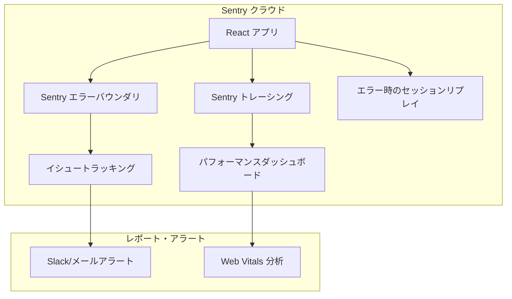

# 監視 & 観測プラットフォーム（Monitoring & Observability）

プラットフォームを円滑に稼働させ続けるため、**scripture-habit** では複数の監視ツールを使用して、ユーザーが問題を報告する前にパフォーマンスの課題や予期しないエラーをキャッチしています。

---

## 1. Sentry によるエラー追跡

私たちは、アプリケーションのパフォーマンス監視とクラッシュの追跡に **Sentry** を使用しています。

### 1.1 パフォーマンスのサンプリング
コストと可視性のバランスを取るために、以下の設定を行っています：
- **`tracesSampleRate: 0.1`**: パフォーマンスデータの 10% をトレースし、低速な API エンドポイントや複雑な React レンダリングを特定します。
- **セッションリプレイ (Session Replays)**: エラーが発生した場合のみセッションリプレイを記録します（`replaysOnErrorSampleRate: 1.0`）。これにより、正常なセッションを記録することなく、クラッシュに至るまでのユーザーの操作手順を確認できます。

### 1.2 React Router の統合
Sentry の React Router 統合により、どのページ遷移が遅いか、または失敗しているかを確認できるため、ダッシュボードの遅延やノートの投稿エラーなどの問題を特定できます。

### 1.3 監視とトレースのガイドライン
アラートの信頼性維持とコスト抑制のため、開発者は以下のトレースおよびエラーフィルタリングのガイドラインに従う必要があります：

*   **エラーフィルタリングポリシー (`ignoreErrors`)**:
    *   セッション期限切れに伴う認証失敗（`401 Unauthorized`）や、ログアウト時の一時的なルール拒否（`403 Forbidden`）、外部ページのメタデータ取得失敗（`404 Not Found`）などの、標準的なユーザー操作に起因するクライアントエラーは無視するか、警告（warning）として記録し、不要なアラート発報を防ぎます。
    *   未処理の例外（Unhandled Exception）や、サーバー側のデータベーストランザクションの中断、Sentry Expressエラーハンドラーがキャッチした例外は、高優先度のエラーとして追跡します。
*   **トランザクションネーミング規則**:
    *   すべてのルートハンドラーは、パラメータ化されたパス（例: `/api/groups/seed-group-daily-bread` などの物理IDではなく、`/api/groups/:groupId`）としてトレースします。パスを抽象化することで、Sentryのダッシュボード上でパフォーマンスメトリクスを正しく単一のトランザクションタイプとして集約できます。
*   **Firestore トランザクションのカスタムスパン**:
    *   アトミックなFirestoreトランザクション（`NoteService`など）を実行する際は、`Sentry.startSpan({ name: 'db.transaction.note-post' })` を用いて、処理全体をカスタムスパンとしてラップします。これにより、一般的なAPIとしてのHTTP応答の遅延と、データベース側の読み取り・書き込みに要した遅延（Read-before-Write）を分離し、パフォーマンスのボトルネック解析を容易にします。

---

## 2. 一般的なエラーの非表示化

モバイルのハイブリッドアプリでは、対応が不要な想定内のエラーがいくつか存在します。Sentry のログをクリーンに保つため、これらを `main.tsx` で抑制しています：
- **`AbortError`**: ユーザーがアプリを閉じた際や、アクティブな Firebase リクエスト中にタブを切り替えた際に発生します。
- **`permission-denied`**: Firestore のリスナーがアクティブな状態でユーザーがログアウトした際、一時的に発生します。誤報（偽陽性）を防ぐためにこれを抑制しています。

---

## 3. PWA 更新ライフサイクル

ユーザーが常に最新バージョンのプログレッシブ Web アプリ（PWA）を実行できるようにするため、以下のようなフローになっています：
1.  **状態の検出**: アプリが Service Worker のインストール状態を監視します。
2.  **イベントのディスパッチ**: 新しい Service Worker の準備ができると、アプリは `pwa-update-available` カスタムイベントをトリガーします。
3.  **ユーザー UI**: ユーザーインターフェースに「新しいバージョンが利用可能です」というバナーが表示されます。
4.  **リフレッシュ**: ユーザーが「更新」をクリックすると、新しい Service Worker が引き継ぎ、ページがリロードされます。

---

## 4. モバイルデバッグ (vConsole)

Chrome デベロッパーツールが使用できない本番用の Android および iOS ビルドをデバッグするために、**vConsole** を使用しています。
- **使用方法**: URL に `?vconsole=true` を追加してアクセスします。
- **機能**: モバイルデバイス上にコンソールログ、ネットワークリクエスト、およびローカルストレージデータを直接表示します。

---

## 5. 監視アーキテクチャ図

