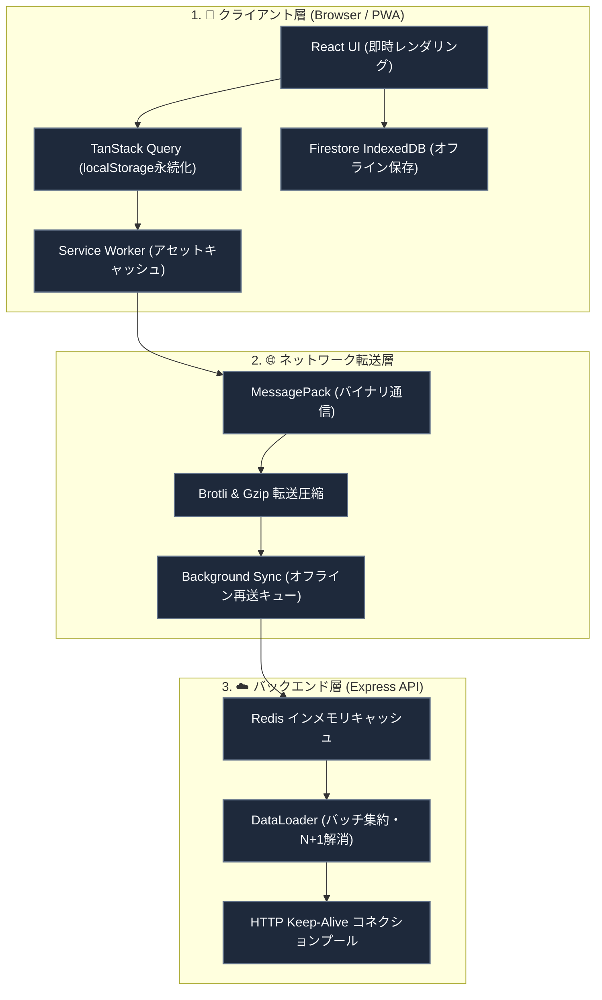

# ネットワーク ＆ パフォーマンス最適化

このドキュメントでは、通信速度の向上、オフライン時のデータ保護、キャッシュ設計、およびデータ通信量削減のための最適化について解説します。

---

## 1. 全体アーキテクチャの概要

アプリの高速な起動と安定した通信を実現するため、クライアントからサーバー、データベースまで多層の最適化を適用しています。

---

## 2. クライアント側のキャッシュ構造

| レイヤー | 保存先 | 有効期間 | 主な目的 |
| :--- | :--- | :--- | :--- |
| **画面状態** | `localStorage` | 24時間 | 再訪問時やリロード時にスピナーを挟まず即座に画面を表示。 |
| **APIキャッシュ** | インメモリ (Axios) | 2分間 | 短時間に同じGETリクエストが重複して飛ぶのを防止。 |
| **静的アセット** | Cache Storage (SW) | バージョン毎 | JS / CSS / フォントを端末に保存し、通信なしで起動。 |
| **Firestoreデータ** | IndexedDB | 自動管理 | オフライン時のノート・チャット閲覧と複数タブ同期。 |

---

## 3. 通信プロトコルとデータサイズの最適化

1. **MessagePack バイナリ通信 (`@msgpack/msgpack`)**:
   JSON 形式と比べてデータサイズを約 30〜50% 削減。クライアントとサーバーで自動ネゴシエーションを行い、対応環境ではバイナリ形式で送受信します。
2. **事前圧縮 (Brotli & Gzip)**:
   静的アセット（JS, CSS）はビルド時に Brotli / Gzip ファイルを事前生成し、配信サイズを最小化。
3. **フォントのセルフホスト (`@fontsource`)**:
   外部の Google Fonts への通信をなくし、フォント読み込みによる画面のちらつき（FOUT）を解消。

---

## 4. バックエンドの最適化

1. **Redis API キャッシュ**:
   外部URLのメタデータや高頻度アクセスリソースを Redis にキャッシュし、数ミリ秒で高速応答。
2. **DataLoader による N+1 クエリ解消**:
   同一リクエスト内での複数のデータベース読み取りを 1 回のバッチクエリ（`db.getAll`）に集約。
3. **Keep-Alive コネクションプール**:
   外部通信時の TLS ハンドシェイク遅延を削減。

---

## 5. オフライン耐性と通信制御

- **Service Worker Background Sync**:
  電波の届かない場所でノートを投稿しても、通信が復帰した際にバックグラウンドで自動的に送信を完了します。
- **画面遷移時の通信キャンセル (`AbortController`)**:
  別の画面に移動した際、前の画面で待機中だった不要な GET リクエストを即座に中断し、端末のリソースを節約します。
- **指数バックオフ自動リトライ**:
  通信の一時的な切断が発生した際、最大3回まで間隔を広げながら自動再試行します。

---

## 6. 関連ドキュメント

- [全体アーキテクチャ](./architecture.md)
- [Firestore のオフライン永続化](./firestore-offline-persistence.md)
- [API 設計 & エラーハンドリング](./api-middleware-error-handling.md)
