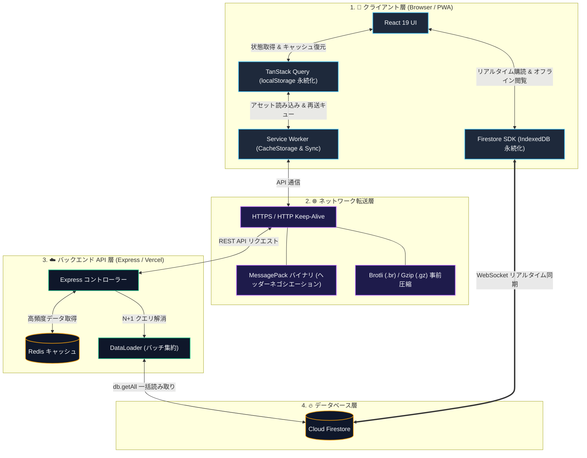

# ネットワーク ＆ パフォーマンス最適化

このドキュメントでは、Scripture Habit における通信速度の向上、オフライン時のデータ保護、多層キャッシュ設計、およびデータ通信量削減のための最適化アーキテクチャについて解説します。

---

## 1. 最適化アーキテクチャの全体像

アプリケーションの即時起動と安定した通信を実現するため、クライアント、ネットワーク、バックエンド、データベースの各層で連携した最適化を施しています。

### アーキテクチャの解説

1. **クライアントでの多層キャッシュ**
   画面の即時表示には TanStack Query と `localStorage` を連携させ、再訪時のローディング表示を抑えます。静的アセット（JS / CSS / フォント）は Service Worker の Cache Storage に保持し、オフライン起動を可能にします。学習ノートやチャット履歴は Firestore の IndexedDB 永続化層により、通信が途切れた環境でも閲覧できます。

2. **ネットワーク転送の効率化**
   API 通信では HTTP ヘッダー（`Accept: application/x-msgpack`）による自動ネゴシエーションを行い、JSON に比べて 30〜50% 軽量な MessagePack バイナリ形式で送受信します。また、ビルド時に生成された Brotli および Gzip 圧縮アセットを配信し、転送データ量を最小化します。

3. **バックエンドでの負荷軽減とバッチ処理**
   外部記事のメタデータや頻繁に参照されるリソースは Redis にキャッシュし、ミリ秒単位で高速に応答します。データベース読み取り時は DataLoader が同一リクエスト内のクエリを `db.getAll` に集約し、N+1 問題を防ぎながら効率的に Firestore へアクセスします。

---

## 2. クライアント側のキャッシュ構造

| レイヤー | 格納先 | 保持期間 | 主な役割 |
| :--- | :--- | :--- | :--- |
| **画面状態** | `localStorage` | 24時間 | 再訪問時やリロード時にローディングを挟まず、直前の状態を即座に復元。 |
| **API キャッシュ** | インメモリ (Axios) | 2分間 | 短時間に同一のエンドポイントへ飛ぶ重複リクエストを排除。 |
| **静的アセット** | Cache Storage (SW) | バージョン毎 | JS、CSS、フォントを端末に保持し、通信なしでのアプリ起動を実現。 |
| **Firestore データ** | IndexedDB | 自動管理 | オフライン時のノート・チャット閲覧と、複数タブ間での排他制御。 |

---

## 3. 通信プロトコルとデータサイズの最適化

1. **MessagePack バイナリ通信 (`@msgpack/msgpack`)**
   JSON 形式と比較してデータサイズを約 30〜50% 削減します。クライアントとサーバー間でヘッダーネゴシエーションを行い、対応環境では透過的にバイナリ形式で送受信します。

2. **事前圧縮 (Brotli & Gzip)**
   静的アセット（JS, CSS）はビルド時に Brotli (`.br`) および Gzip (`.gz`) ファイルを事前生成し、配信時の帯域消費を最小限に抑えます。

3. **フォントのセルフホスト (`@fontsource`)**
   外部の Google Fonts CDN への依存をなくし、フォント読み込みに伴うレイアウトのずれ（FOUT）と追加の TLS ハンドシェイク遅延を解消します。

---

## 4. バックエンドとデータベースの最適化

1. **Redis API キャッシュ**
   外部 URL のメタデータや頻繁に参照されるデータを Redis にキャッシュし、ミリ秒単位の高速応答を実現します。

2. **DataLoader による N+1 クエリ解消**
   同一リクエスト内で発生する複数の Firestore 読み取りを 1 回のバッチクエリ（`db.getAll`）に集約し、データベースへの負荷とレイテンシを削減します。

3. **Keep-Alive コネクションプール**
   外部サービスとの通信コネクションをプールして再利用し、TLS ハンドシェイクに伴う遅延を低減します。

---

## 5. オフライン耐性と通信制御

1. **Service Worker Background Sync**
   オフライン時に送信されたノートやメッセージを一時保存し、通信復帰時にバックグラウンドで自動的に再送を完了します。

2. **画面遷移時の通信中断 (`AbortController`)**
   ユーザーが別の画面へ移動した際、待機中だった不要な GET リクエストを即座に中断し、端末のリソースと帯域を節約します。

3. **指数バックオフによる自動リトライ**
   一時的なネットワーク切断や 5xx エラーが発生した際、間隔を広げながら最大 3 回まで自動的に再試行します。

---

## 6. 関連ドキュメント

- [全体アーキテクチャ](./architecture.md)
- [Firestore のオフライン永続化](./firestore-offline-persistence.md)
- [API 設計とエラー処理](./api-middleware-error-handling.md)
