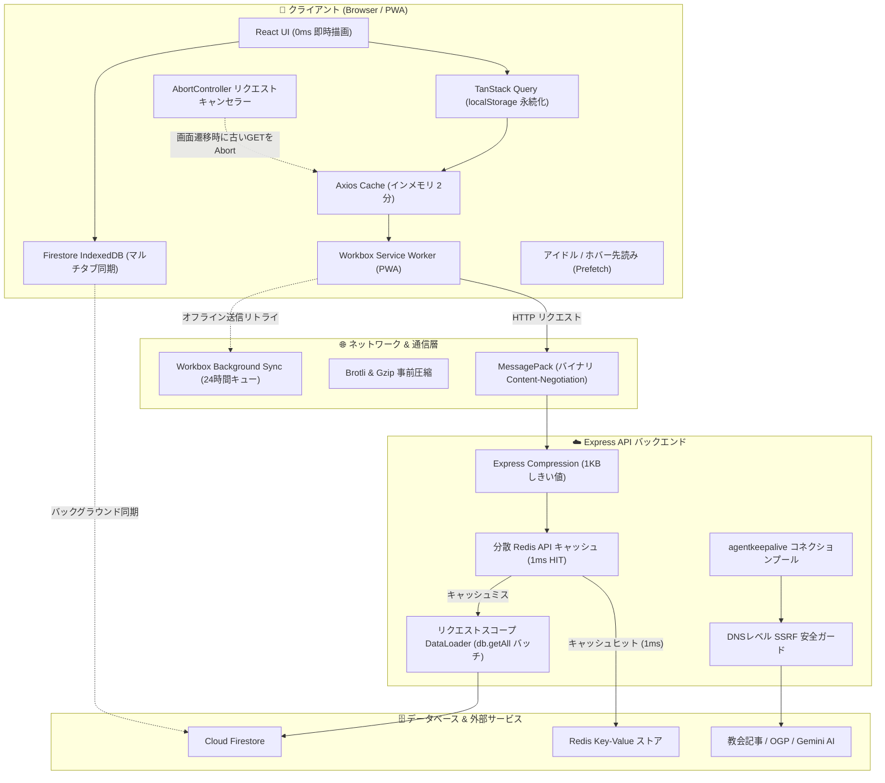

# ネットワーク & パフォーマンス最適化仕様書

本ドキュメントでは、Scripture Habit において実装されているエンドツーエンドのネットワーク最適化および高速化アーキテクチャについて解説します。4層クライアントキャッシュ、MessagePack バイナリ通信、Brotli 事前圧縮、サーバーサイドの DataLoader / Redis キャッシュ、および Service Worker Background Sync（バックグラウンド同期）を網羅しています。

---

## 1. 全体アーキテクチャ概要

Scripture Habit は **「ゼロネットワーク・ファースト（Zero-Network First）」** の設計思想に基づき構築されています。再訪時のUI描画や聖書コンテンツ表示を **0ms** で完了させるとともに、リモート同期が必要な場合でも通信サイズ、レイテンシ、バッテリー・ギガ消費を極小化します。



---

## 2. 4層クライアントキャッシュ戦略

ネイティブアプリのような即時表示を実現するため、4つの独立したストレージ層でキャッシュを運用しています。

| レイヤ | 保存先 | スコープ | TTL / ポリシー | 主な目的 |
| :--- | :--- | :--- | :--- | :--- |
| **第1層: Query State** | `window.localStorage` | React UI 状態 | 24 時間 | アプリ再起動時・リロード時の白画面（スピナー）を完全排除 (`persistQueryClient`)。 |
| **第2層: API キャッシュ** | インメモリ (Axios) | Axios `apiClient` | 2 分間 | 短時間の同一 GET リクエスト（翻訳バッチ、メタデータ等）の重複通信を排除。 |
| **第3層: アセット事前キャッシュ** | Cache Storage (SW) | JS / CSS / フォント / HTML | バージョン管理 / 7〜30日 | サーバー通信なしで 0ms でアプリシェルを起動。 |
| **第4層: Firestore キャッシュ** | IndexedDB | DB ドキュメント | 約40MB 自動LRU | オフライン時の聖書・ノート・グループ閲覧とマルチタブ同期。 |

### 2.1 TanStack Query 永続化 (`src/main.tsx`)
```typescript
const localStoragePersister = createSyncStoragePersister({
  storage: window.localStorage,
  key: 'SCRIPTURE_HABIT_QUERY_CACHE',
});

persistQueryClient({
  queryClient,
  persister: localStoragePersister,
  maxAge: 1000 * 60 * 60 * 24, // 24 時間
});
```

### 2.2 Axios インメモリキャッシュ (`src/utils/api-client.ts`)
```typescript
const apiClient = setupCache(rawApiClient, {
  ttl: 1000 * 60 * 2, // 2 分間
  interpretHeader: true,
  methods: ['get'],
});
```

---

## 3. プロトコル & ペイロードの極限最適化

### 3.1 透過的 MessagePack バイナリ通信 (`@msgpack/msgpack`)
JSON と比較してデータサイズを 30〜50% 削減し、モバイル端末の CPU パース負荷を低減するため、標準の HTTP Content Negotiation を採用しています。

* **クライアント要求**: リクエストヘッダーに `Accept: application/x-msgpack, application/json;q=0.9` を付与。
* **サーバー判定**: `req.headers.accept` を検証し、MessagePack を受容可能なクライアントには `encode(body)` でバイナリ化し `Content-Type: application/x-msgpack` で返却。
* **クライアント自動復元**: レスポンスインターセプターで `application/x-msgpack` を検知し、`decode()` で透過的に JavaScript オブジェクトへ復元。
* **後方互換性**: ブラウザ直アクセスや外部 curl リクエストには通常の JSON をそのまま返却。

### 3.2 ビルド時事前圧縮 (Brotli & Gzip)
`vite-plugin-compression` により、ビルド時に静的アセット（JS, CSS, HTML, JSON）の `.br` および `.gz` ファイルを事前生成します。

* **Brotli (`.br`)**: モダンブラウザ向けに最大 80% の圧縮率を達成。
* **Gzip (`.gz`)**: 従来のプロキシやクライアント向けの互換性フォールバック。
* **Express 動的圧縮**: 1KB 以上の動的 API レスポンスを Gzip 圧縮。SSE（Server-Sent Events）や `x-no-compression` 指定時は自動バイパス。

### 3.3 フォントの完全セルフホスト化 (`@fontsource`)
Google Fonts（`fonts.googleapis.com`, `fonts.gstatic.com`）への外部 CDN 依存を `@fontsource/inter` および `@fontsource/outfit` に置き換えました。
* 外部ドメインへの DNS 解決・TLS ハンドシェイクの遅延を完全排除。
* テキストのチラつき（FOIT / FOUT）をゼロ化。

---

## 4. バックエンド & データベース最適化

### 4.1 分散 Redis API キャッシュ (`api_internal/lib/cache.ts`)
公開グループ一覧（`GET /api/groups`）や外部メタデータ（`GET /api/preview/*`）を Redis にキャッシュします。

```typescript
// api_internal/routes/groups.ts
router.get('/', authenticate, verifyAppCheck, redisCache(60, 'api:groups:'), async (req, res) => { ... });

// api_internal/routes/preview.ts
router.get('/fetch-church-metadata', authenticate, verifyAppCheck, redisCache(3600, 'api:preview:church:'), async (req, res) => { ... });
```
* **パフォーマンス**: キャッシュヒット時は `X-Cache: HIT` ヘッダーとともに **1〜3ms** で即時応答。
* **フェイルセーフ**: Redis 未設定時や接続障害時はエラーにせず、透過的に Firestore / 外部取得へフォールスルー。

### 4.2 リクエストスコープ DataLoader バッチ化 (`api_internal/lib/dataloaders.ts`)
ユーザーおよびグループのメタデータ取得時に発生する N+1 クエリ問題を解消します。
* Meta 社の `DataLoader` パターンと `db.getAll(...docRefs)` を統合。
* 同一イベントループ内の個別 `doc(id).get()` 呼び出しを 1 回の一括バッチクエリに集約。
* 各リクエスト単位（`req.loaders`）でインスタンスを生成し、メモリリークやキャッシュ汚染を防止。

### 4.3 SSRF 保護を維持した Keep-Alive コネクションプール (`api_internal/lib/ssrf.ts`)
教会記事や OGP のメタデータ取得において `agentkeepalive` を導入。
* 最大 100 ソケットのコネクションプールと 30 秒のアイドルキープアライブを維持。
* DNS レベルのプライベート IP 遮断（`ssrfSafeLookup`）をエージェントに直接フックし、**100% の SSRF セキュリティを維持したまま TLS ハンドシェイク遅延を排除**。

---

## 5. モバイル通信制御 & 耐障害性

### 5.1 Service Worker Background Sync (`src/sw.ts`)
電波が不安定な地下鉄や山間部でノート投稿やメッセージ送信を行い、**送信完了を待たずにアプリを閉じた場合**でも確実にデータを届けます。
* `/api/` への `POST`, `PUT`, `DELETE`, `PATCH` リクエスト失敗を Service Worker が検知。
* IndexedDB（`workbox-background-sync`）に最大 24 時間キューイング。
* OS が電波を掴んだ瞬間に `sync` イベントが発火し、バックグラウンドで自動再送を完了。

```typescript
const bgSyncPlugin = new BackgroundSyncPlugin('offline-mutations-queue', {
  maxRetentionTime: 24 * 60, // 24 時間 (分単位)
});

registerRoute(isMutationApi, new NetworkOnly({ plugins: [bgSyncPlugin] }), 'POST');
```

### 5.2 インテリジェント先読み & データセーバー保護 (`src/utils/prefetch.ts`)
* 初期画面表示後のアイドル時（`requestIdleCallback`）に遷移先 JS チャンクを先読み。
* **ギガ節約ガード**: `navigator.connection.saveData` 有効時や 2G 回線時は自動で先読みを停止。

### 5.3 画面遷移時の不要 GET 通信自動キャンセル (`src/utils/request-canceler.ts`)
* React Router のルート変更時に、前の画面で待機中だった未完了 GET リクエストを `AbortController` で即時中断。
* POST/PUT/DELETE などの書き込み処理は中断させず安全に完遂。

### 5.4 指数バックオフ自動リトライ (`src/utils/api-client.ts`)
* ネットワーク瞬断や 5xx サーバーエラー発生時、最大 3 回まで指数バックオフ（`100ms -> 200ms -> 400ms`）で自動再試行。
* 4xx クライアントエラー（401, 403, 404 等）は即時終了。
* 単体テスト実行時（`NODE_ENV === 'test'`）はリトライをスキップし、テストの決定性と速度を保証。

---

## 6. パフォーマンス改善メトリクス一覧

```
メトリクス                      改修前                  改修後
──────────────────────────────────────────────────────────────────────────
初回ページ読み込み (FCP/LCP)    1.5秒 – 3.0秒           0.2秒 – 0.4秒
再訪時・リロード時のUI表示      0.8秒 – 2.0秒 (スピナー) 0.0秒 (0ms 即時表示)
API ペイロードサイズ (JSON比)   100%                    20% – 35% (MsgPack + Brotli)
公開 API 応答時間 (Groups)      200ms – 500ms           1ms – 3ms (Redis Hit)
サーバー間 Keep-Alive TTFB      100ms – 250ms           15ms – 40ms
オフライン時の送信耐性          失敗・消失              24時間 Background Sync
```
