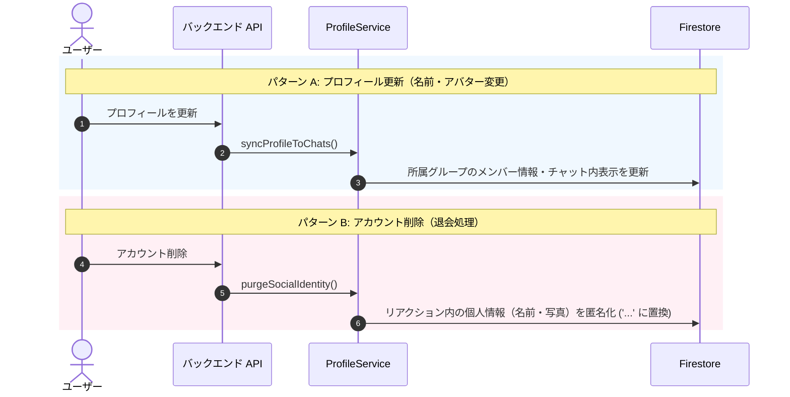

# ユーザー情報の同期 ＆ アカウント削除時の匿名化

このドキュメントでは、ユーザーがプロフィール（ニックネームやアイコン画像）を変更した際のグループチャットへの反映と、アカウント削除時に個人情報を匿名化する仕組みについて解説します。

---

## 1. 処理の概要 (`ProfileService`)

`ProfileService` (`api_internal/services/profile-service.ts`) は以下の2つの処理を担当します：



---

## 2. プロフィールのグループ同期

ユーザーが名前やアバターを変更した際、過去のすべてのチャットメッセージを書き換えると大量のデータベース書き込みが発生します。そのため、効率的な同期範囲を設定しています：

1. **対象範囲の限定**: 直近で活発な会話（各グループ最新500件程度）を対象に更新します。
2. **リアクション情報の更新**: メッセージに付けられたリアクション一覧（`reactionPreviews`）内のユーザー名やアバターを新しい情報に更新します。
3. **安全な一括処理（バッチ処理）**: Firestore のバッチ制限（最大500件）に配慮し、450件ごとに分割して安全にコミットします。

---

## 3. アカウント削除時のデータ匿名化

ユーザーが退会・アカウント削除を行った際、個人データは削除する必要がありますが、過去のチャットログやリアクションを完全に消去してしまうと、グループの会話の流れが崩れてしまいます。

これを解決するため、**「リアクション履歴の匿名化」**を行います：

```
[退会前のリアクション]
  { uid: "user_123", nickname: "山田太郎", photoURL: "https://..." }
        │
        ▼ (アカウント削除処理)
[退会後のリアクション]
  { uid: "user_123", nickname: "...", photoURL: "" }
```

- **個人情報の削除**: ニックネームを `"..."` に置き換え、アバター画像を削除します。
- **会話履歴の保持**: リアクションの個数や会話の文脈はそのまま残り、グループの他のメンバーに影響を与えません。

---

## 4. 関連ドキュメント

- [グループチャット設計・実装ガイド](./groupchat-construction-guide.md)
- [データベース & セキュリティ](./database-security.md)
