# ユーザー情報の同期 ＆ アカウント削除時の匿名化

::: tip インタラクティブ・アーキテクチャツアー
この機能のデータフローとステップ解説ツアーを体験できます：
- **オンライン（GitHubブラウザプレビュー）**: [インタラクティブツアーを開く (プロファイル & 設定編集)](https://htmlpreview.github.io/?https://github.com/ScriptureHabit/scripture-habit/blob/main/docs/public/architecture-tour.html?tour=tour-profile&lang=ja)
- **VitePress / ローカル**: [プロファイル & 設定編集 の解説ツアーを開く](/architecture-tour.html?tour=tour-profile&lang=ja)
:::

このドキュメントでは、プロフィール（表示名やアバター画像）更新時のグループチャットへの差分同期と、アカウント削除（退会）時におけるソーシャルデータの匿名化処理について解説します。

---

## 1. 処理の概要 (`ProfileService`)

`ProfileService` (`api_internal/services/profile-service.ts`) は、プロフィール更新に伴う同期と退会時のデータパージを統括します。

```mermaid
sequenceDiagram
    autonumber
    actor User as ユーザー
    participant API as バックエンド API
    participant PS as ProfileService
    participant DB as Cloud Firestore

    rect rgb(30, 41, 59)
        Note over User,DB: パターン A: プロフィール更新 (表示名・アバター変更)
        User->>API: プロフィール更新リクエスト
        API->>PS: syncProfileToChats() を呼び出し
        PS->>DB: 所属グループのメンバー情報 ＆ リアクションプレビューを一括更新
    end

    rect rgb(15, 23, 42)
        Note over User,DB: パターン B: アカウント削除 (退会処理)
        User->>API: アカウント削除リクエスト
        API->>PS: purgeSocialIdentity() を呼び出し
        PS->>DB: メッセージリアクション内の個人識別情報を匿名化 ('...' に置換)
    end
```



### シーケンスの解説

1. **プロフィール更新の差分同期（パターン A）**  
   ユーザーが表示名やアバターを変更した際、所属グループのメンバー一覧および直近メッセージのリアクション表示をバッチ処理で同期します。
2. **退会時の社会的アイデンティティ匿名化（パターン B）**  
   アカウント削除時、過去のチャットスレッドの文脈を壊さずにプライバシーを保護するため、リアクション内の名前とアバター画像 URL をマスキングします。

---

## 2. プロフィールのグループ同期

全履歴の書き換えによる過剰なデータベース負荷を避けるため、効率的な更新境界を設けています。

1. **更新対象の局所化**: 直近のアクティブな会話（各グループ最新 500 件程度）に限定して更新。
2. **リアクションプレビューの同期**: メッセージに付与されたリアクション配列（`reactionPreviews`）内のユーザー情報を更新。
3. **安全なバッチ分割**: Firestore の制限（最大 500 件）を考慮し、450 件単位で分割コミットを実行。

---

## 3. アカウント削除時のデータ匿名化

退会時に過去ログやリアクションを物理削除すると、会話の脈絡が崩壊します。このため、**「ソーシャルデータの匿名化（Masking）」**を実施します。

```
[退会前のリアクション]
  { uid: "user_123", nickname: "山田太郎", photoURL: "https://..." }
        │
        ▼ (アカウント削除処理)
[退会後のリアクション]
  { uid: "user_123", nickname: "...", photoURL: "" }
```

- **個人識別情報の消去**: ニックネームを `"..."` に置換し、アバター画像 URL を消去。
- **スレッド文脈の保持**: リアクション数や投稿記録の構造は維持され、他メンバーの表示体験を損ないません。

---

## 4. 関連ドキュメント

- [グループチャット設計・実装ガイド](./groupchat-construction-guide.md)
- [データベースとセキュリティ](./database-security.md)
