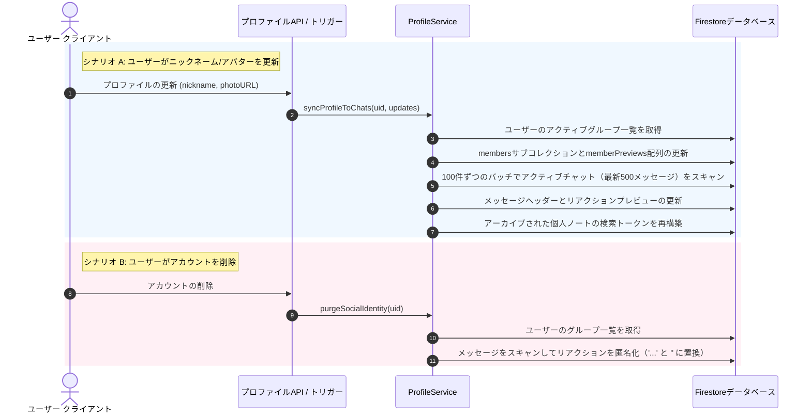

# ユーザープロファイル同期＆アカウント削除パイプライン

このドキュメントでは、ユーザープロファイルの変更（ニックネームやアバターの更新など）がグループチャットに同期される仕組み、およびアカウント削除時に個人データが匿名化される仕組みについて説明します。

---

## 🏗️ コアアーキテクチャの概要

システムは、サーバーレスの **`ProfileService`** (`api_internal/services/profile-service.ts`) によって管理されており、主に次の2つのワークフローを処理します。
1. **プロファイルの同期**: プロファイルの更新（ニックネームとアバター写真）をアクティブなグループ環境と検索インデックスに伝播します。
2. **ソーシャルアイデンティティの消去（パージ）**: ユーザーがアカウントを削除した際、チャットのリアクションから個人のメタデータを削除します。これにより、個人データを保持することなくチャット履歴を維持できます。



---

## ⚡ プロファイル同期エンジン

ユーザーがプロファイルの詳細を変更したとき、他のメンバーに正しい名前やアバターが表示されるように、グループチャット内で変更を更新する必要があります。しかし、すべての過去のチャットログを更新することは速度が遅く、コストも高くつきます。

これを解決するために、`syncProfileToChats` は**アクティブホライズン（Active Horizon）**ポリシーを適用します。

### 1. アクティブチャットのターゲット選定
グループ内のすべてのメッセージを更新する代わりに、エンジンは範囲を制限します。
- **最大制限**: グループごとに**最新の500メッセージ**のみをスキャンします。
- **ページネーション**: `createdAt` を降順でソートし、**100ドキュメント**ずつのチャンクでメッセージを読み込みます。
- **早期終了（Early Exit）**: チャンクにユーザーからのメッセージが含まれていない場合、データベースのコストを削減するために同期を早期に停止します。

### 2. チャットリアクションプレビューの同期
Firestoreのメッセージは、追加のデータベースクエリを実行せずに即座にリアクションを表示するために `reactionPreviews` マップをキャッシュします。
```json
{
  "reactionPreviews": {
    "👍": [
      { "uid": "user_abc", "nickname": "John Doe", "photoURL": "https://..." }
    ]
  }
}
```
更新スキャン中に、サービスはこのキャッシュを更新します。
1. `reactionPreviews` 内の各絵文字をループ処理します。
2. ユーザーの `uid` に一致するリアクションアイテムを特定します。
3. その特定のリアクションアイテム内のキャッシュされた `nickname` と `photoURL` を更新します。
4. 更新されたメッセージドキュメントを保存します。

### 3. 検索インデックスの再構築
各個人ノートには、オートコンプリート用の接頭辞（プレフィックス）文字列の `searchTokens` 配列が含まれています。ユーザーのニックネームは `speaker` の下に保存されます。
ユーザーがニックネームを更新したとき：
1. エンジンは、ユーザーの個人 `notes` サブコレクションを100件ずつのチャンクでスキャンします。
2. 各ノートに対して `buildNoteSearchTokens` ヘルパーを呼び出し、検索プレフィックスを再作成します。
3. これにより、「話者で検索」機能の正確性が維持されます。

---

## 🧹 ソーシャルアイデンティティの消去（匿名化）

ユーザーがアカウントを削除するとき、個人データは削除される必要があります。しかし、彼らのチャットメッセージやリアクションを削除してしまうと、会話の流れが壊れてしまいます。

`purgeSocialIdentity` エンジンは、**ソーシャルな対話を匿名化**することでこれを解決します。

```
[アクティブメッセージのリアクションプレビュー]
  👍 リアクション: { uid: "user_123", nickname: "Alice Smith", photoUrl: "https://alice.jpg" }
                │
                ▼ (アカウント削除 / ソーシャルアイデンティティの消去がトリガーされる)
  👍 リアクション: { uid: "user_123", nickname: "...", photoUrl: "" }
```

### 匿名化の手順
1. **アクティブグループの確認**: 削除されたユーザーのプロファイルを読み込み、所属していたアクティブなグループを特定します。
2. **リアクションのスキャン**: それらのグループ内のすべてのメッセージをループ処理します。
3. **データマスキング**:
   - 削除されたユーザーの `uid` に属するリアクションプレビューを特定します。
   - ユーザーの個人 `nickname` をプレースホルダー（`"..."`）に置き換えます。
   - `photoURL` を空の文字列（`""`）にクリアします。
4. **データの整合性**:
   - リアクション数は変更されません。
   - 他のユーザーのリアクションは影響を受けません。
   - リアクションの詳細に個人データは保持されません。

---

## 📦 バッチ管理とパフォーマンス

Firestoreのレート制限エラーやサーバーレス関数のタイムアウトを防ぐため、エンジンは**バッチセーフガード（Batching Safeguards）**を使用します。

* **Firestoreの制限**: Firestoreはバッチ操作を500回の書き込みに制限しています。
* **450書き込みバッファ**: サービスは1バッチあたり**450操作のバッファ**（`currentBatchSize >= 450`）で動作します。
* **自動コミット**: バッファ制限に達すると、バッチがコミットされ、リセットされて新しいトランザクションを開始します。
* **削除時のしきい値**: 削除処理は負荷が高いため、ソーシャルアイデンティティ消去のバッチはレイテンシを低く維持するために、より低い制限である**90操作**でコミットされます。
