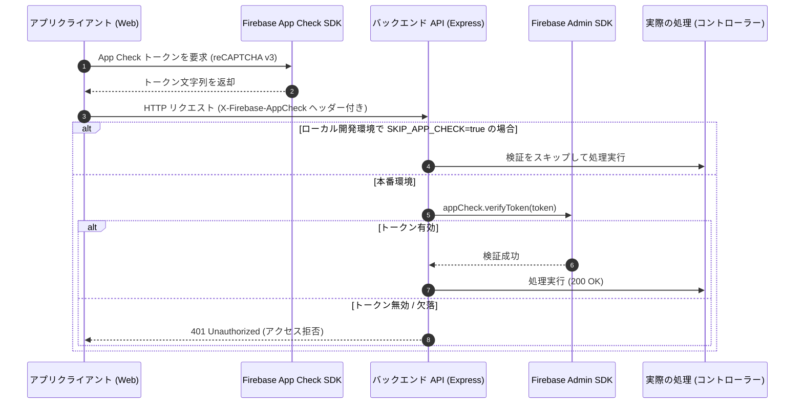

# App Check ＆ API 保護アーキテクチャ

このドキュメントでは、ボットや不正なクライアントからのアクセスを防ぐための **Firebase App Check** の導入、多重防御モデル、および各エンドポイントの保護方針について解説します。

---

## 1. 2層の多重防御モデル

悪意あるアクセスやリソースの過度な消費を防ぐため、2つの境界でセキュリティチェックを実施しています：

```
リクエスト ──► [ 第1層: API ゲートウェイ ] ──► [ 第2層: データベースルール ] ──► データ保存
                 - Express ミドルウェア           - firestore.rules
                 - verifyAppCheck (App Check)     - isAuthenticated()
                 - レート制限 (express-rate-limit)
```

1. **第1層（API ゲートウェイ）**:
   AI翻訳や外部メタデータ取得など、サーバーリソースを消費する処理を実行する前に、正規のアプリ（Web/モバイル）からのアクセスであるかを App Check で検証します。
2. **第2層（データベースルール）**:
   万が一 API を経由せずに Firestore へ直接アクセスされた場合でも、セキュリティルールにより不正な読み書きをブロックします。

---

## 2. App Check 検証の流れ (`verifyAppCheck`)



---

## 3. 環境別の設定とテスト時の扱い

- **本番環境 (`production`)**:
  App Check トークンの検証が必須です。環境変数でスキップ（`SKIP_APP_CHECK=true`）が設定されていた場合でも、セキュリティアラートをログ出力してリクエストを遮断します。
- **ローカル開発環境 (`development`)**:
  `.env.local` に `SKIP_APP_CHECK=true` を設定することで、トークン発行をバイパスして快適に開発できます。
- **E2E テスト (Playwright)**:
  Firebase の Debug Token（テスト用トークン）をブラウザに注入して自動テストを実行します。

---

## 4. 保護対象エンドポイント一覧

| カテゴリ | エンドポイント | 保護する主な理由 |
| :--- | :--- | :--- |
| **AI サービス** | `/api/ai/translate`, `/api/ai/generate-personal-weekly-recap` | 高額な LLM トークン消費・スパムの防止 |
| **ノート・学習** | `/api/notes`, `/api/messages/post-note` | 不正なストリーク加算やノートスパムの防止 |
| **グループ操作** | `/api/groups/join-group`, `/api/groups/regenerate-invite-code` | 定員オーバーや招待コードへの総当たり攻撃防止 |
| **URLプレビュー** | `/api/preview/fetch-church-metadata` | SSRF 悪用や外部スクレイピングの防止 |

---

## 5. 関連ドキュメント

- [Firebase セキュリティルール](./firebase-security-rules.md)
- [API 設計 & エラーハンドリング](./api-middleware-error-handling.md)
- [全体アーキテクチャ](./architecture.md)
