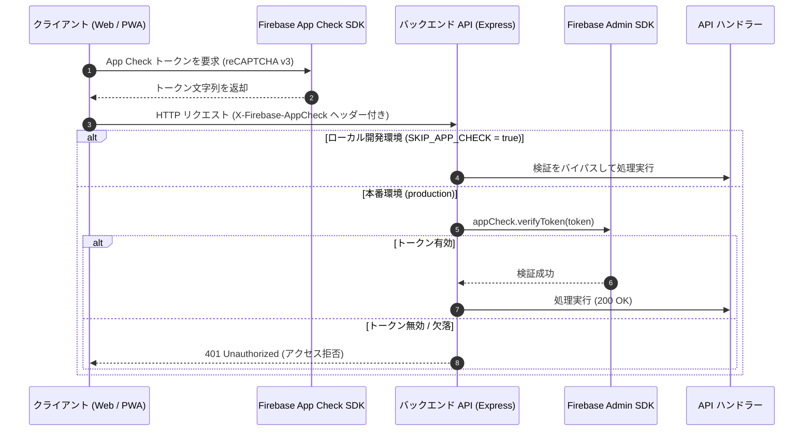

# App Check ＆ API 保護アーキテクチャ

このドキュメントでは、不正なクライアントやボットからのアクセスを防ぐための **Firebase App Check** による多重防御モデル、トークン検証パイプライン、および各エンドポイントの保護方針について解説します。

---

## 1. 2層の多重防御モデル

悪意あるアクセスやリソースの枯渇攻撃を防ぐため、2つの境界で多重防御を実施しています。

```
リクエスト ──► [ 第1層: API ゲートウェイ ] ──► [ 第2層: データベース層 ] ──► データ保存
                 - Express ミドルウェア           - firestore.rules
                 - verifyAppCheck (App Check)     - isAuthenticated()
                 - レート制限 (express-rate-limit)
```

1. **第1層（API ゲートウェイ）**  
   AI 翻訳や外部メタデータ取得など、サーバーリソースを消費する処理を実行する前に、正規のアプリ（Web / モバイル）からのリクエストであることを App Check で検証します。
2. **第2層（データベースルール）**  
   万が一 API を経由せずに Firestore へ直接アクセスが試みられた場合でも、セキュリティルールにより不正な読み書きを確実に遮断します。

---

## 2. App Check 検証の流れ (`verifyAppCheck`)



### シーケンスの解説

1. **クライアントでのトークン取得**  
   ブラウザ上の Firebase App Check SDK が reCAPTCHA v3 と連携してトークンを取得し、`X-Firebase-AppCheck` HTTP ヘッダーに付与してバックエンドへ送信します。

2. **サーバーサイドでの厳格な検証**  
   Express の `verifyAppCheck` ミドルウェアがヘッダーからトークンを抽出し、Firebase Admin SDK を通じて署名と有効期限を検証します。

3. **不正リクエストの早期遮断**  
   トークンが欠落しているか無効である場合、後続のビジネスロジックを実行する前に即座に `401 Unauthorized` を返却し、サーバー負荷と API コストを抑えます。

---

## 3. 環境別の設定とテスト時の扱い

- **本番環境 (`production`)**  
  App Check トークンの検証が必須です。本番環境で万が一 `SKIP_APP_CHECK=true` が設定されていた場合でも、セキュリティアラートを出力してリクエストを安全に遮断します。
- **ローカル開発環境 (`development`)**  
  `.env.local` に `SKIP_APP_CHECK=true` を設定することで、トークン検証をバイパスして迅速に開発を進めることができます。
- **E2E テスト (Playwright)**  
  Firebase の Debug Token（テスト専用トークン）をブラウザコンテキストに注入し、自動テストを実行します。

---

## 4. 保護対象エンドポイント一覧

| カテゴリ | エンドポイント | 保護の目的 |
| :--- | :--- | :--- |
| **AI サービス** | `/api/ai/translate`, `/api/ai/generate-personal-weekly-recap` | LLM トークンの不正消費およびスパム呼び出しの防止 |
| **ノート・学習** | `/api/notes`, `/api/messages/post-note` | 不正な学習日数の加算やノートスパムの防止 |
| **グループ操作** | `/api/groups/join-group`, `/api/groups/regenerate-invite-code` | 定員超過の参加や招待コードへの総当たり攻撃防止 |
| **URL プレビュー** | `/api/preview/fetch-church-metadata` | SSRF 攻撃の悪用や外部スクレイピングの踏み台化防止 |

---

## 5. 関連ドキュメント

- [Firebase セキュリティルール](./firebase-security-rules.md)
- [API 設計とエラー処理](./api-middleware-error-handling.md)
- [全体アーキテクチャ](./architecture.md)
