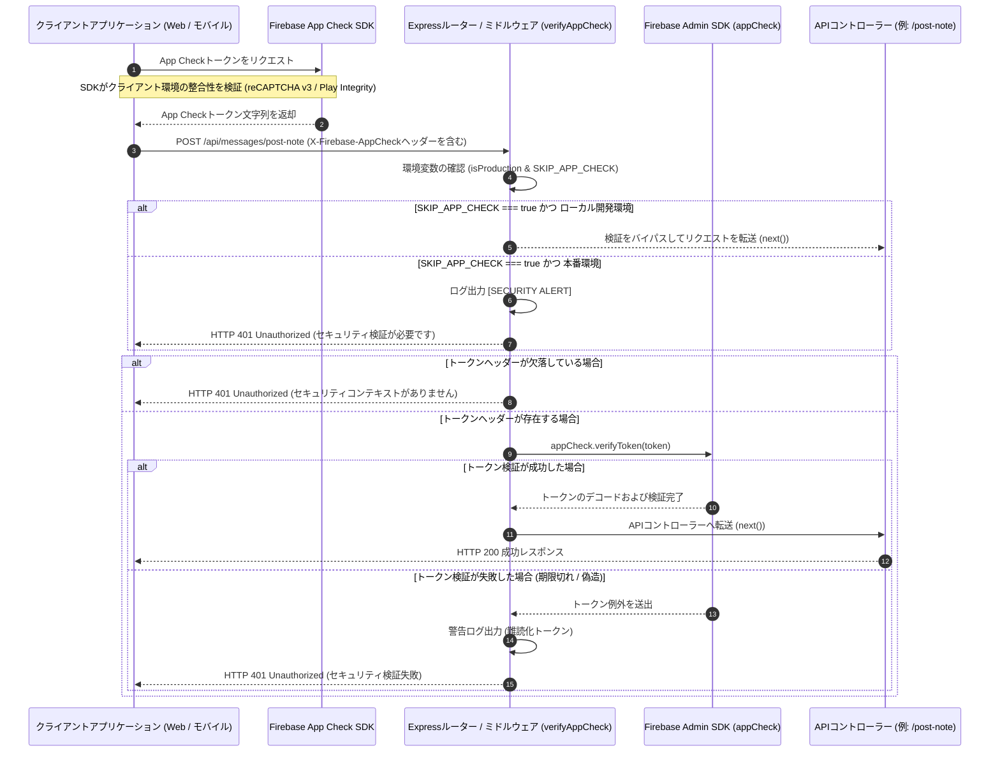

# App Check & API 保護アーキテクチャ

スパム、スクレイパー、サービス拒否（DDoS）攻撃、および不正なAPIクライアントからバックエンドリソースを保護するため、**scripture-habit** は **Firebase App Check** をゲートウェイガードとして統合しています。

App Checkは、AI翻訳、グループ作成、メタデータの解析などの高負荷な処理を実行する前に、受信したHTTPリクエストがアプリケーションの実インスタンス（Webまたはモバイル）からのものであるかを検証します。

---

## 🛡️ セキュリティモデル: 2層の保護体制

私たちのアーキテクチャは**多重防御（Defense-in-Depth）**戦略を採用しています。セキュリティは2つの異なる境界で検証されます。**APIゲートウェイレイヤー**（本ドキュメント）と、**データベースセキュリティルールレイヤー**です。

```
受信したリクエスト ──► [ ティア1: APIミドルウェア ] ──► [ ティア2: データベースルール ] ──► データのコミット
                       - Express ルーター                  - firestore.rules
                       - verifyAppCheck                 - isAuthenticated()
                       - globalLimiter                  - isAppCheckVerified()
                       (本ドキュメント)                   (firebase-security-rules.md を参照)
```

1. **ティア1 (APIゲートウェイ - 本ドキュメント)**: リソース消費の激しいエンドポイントや外部API（Gemini AI、プッシュ通知、Webページスクレイパーなど）を保護します。このゲートウェイは、クラウドサーバーのリソースが消費される前に、無効なリクエストやスパムリクエストをブロックします。
2. **ティア2 (データベースレイヤー)**: Firestoreセキュリティルールが直接フォールバックとして機能します。ユーザーがクライアントSDKを使用してFirestoreに直接書き込みを行うことでExpress APIをバイパスしようとした場合、データベースレイヤーが書き込みをブロックします。（[Firebaseセキュリティルールと書き込み分離](firebase-security-rules.md) を参照）。

---

## 🛡️ App Checkゲートウェイのフロー

App Checkは、バックエンドルーターパイプラインの最前線でインターセプターミドルウェアとして機能します。



---

## 🔒 セキュリティゲートウェイとミドルウェアの実装

コアロジックは、`api_internal/lib/middleware.ts` 内の `verifyAppCheck` ミドルウェア関数に実装されています。

### 1. 検証ロジック
```typescript
export const verifyAppCheck = async (req: Request, res: Response, next: NextFunction) => {
    const isProduction = process.env.NODE_ENV === 'production';
    const skipRequested = process.env.SKIP_APP_CHECK === 'true';

    // 1. Strict Production Lockdown
    if (skipRequested) {
        if (isProduction) {
            console.error('[SECURITY ALERT] SKIP_APP_CHECK is enabled in production! This is forbidden.');
            return res.status(401).json({ error: 'Unauthorized: Security check required' });
        }
        console.warn('[AppCheck] Skipping verification (Development only)');
        return next();
    }

    // 2. Extract Token
    const token = req.header('X-Firebase-AppCheck');
    if (!token) {
        console.warn('[AppCheck] Security context missing from:', req.ip);
        return next(new AppError('Unauthorized: Security context missing', 401, 'APP_CHECK_MISSING'));
    }

    // 3. Verify via Firebase Admin SDK
    try {
        if (!appCheck) {
            throw new Error('Firebase App Check service is unavailable.');
        }
        await appCheck.verifyToken(token);
        next();
    } catch (err: unknown) {
        const error = err as Error;
        // Obfuscate the token in logs to protect user privacy
        console.warn('[AppCheck] Verification failed for token:', token.substring(0, 10) + '...', 'Error:', error.message);
        return next(new AppError('Unauthorized: Security check failed', error.message.includes('unavailable') ? 503 : 401, 'APP_CHECK_FAILED'));
    }
};
```

---

## ⚙️ 環境別戦略とテスト用バイパス

自動テストやローカル開発環境でセキュリティチェックを実行するには、柔軟なセットアップが必要です。

### 1. ローカル開発時のバイパス
開発者が署名済みのアプリトークンを生成することなく、ローカルでAPIのコードを作成しテストできるようにします。
* **設定**: `.env.local` に `SKIP_APP_CHECK=true` を追加します。
* **保護措置**: ミドルウェアは、`NODE_ENV === 'production'` の場合に App Check のスキップ要求を検出すると、重大度の高い `[SECURITY ALERT]` ログを記録し、`HTTP 401` でリクエストを遮断します。

### 2. 統合テストおよびエンドツーエンド（E2E）テスト (Vitest / Playwright)
* **Vitest**: 統合テスト中、バックエンドテスト（例: `api_internal/routes/groups.integration.test.ts`）は自動的に `SKIP_APP_CHECK=true` が設定された環境で実行されます。
* **Playwright**: ブラウザE2Eテストでは、Firebaseが提供する **App Check Debug Provider** を使用します。E2E環境ではブラウザコンテキストにデバッグトークンが注入され、App Checkはこれをテストデバイスとして検証します。

---

## 🚦 保護対象の API インベントリ

状態を変更するルートや高負荷なルートの多くは、`verifyAppCheck` ミドルウェアによって保護されています。以下は、このゲートウェイによって保護されているルートの一覧です。

| カテゴリ | エンドポイント | 保護されるアクション | 保護の理由 |
| :--- | :--- | :--- | :--- |
| **認証** | `POST /api/auth/update-profile` | ユーザーのニックネームや設定を変更する。 | データベースへの大量のスパム送信を防止する。 |
| | `POST /api/auth/verify-login` | ユーザーセッションの解決。 | セッション解決ゲートウェイのセキュリティ保護。 |
| **習慣ループ** | `POST /api/messages/post-note` | 聖句ノートを送信し、ストリークを更新し、レベルを増加させる。 | ストリークの偽造やノートのスパム送信を阻止する。 |
| | `POST /api/messages/toggle-reaction` | メッセージの絵文字リアクションを切り替える。 | 自動化されたリアクションの大量送信を防止する。 |
| **グループ管理** | `POST /api/groups/create-group` | 新しいスタディグループを設定する。 | 無駄なグループ作成によるリソースの枯渇や肥大化を防ぐ。 |
| | `POST /api/groups/regenerate-invite` | 招待コードの無効化と更新を行う。 | トークンの枯渇をブロックする。 |
| **AI連携** | `POST /api/ai/translate` | LLM翻訳ジョブを実行する。 | LLMトークンの高額な利用コストから保護する。 |
| | `POST /api/ai/generate-ponder-questions` | 振り返り用の質問の生成をLLMに要求する。 | LLMの請求額急増を防止する。 |
| **スクレイパー** | `GET /api/preview/fetch-church-metadata` | 外部のWebページコンテンツを取得する。 | SSRFプロキシを悪用したサードパーティによるスクレイピングを阻止する。 |
