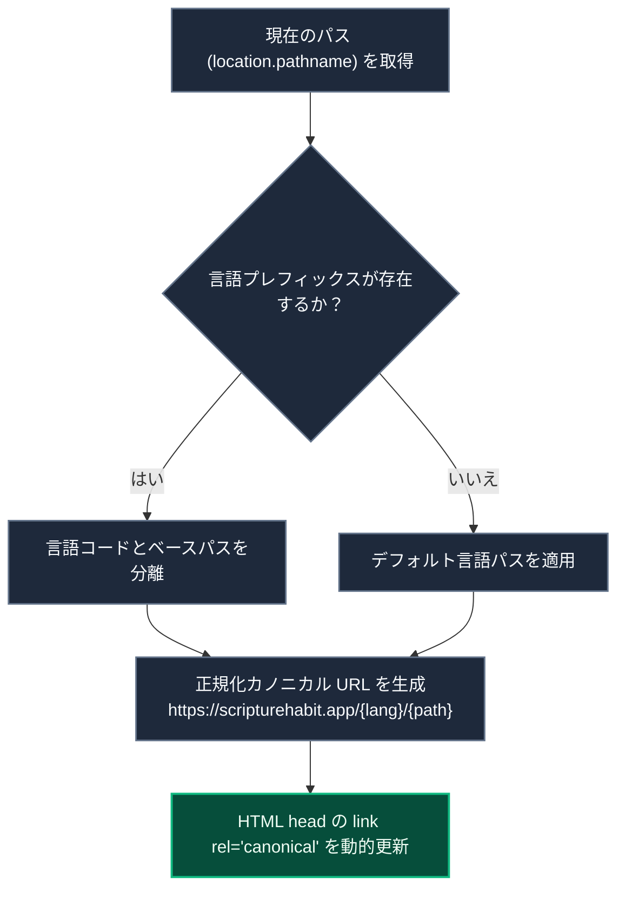

# SEO ＆ メタデータ管理

> [!TIP]
> **インタラクティブ・アーキテクチャツアー**: [ブラウザでツアーを開く (SEO & OGPメタタグ管理)](https://htmlpreview.github.io/?https://github.com/ScriptureHabit/scripture-habit/blob/main/docs/public/architecture-tour.html?tour=tour-seo&lang=ja)

このドキュメントでは、多言語カノニカル（正規化）URL の動的解決、非公開画面の検索除外設定（Robots 設定）、SNS 共有用 OGP 管理、およびビルド時事前ローカライズについて解説します。

---

## 1. カノニカル (Canonical) URL の動的解決

言語プレフィックス（`/ja/...`、`/en/...`）を含む URL において、検索エンジンの重複コンテンツ判定を防ぐため、`SEOManager` (`src/components/seo-manager.tsx`) が動的に `<link rel="canonical">` を設定します。

### 解決フローの解説

1. **パスとロケールの解析**  
   React Router の現在地を取得し、パス冒頭の言語コードを抽出します。
2. **正規化 URL の組み立て**  
   プロトコル、ドメイン、ロケール、および末尾スラッシュを統一した標準 URL を生成します。
3. **DOM への動的注入**  
   ルート遷移ごとに `document.head` のカノニカルリンクタグを同期的に更新します。

---

## 2. 検索エンジンからのプライベート画面の保護 (Robots 設定)

個人の学習ノートやグループチャットの会話が検索エンジンにインデックスされないよう、画面ごとに `robots` メタタグを動的に切り替えます。

| 画面カテゴリ | 対象パスの例 | インデックス許可 | 設定内容 |
| :--- | :--- | :---: | :--- |
| **パブリック画面** | `/`, `/privacy`, `/terms` | **◯ 許可** | `index, follow` (検索流入を促進) |
| **ダッシュボード** | `/dashboard`, `/welcome` | **✖ 除外** | `noindex, nofollow` (個人画面の保護) |
| **認証画面** | `/login`, `/signup` | **✖ 除外** | `noindex, nofollow` (ログイン画面の保護) |
| **グループ・チャット** | `/group/*`, `/join/*` | **✖ 除外** | `noindex, nofollow` (チャットログ・名簿の保護) |
| **マイノート・設定** | `/my-notes`, `/profile`, `/settings` | **✖ 除外** | `noindex, nofollow` (個人データの保護) |

---

## 3. SNS 共有時の OGP・Twitter カード表示

LINE、Slack、X（旧 Twitter）等でリンクが共有された際、適切なタイトル・説明文・サムネイルが表示されるよう、言語設定に応じたメタタグ（`og:title`, `og:description`, `og:image` 等）を出力します。

---

## 4. クローラー向けビルド時事前ローカライズ

JavaScript を実行しないボットやクローラー向けに、ビルド時に言語別の静的 HTML（`index-ja.html` 等）を事前生成しています。
- **事前生成スクリプト (`scripts/localize-meta.ts`)**: ビルド時に各言語の翻訳文を埋め込んだ HTML テンプレートを生成。
- **サーバーリライト (`vercel.json`)**: `/ja/...` へのアクセスを自動的に `index-ja.html` へルーティングし、初回ロード時から正しい言語のメタデータを返却。

---

## 5. 関連ドキュメント

- [全体アーキテクチャ](./architecture.md)
- [多言語対応 (i18n)](./logic-i18n.md)
- [ネットワーク & パフォーマンス最適化](./network-performance-optimization.md)
