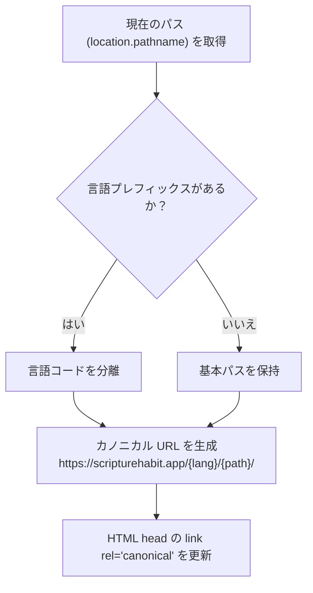

# SEO ＆ メタデータ管理

このドキュメントでは、多言語カノニカル URL の解決、プライベート画面の検索除外設定（Robots 設定）、SNS 共有用 OGP の管理、およびビルド時の事前ローカライズについて解説します。

---

## 1. カノニカル (Canonical) URL の解決

言語コード（`/ja/...`、`/en/...`）を含む URL でも、検索エンジンが正規のページを正しく認識できるように、`SEOManager` (`src/components/seo-manager.tsx`) が動的に `<link rel="canonical">` を設定します。

---

## 2. 検索エンジンからのプライベート画面の保護 (Robots 設定)

プライベートな学習記録やグループチャットの会話が検索結果にインデックスされないよう、画面ごとに `robots` メタタグを動的に切り替えます：

| 画面カテゴリ | 対象パスの例 | インデックス許可 | 設定内容 |
| :--- | :--- | :---: | :--- |
| **パブリック画面** | `/`, `/privacy`, `/terms` | **◯ 許可** | `index, follow` (検索流入を促進) |
| **ダッシュボード** | `/dashboard`, `/welcome` | **✖ 除外** | `noindex, nofollow` (個人画面の保護) |
| **認証画面** | `/login`, `/signup` | **✖ 除外** | `noindex, nofollow` (ログイン画面の保護) |
| **グループ・チャット** | `/group/*`, `/join/*` | **✖ 除外** | `noindex, nofollow` (チャットログ・名簿の保護) |
| **マイノート・設定** | `/my-notes`, `/profile`, `/settings` | **✖ 除外** | `noindex, nofollow` (個人データの保護) |

---

## 3. SNS 共有時の OGP・Twitter カード表示

LINE、Slack、X（旧Twitter）などでリンクが共有された際、適切なタイトル・説明文・サムネイルが表示されるよう、言語設定に応じたメタタグ（`og:title`, `og:description`, `og:image` 等）を出力します。

---

## 4. クローラー向けビルド時事前ローカライズ

JavaScript を実行しない検索エンジンのクローラーや SNS ボット向けに、ビルド時に言語別の HTML（`index-ja.html` 等）を事前生成しています：
- **事前生成スクリプト (`scripts/localize-meta.ts`)**: ビルド時に各言語の翻訳文を埋め込んだ HTML テンプレートを生成。
- **サーバーリライト (`vercel.json`)**: `/ja/...` へのアクセスを自動的に `index-ja.html` へルーティングし、初回ロード時から正しい言語のメタデータを返却。

---

## 5. 関連ドキュメント

- [全体アーキテクチャ](./architecture.md)
- [多言語対応 (i18n)](./logic-i18n.md)
- [ネットワーク & パフォーマンス最適化](./network-performance-optimization.md)
