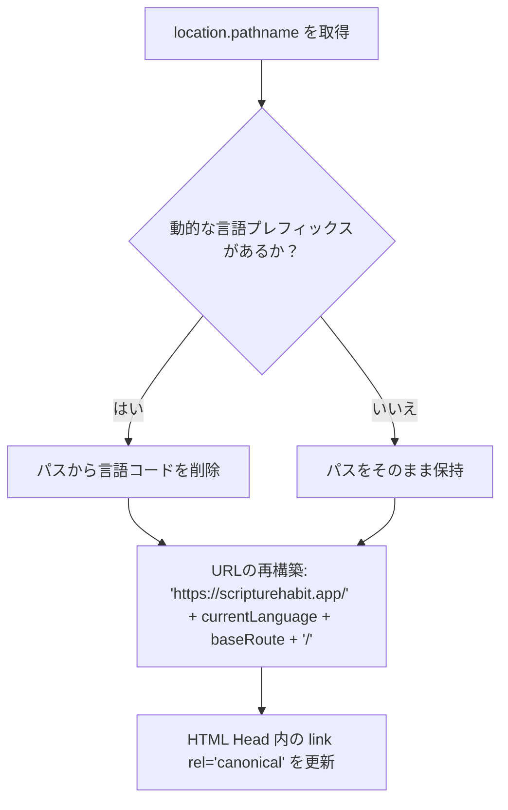

# SEO と OGP 動的メタデータ管理

このドキュメントでは、**SEO & OGP Dynamic Meta Manager** コンポーネント（`src/components/seo-manager.tsx`）によって管理されるルーティング構造、メタデータの同期、およびインデックス設定について説明します。

このコンポーネントは、複数の言語にわたって検索エンジンの掲載順位とリッチメディアのプレビュー表示（Open Graph）を維持します。

---

## 1. 多言語ルートとカノニカル (Canonical) URL の解析

クライアント側のシングルページアプリケーション（SPA）において、特にルートの先頭に動的な言語コード（例: `/ja/...`、`/en/...`）が付加される場合、検索エンジンに対して正しいカノニカル（優先）パスを生成することは非常に重要です。

### ルート正規化のフロー
1. **抽出**: コンポーネントは React Router（`useLocation().pathname`）から現在のルートを取得します。
2. **プレフィックスの照合**: パスを分割し、`SUPPORTED_LANGUAGES` に登録されている言語プレフィックスがあるか確認します。
3. **カノニカル URL の生成**:
   * 論理的なWebパス（例: `/dashboard`）を抽出します。
   * アクティブな言語に合わせて、ローカライズされた標準的なカノニカル URL を再構築し、重複を避けるために末尾にスラッシュが追加されるようにします：
     `https://scripturehabit.app/{language}{normalizedPath}/`
   * ドキュメントの `<link rel="canonical" href="...">` 要素を動的に更新します。



---

## 2. Robots とインデックス設定（プライバシー保護）

プライベートなWebアプリにおけるSEOの最も重要な側面の1つは、**検索エンジンからプライベートなページを除外すること**です。

`SEOManager` は、ドキュメントの head に挿入される robots メタタグを管理し、公開ページと非公開ページを分類します。

| ルートパラメータ | 対象パスの例 | インデックス対象？ | Robots ディレクティブ | 根拠 / 目的 |
| :--- | :--- | :--- | :--- | :--- |
| **パブリックコア** | `/`, `/privacy`, `/terms`, `/legal` | **はい** | `index, follow` | オーガニックトラフィックを促進し、公的な法的利用規約を維持する。 |
| **ユーザーポータル** | `/dashboard`, `/welcome` | **いいえ** | `noindex, nofollow` | アクティブなポータルや空の動的状態がキャッシュされるのを防ぐ。 |
| **認証画面** | `/login`, `/signup`, `/forgot-password` | **いいえ** | `noindex, nofollow` | 登録エンドポイントや空白ページの露出を防ぐ。 |
| **グループ / ソーシャル** | `/group/*`, `/join/*` | **いいえ** | `noindex, nofollow` | プライベートな学習ログや参加者の名簿一覧を保護する。 |
| **個人スペース** | `/profile`, `/my-notes`, `/settings` | **いいえ** | `noindex, nofollow` | ユーザー特有のデータをスクレイピングエンジンから厳格に隔離する。 |

### 動的ディレクティブの適用
マネージャーはプライマリルートを解析します。ルートが非公開である場合、ヘッダーを以下のように更新します：
```typescript
robotsTag.setAttribute('content', 'noindex, nofollow');
```
公開向けのルートである場合は、以下を適用します：
```typescript
robotsTag.setAttribute('content', 'index, follow');
```

---

## 3. ソーシャルメディアプレビュー（OGP と Twitter カード）

Slack、Facebook、LINE、Twitter などのプラットフォームでリンクが共有された際にサムネイル画像が正しく表示されるように、ソーシャルメタデータをリアルタイムで同期します。

### 同期されるメタデータプロパティ
ルートが変更されたり翻訳が更新されたりするたびに、マネージャーは `useLanguage` によって翻訳された値を読み取り、DOM に書き込みます：

1. **ドキュメントタイトル (`document.title`)**:
   * ローカライズされたブランディング用の接尾辞を追加します（例: `ダッシュボード | Scripture Habit` や `ログイン | Scripture Habit`）。
   * `og:title` および `twitter:title` に自動的に反映されます。
2. **メタデータ説明 (`meta[name="description"]`)**:
   * アクティブなローカライズ済みの値（`t('seo.description')`）を評価し、`description`、`og:description`、`twitter:description` に入力します。
3. **Google 検索向けのサイト名最適化 (`og:site_name`)**:
   * Google は、検索結果におけるプロダクト名の表示方法を決定するために特定のメタデータを使用します。
   * 正しいブランディングを保証するため、`SEOManager` は `Scripture Habit` を宣言する `og:site_name` タグを注入します。
4. **カノニカル URL の配置合わせ (`og:url`)**:
   * ローカライズされたカノニカル URL と同期させることで、ソーシャルメディアのクローラーが標準の多言語ページへ共有を誘導するようにします。
