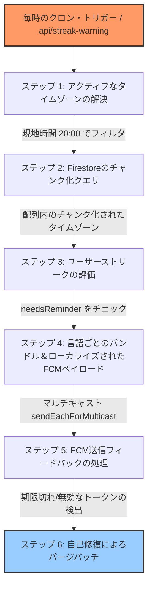

# タイムゾーンを考慮したローカルストリーク通知システム

> [!WARNING]
> **一時的な無効化**: この機能は2026年5月28日時点で一時的に無効化（ロジックのコメントアウト）され、モック統計を返すバイパス状態になっています。再有効化するには、[`cron.ts`](../../scripture-habit/api_internal/routes/cron.ts) 内のバイパスブロックを削除し、[`cron.integration.test.ts`](../../scripture-habit/api_internal/routes/cron.integration.test.ts) と [`streak-warning.integration.test.ts`](../../scripture-habit/api_internal/streak-warning.integration.test.ts) 内のスキップされた統合テストを復元してください。

世界中のユーザーをサポートするため、Scripture Habitにはタイムゾーンを考慮したストリークリマインダーエンジン（`api_internal/lib/streak-reminder.ts` および `cron.ts` 内の `/api/streak-warning`）が備わっています。

単一のUTC時間ですべてのユーザーに一斉に通知を送信するのではなく、システムは毎時バックグラウンドチェックを実行して、**現地時間の午後8:00（20:00）**に達したタイムゾーンを検出し、その日の学習をまだ終えていないユーザーに対してローカライズされたプッシュ通知を送信します。

---

## 🏗️ アーキテクチャの概要

リマインダー処理は、毎時のクロン（Cron）トリガー、タイムゾーン計算用の `Intl` API、チャンク化された Firestore クエリ、および通知配信用に Firebase Cloud Messaging (FCM) を使用します。



---

## ⏰ タイムゾーンの評価と日付の計算

`StreakReminderEngine` のコアロジックは、タイムゾーンのオフセットとその日の完了ステータスを決定します。

### 1. アクティブなタイムゾーンの検索
（サマータイムの変更時に失敗する）静的なオフセットを使用する代わりに、システムはネイティブの JavaScript Internationalization API を使用します。
1. `Intl.supportedValuesOf('timeZone')` を使用して、すべての標準的なグローバルタイムゾーンを取得します。
2. タイムゾーンごとに、ローカライズされた24時間形式のフォーマッタを作成します。
   ```typescript
   const formatter = new Intl.DateTimeFormat('en-US', {
       timeZone: tz,
       hour: 'numeric',
       hour12: false
   });
   ```
3. 現在のUTC時間をフォーマットします。現地時間がちょうど `20`（現地時間の午後8時）である場合、そのタイムゾーンがターゲットリストに追加されます。
4. 深夜のフォーマット値（一部のエンジンでは `24` としてレンダリングされる）は `0` に正規化されます。

### 2. タイムゾーンを考慮した完了チェック
特定のタイムゾーンのユーザーがすでに学習を完了しているかどうかを確認するため、`needsReminder` は日付の比較を実行します。
1. 現在のUTC時間を、`sv-SE` フォーマット（`YYYY-MM-DD` を返却）を使用してユーザーのローカルタイムゾーンの日付に変換します。
2. この日付文字列を、ユーザーの `lastPostDate`（投稿タイムゾーンに基づいて `YYYY-MM-DD` として保存されているもの）と比較します。
3. **評価**:
   - `lastPostDate === localizedToday` の場合、ユーザーはすでに本日投稿しています。`false` を返し、リマインダーは不要と判断されます。
   - 一致しない場合、ユーザーは投稿していません。`true` を返し、リマインダーが必要と判断されます。

---

## 🚦 Firestoreのチャンク化クエリ

Firestoreは、`where(field, 'in', Array)` クエリを最大 **10個の配列要素** に制限しています。任意の時間帯に午後8時に達するアクティブなタイムゾーンのリストは10個を超えることが多いため、サービスはクエリを分割（パーティショニング）します。

- **分割（パーティショニング）**: アクティブなタイムゾーンのリストは、それぞれ10個の要素を持つ配列に分割されます。
- **並行クエリ**: バックエンドは、各チャンクに対して並行して Firestore の読み込みを実行し、`timeZone in [tz_chunk]` かつ `hasFcmToken == true` であるユーザーを検索します。
- **重複排除**: 結果を結合し、リマインダーが必要なユーザーの単一のリストを作成します。

---

## 💬 ローカライズされたプッシュ通知

ターゲットユーザーが見つかると、システムは遅延を削減するために配信を最適化します。

### 1. 言語ごとのグループ化
通知を1つずつ送信するのを避けるため、システムはユーザーを希望の言語コード（例: 英語は `'en'`、日本語は `'ja'`）でグループ化します。

### 2. 翻訳（`t()` ヘルパー）
各言語グループについて、サーバーは通知テキストを翻訳します。
- **タイトル**: `t(lang, 'notifications.streak_warning_title')`
- **本文（ボディー）**: `t(lang, 'notifications.streak_warning_body')`

### 3. マルチキャスト送信
プッシュ通知は、1回の呼び出しで最大500個のトークンを受け入れる `messaging.sendEachForMulticast` を使用して送信されます。グループのトークンが500個を超える場合は、自動的に複数の500トークンのバッチにチャンク分割されます。

---

## 🩹 古くなったトークンのクリーンアップ（自己修復）

アプリがアンインストールされたり、トークンが期限切れになったりすると、データベースに「ゴーストトークン」が残ります。これらのトークンに通知を送信しようとすると、システム全体の速度が低下します。

`/api/streak-warning` エンドポイントは、送信結果（フィードバック）を使用してこれらを自動的にクリーンアップします。

1. **ステータスチェック**: Firebase Admin SDKは、各トークンを成功/失敗のステータスにマッピングする詳細なレスポンス配列を返します。
2. **エラー検出**: プッシュ送信が失敗した場合、システムは以下のエラーコードをチェックします。
   - `messaging/invalid-registration-token`
   - `messaging/registration-token-not-registered`
3. **ユーザーの解決**: 失敗したトークンのインデックスから、対応するユーザーの Firestore ドキュメント ID (`uid`) を特定します。
4. **トークンの削除**: Firestoreのバッチ処理により、`admin.firestore.FieldValue.arrayRemove` を使用して、ユーザーのトークンサブコレクション（`users/{uid}/private/tokens/fcmTokens`）から無効なトークンを削除します。
5. **バッチ制限**: トークンの削除は、一度に最大 **400回の書き込み操作** という安全なチャンクでコミットされます。

> [!IMPORTANT]
> **安全チェック**: クリーンアップ後にユーザーの有効な FCM トークンが残っていない場合、システムは将来の冗長なルックアップ（クエリ）を防ぐため、公開用のユーザードキュメントを `hasFcmToken = false` に更新します。
