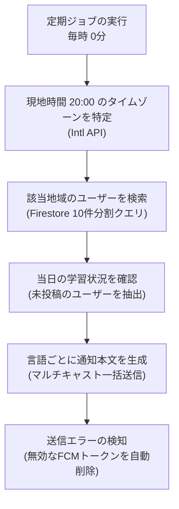

# タイムゾーン対応のリマインダー通知システム

このドキュメントでは、世界各地のユーザーの現地時間に合わせて夜間にリマインダー通知を送信する仕組み（`api_internal/lib/streak-reminder.ts`）について解説します。

---

## 1. 処理の流れ

全ユーザーに一斉送信するのではなく、1時間ごとの定期ジョブで「現地時間の夜20:00」を迎えたタイムゾーンを検出し、その日の学習が未完了のユーザーに通知を送信します。

---

## 2. タイムゾーンと学習状況の判定

### ① 20:00 のタイムゾーン特定
サマータイム（夏時間）の変化にも自動対応するため、Node.js の `Intl.supportedValuesOf('timeZone')` を使って現在時刻が20時台となっているタイムゾーンを動的に割り出します。

### ② 本日の学習判定
サーバー時刻ではなくユーザーのタイムゾーン基準の「今日の日付（YYYY-MM-DD）」を生成し、ユーザーの最終投稿日（`lastPostDate`）と比較します。まだ今日投稿していないユーザーのみを通知対象とします。

---

## 3. 効率的な配信とFirestoreクエリ

- **10件ずつの分割クエリ**: Firestore の `in` クエリ制限（最大10要素）に対応するため、該当タイムゾーンを10件ずつのチャンクに分割して並行取得します。
- **言語別の一括送信**: 言語ごとにグループ化し、FCM の `sendEachForMulticast` を使って最大500件ずつ一括配信します。

---

## 4. 無効な通知トークンの自動整理

アプリのアンインストールなどで無効になったトークン（`messaging/registration-token-not-registered` 等）は、配信時のエラーレスポンスを検知して自動的にデータベースから削除されます。

---

## 5. 関連ドキュメント

- [プッシュ通知システム](./feature-notifications.md)
- [定期メンテナンスジョブ (Cron)](./maintenance-cron.md)
- [ノート投稿 & ストリーク計算](./logic-note-posting.md)
