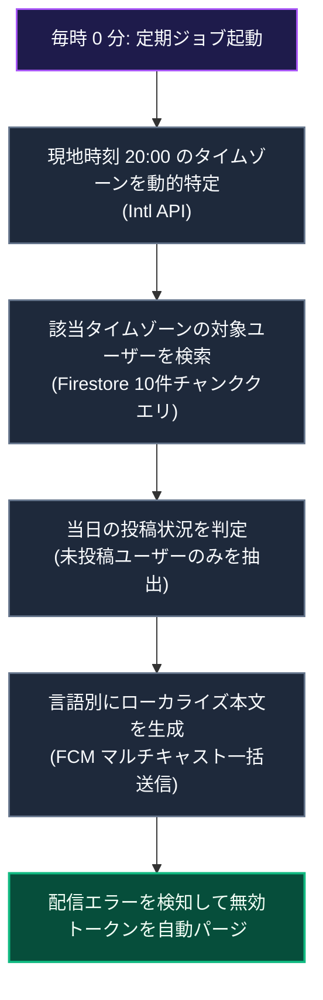

# タイムゾーン対応のリマインダー通知システム

このドキュメントでは、世界各地のユーザーの現地時刻（夜 20:00）に合わせてストリークリマインダー通知を送信するパイプライン（`api_internal/lib/streak-reminder.ts`）について解説します。

---

## 1. 処理の流れ

一斉送信を排し、1 時間ごとの定期ジョブで「現地時刻 20:00」を迎えたタイムゾーンを検出し、当日の学習が未完了のユーザーへ段階的に配信します。

### パイプラインの解説

1. **タイムゾーンの動的抽出**  
   Node.js の `Intl` API を用い、サーバー時刻から現在 20:00 台にある IANA タイムゾーン群を抽出します（夏時間に自動対応）。
2. **チャンク分割による並行検索**  
   Firestore の `in` 演算子制限（最大 10 件）に合わせ、タイムゾーン配列を 10 件ずつ分割して並行クエリを実行します。
3. **当日未投稿のフィルタリング**  
   ユーザーの現地日付（`YYYY-MM-DD`）と `lastPostDate` を照合し、本日未完了のユーザーのみを抽出します。
4. **多言語一括配信とトークンパージ**  
   ユーザーの言語設定ごとに文面をグループ化し、FCM マルチキャストで一括送信します。無効化したトークンはエラーを捕捉して即時パージします。

---

## 2. タイムゾーンと学習状況の判定

### ① 20:00 のタイムゾーン特定
`Intl.supportedValuesOf('timeZone')` を走査し、現地時刻の「時」が `20` であるタイムゾーンを動的に割り出します。

### ② 現地日付に基づく学習判定
サーバーの UTC 時刻ではなくユーザーの現地タイムゾーン基準で今日の日付文字列を生成し、`lastPostDate` と比較することで、時差による誤送信を防ぎます。

---

## 3. クエリと配信の最適化

- **10件ずつの分割クエリ**: Firestore の制約を遵守し、対象タイムゾーン群を 10 件ずつの配列に分割して並行検索。
- **言語別マルチキャスト**: 言語ごとにメッセージペイロードをまとめ、`sendEachForMulticast` により最大 500 件単位で送信。

---

## 4. 無効な通知トークンの自動パージ

アンインストール等で無効化したトークン（`messaging/registration-token-not-registered` 等）は、配信エラーレスポンスから自動的に抽出し、データベースから安全に削除します。

---

## 5. 関連ドキュメント

- [プッシュ通知システム](./feature-notifications.md)
- [定期メンテナンスジョブ (Cron)](./maintenance-cron.md)
- [ノート投稿 & ストリーク計算](./logic-note-posting.md)
