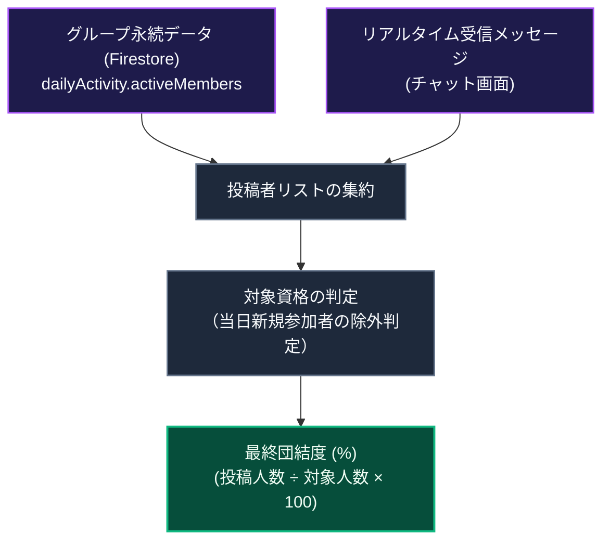
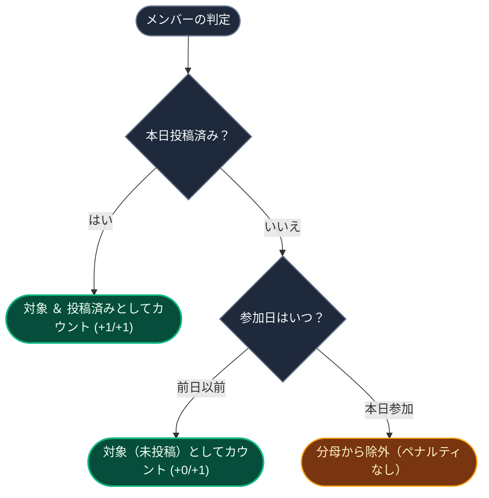

# 団結度（Unity）の計算と同期の仕組み

> [!TIP]
> **インタラクティブ・アーキテクチャツアー**: [ブラウザでツアーを開く (グループチャット & 団結力)](https://htmlpreview.github.io/?https://github.com/ScriptureHabit/scripture-habit/blob/main/docs/public/architecture-tour.html?tour=tour-groupchat&lang=ja)

このドキュメントでは、グループメンバー全体の当日の学習達成度を表す指標**「団結度（Unity Percentage）」**の算出ロジックとリアルタイム同期について解説します。

---

## 1. 団結度（Unity）の基本概念

団結度は、**「本日ノート投稿対象となっているメンバーのうち、実際に投稿を完了した人の割合（％）」**を指します。

個人間の順位争いを排し、「チーム全体で目標を達成できたか」を可視化することで、協力的な習慣形成を促進します。

### 算出パイプラインの解説

1. **データソースの二重集約**  
   サーバー側の公式記録（`group.dailyActivity`）と、チャット画面で受信したリアルタイムメッセージ（`isNote: true`）を合成し、即時性を担保します。
2. **公平な対象資格判定**  
   メンバーごとの参加日時と当日の投稿有無を照合し、不公平なパーセンテージ低下を防ぎます。
3. **達成率の算出**  
   分母（対象メンバー数）と分子（投稿完了メンバー数）からパーセンテージを導出し、UI へ描画します。

---

## 2. リアルタイム表示を支える2つのデータソース

1. **サーバー側の記録 (`group.dailyActivity`)**  
   Firestore のグループ親ドキュメントに記録されている、本日投稿済みの公式 UID リスト。
2. **チャットのリアルタイムメッセージ (`Message[]`)**  
   画面表示中に受信したメッセージ群。`isNote: true` を持つメッセージが含まれる場合、サーバーデータの更新を待たずに投稿済みとして即時カウントします。

---

## 3. 計算対象（分母）の公平なルール

不公平なパーセンテージ低下を防ぐため、新規参加者に対する保護ルールを設けています。

### 対象判定フローの解説

- **本日参加して投稿済みの場合**: 対象人数（分母）と投稿人数（分子）の双方に加算されます（+1/+1）。
- **本日参加して未投稿の場合**: 未参加とはみなされず、グループの達成率を下げないよう分母から除外されます。
- **前日以前に参加していた場合**: 通常通り投稿対象（分母 +1）として集計されます。

---

## 4. タイムゾーンの扱いとゼロ除算防止

- **グループタイムゾーンの適用**: メンバーが異なる地域に居住している場合でも、グループ設定のタイムゾーン（`group.timeZone`）における日付境界（0:00〜23:59）を基準に判定します。
- **対象者 0 名の境界処理**: 全員が本日参加の未投稿者である場合など対象者が 0 名の場合は、ゼロ除算を回避して `100%` を返却します。

---

## 5. 関連ドキュメント

- [少人数グループ（最大5人）とピア・アカウンタビリティの心理学](./ux-small-groups-and-peer-accountability.md)
- [Unity 深夜リセットフック](./client-unity-midnight-reset.md)
- [グループチャット設計・実装ガイド](./groupchat-construction-guide.md)
