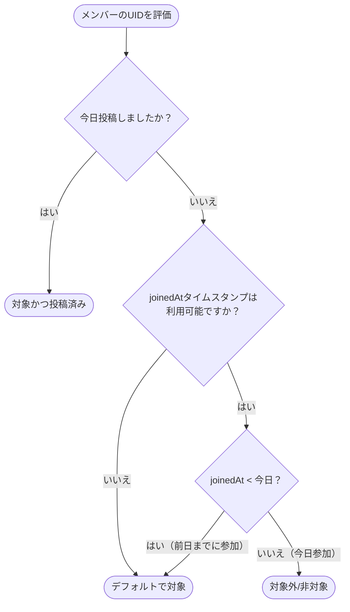

# Unity（団結度）の参加率と同期アーキテクチャ

このドキュメントでは、**Unity（団結度）** の設計、数式、データの同期、および計算について説明します。この指標は、聖典読書グループの毎日の学習完了ステータスを表します。

---

## 1. コアコンセプト

Unity（団結度）の指標は、当日に聖典スタディノートを投稿した対象グループメンバーの割合（パーセンテージ）を示します。

UIの応答性を高速に保つため、アプリは**サーバー側の履歴データ**と**クライアント側のリアルタイムメッセージ**を組み合わせて、この指標を即座に計算します。

```
       ┌───────────────────────────────┐
       │   グループドキュメント(Firestore)│
       │   - dailyActivity.activeMembers│
       └──────────────┬────────────────┘
                       │
                       │ (サーバーベース)
                       ▼
             [ getUnityParticipation() ] ◄─── (クライアント補完) ─── [ リアルタイムチャットメッセージ ]
                       │
                       ├──────────────────────────┐
                       ▼                          ▼
             [ 対象資格ルールの適用 ]        [ タイムゾーン/日付の整合性チェック ]
                       │
                       ▼
             [ 最終的なUnityパーセンテージ ]
```

---

## 2. 動的な同期（デュアルデータソース）

ユーザーがノートを投稿したときに即座に更新を表示するため、`getUnityParticipation` は2つのデータソースからアクティブな投稿者のIDを集計します。

### ソースA: サーバー側のスナップショット (`dailyActivity`)
* **場所**: ルートの `/groups/{groupId}` ドキュメントからロードされます。
* **プロパティ**: `group.dailyActivity`（`{ activeMembers: string[], date: string }` を含む）。
* **挙動**: これは、本日ノートを投稿したユーザーの公式なデータベースレコードです。ノートが送信されたときにトランザクション内で更新されます。

### ソースB: クライアント側のメッセージ (`Message[]`)
* **場所**: アクティブなグループチャット画面内で動的に取得されます。
* **挙動**: ユーザーがチャット画面を開いているときに他の誰かがノートを投稿すると、静的なグループドキュメントが更新される前に、クライアント状態に新しいメッセージが受信されます。
* **照合（レコンシリエーション）**: クライアントはこれらのリアルタイムメッセージをスキャンします。メッセージが `isNote: true` を持ち、その日付がグループのタイムゾーンにおける今日と一致する場合、送信者のUIDが即座に投稿者リストに追加され、ネットワークの遅延を回避します。

---

## 3. 対象資格ロジック（エッジケース）

公平なパーセンテージを計算するためには、誰が投稿を求められているかについてのルールが必要です。例えば、午後11時59分にグループに参加した新しいユーザーのせいで、グループのUnityパーセンテージが下がってしまうようなことは避けるべきです。

### 分母のルール
ルールは以下の通りです。
> **今日参加したメンバーは、すでにノートを投稿していない限り、必要な合計（分母）から除外されます。**

彼らがすでに今日投稿している場合は、対象（分母と分子の両方）としてカウントされます。まだ投稿していない場合は、グループの計算でペナルティ（減点）にはなりません。



### joinedAt フォールバックリゾルバー
このルールを適用するには、アプリはメンバーがいつ参加したかを知る必要があります。メンバーデータはビューごとに異なる構造になっているため、アルゴリズムは **3段階のフォールバックチェーン** を使用します。

1. **優先度 1 (Primary)**: `group.memberJoinedAt[uid]`
   * グループメタデータドキュメントに保存されているグローバルな参加日時マップ。
2. **優先度 2 (Secondary)**: `membersMap[uid].joinedAt`
   * メンバーメタデータを解決するグループチャットビュー内のローカルマップ。
3. **優先度 3 (Tertiary)**: `group.myMemberStatus.joinedAt`（現在のユーザー用）
   * サイドバーコンテキストで解析された個人メンバーのステータスオブジェクト。

3つすべての段階をチェックしても参加時間が見つからない場合、エラーを避けるためにメンバーはデフォルトで**対象（Eligible）**として扱われます。

---

## 4. タイムゾーンと日付の正規化

グループメンバーは異なる国に居住している可能性があるため、計算は**グループで指定されたタイムゾーン**（`group.timeZone`、設定されていない場合はデフォルトの `UTC`）に固定されます。

1. **日付の解析**: `formatDateInTimeZone()` を使用して、タイムスタンプをグループのタイムゾーンに一致するローカル日付文字列（`YYYY-MM-DD`）に変換します。
2. **比較**:
   * 参加日が文字列に変換されます。
   * `normalizedJoinedDate < normalizedTodayDate`（正規化された参加日 < 正規化された今日の日付）の場合、メンバーは計算対象となります。
3. **分母が空になる基本ケース**: 投稿対象となるメンバーが存在しない場合（例：今日参加してまだ投稿していない新しいメンバーだけで構成されたグループなど）、ゼロ除算を避けるため、アルゴリズムは **100% Unity** を返します。

---

## 5. 実装リファレンス

コアロジックは `src/utils/unity-utils.ts` に配置されています。

```typescript
export const getUnityParticipation = (
  group: Group | null,
  messages: Message[] = [],
  referenceDate: Date = new Date(),
  membersMap?: MembersMap
): UnityParticipation => {
  // ... コアチェック＆デュアルソース読み込み ...
  
  const eligibleMembers = uniqueMemberIds.filter(uid => {
    const isPoster = uniquePosters.has(uid);
    if (isPoster) return true; // 今日投稿済み -> カウント
    
    // 3段階のフォールバック解決
    let joinedTs = memberJoinedAt[uid] || membersMap?.[uid]?.joinedAt || group.myMemberStatus?.joinedAt;
    if (!joinedTs) return true; // デフォルトのフォールバック

    const joinedDateStr = formatDateInTimeZone(new Date(parseTimestampToMillis(joinedTs)), groupTimeZone);
    
    // 辞書順で比較: 今日より前に参加している必要がある
    return normalizeDateString(joinedDateStr) < normalizeDateString(todayStr);
  });

  const postedMembers = eligibleMembers.filter(uid => uniquePosters.has(uid));
  
  if (eligibleMembers.length === 0) return { ..., percentage: 100 };
  
  const percentage = Math.round((postedMembers.length / eligibleMembers.length) * 100);
  return { eligibleMembers, postedMembers, notPostedMembers, percentage };
};
```
