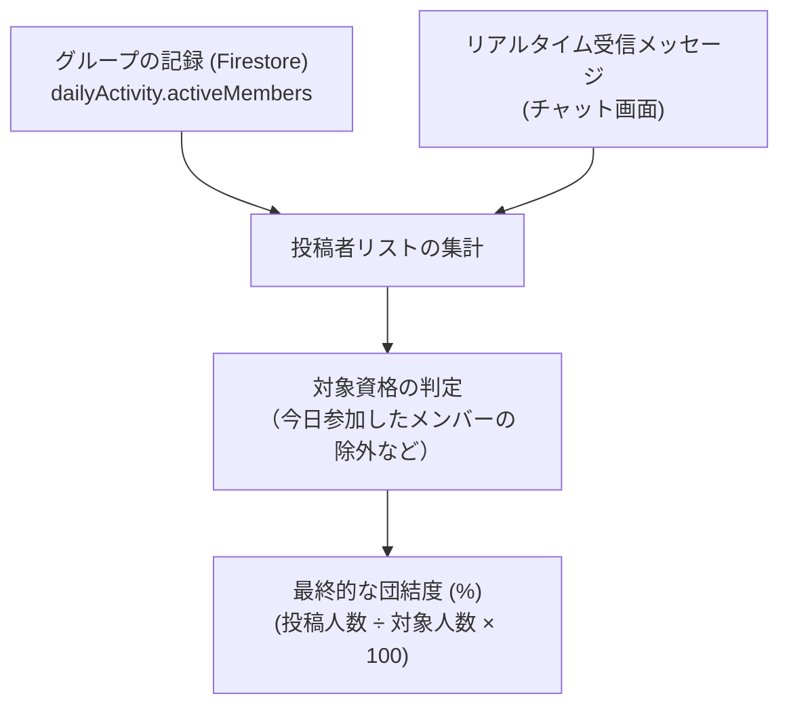
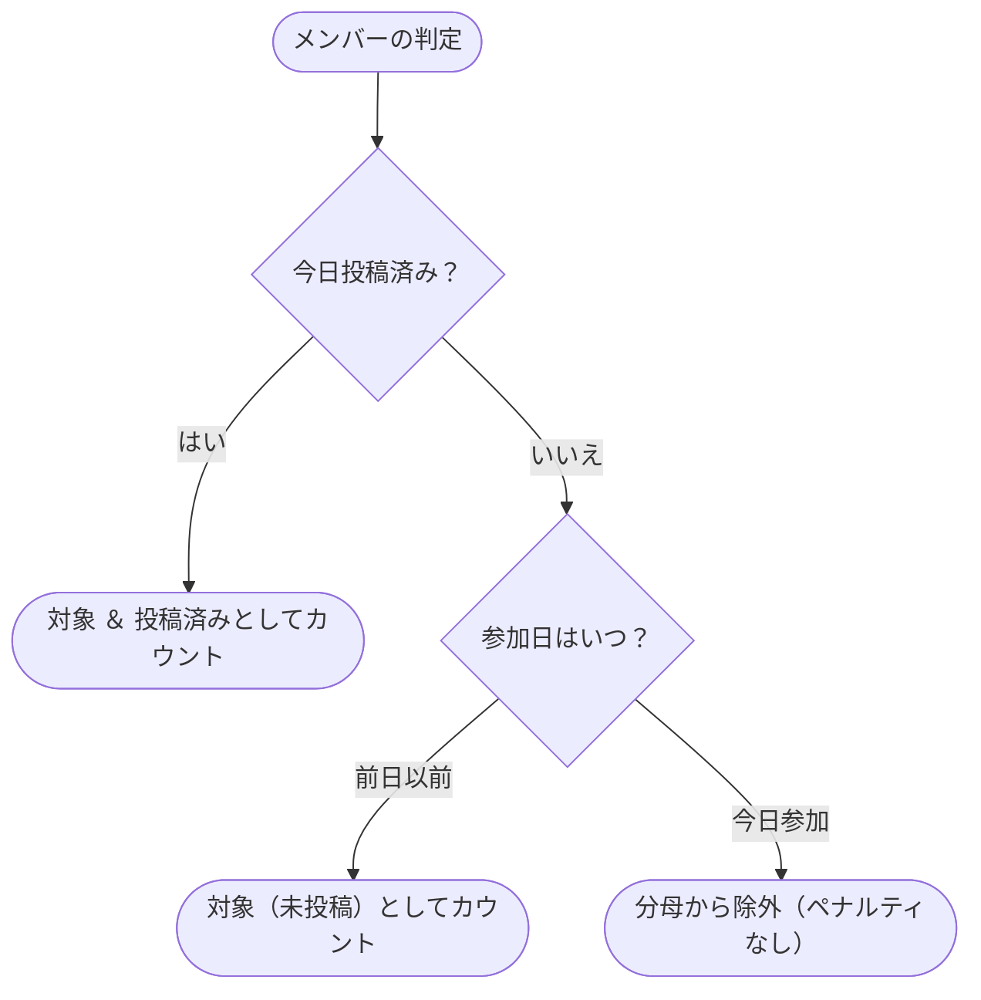

# 団結度（Unity）の計算と同期の仕組み

このドキュメントでは、グループメンバー全体の当日の学習達成度を表す指標**「団結度（Unity Percentage）」**の計算ルールとリアルタイム同期について解説します。

---

## 1. 団結度（Unity）の基本概念

団結度は、**「今日ノートを投稿する対象となっているメンバーのうち、実際に投稿した人の割合（％）」**を示します。

個人同士の順位を競わせるのではなく、「チーム全員で目標を達成できたか」を可視化することで、健全で協力的な習慣化を促します。

---

## 2. リアルタイム表示を支える2つのデータソース

画面を開いている間に他のメンバーがノートを投稿した際、即座に団結度を更新するために2つのデータを組み合わせて計算します：

1. **サーバー側の記録 (`group.dailyActivity`)**: Firestore のグループドキュメントに保存されている、本日投稿済みの公式ユーザーリスト。
2. **チャットのリアルタイムメッセージ (`Message[]`)**: 画面を開いている間に受信したメッセージ。`isNote: true` を持つメッセージがあれば、サーバーデータの更新を待たずに即座に投稿済みとしてカウントします。

---

## 3. 計算対象（分母）の公平なルール

不公平なパーセンテージ低下を防ぐため、以下の対象資格ルールを設けています：

> **今日グループに参加したばかりのメンバーは、まだノートを投稿していない場合、計算の分母（対象人数）から除外されます。**

- **今日参加してすでに投稿した場合**: 対象人数と投稿人数の両方にカウントされます（+1/+1）。
- **今日参加してまだ投稿していない場合**: 不参加として扱われず、グループの達成率を下げるペナルティにはなりません。
- **前日までに参加していた場合**: 通常通り投稿対象（分母）としてカウントされます。

---

## 4. タイムゾーンの扱いとゼロ除算防止

- **グループタイムゾーンに準拠**: メンバーが異なる地域に住んでいる場合でも、グループ設定のタイムゾーン（`group.timeZone`）における「今日（0:00〜23:59）」を基準に判定します。
- **対象者が0人の場合**: 新規参加者のみで構成されるなど対象者がいない場合は、ゼロ除算を避けて `100%` を返します。

---

## 5. 関連ドキュメント

- [少人数グループ（最大5人）とピア・アカウンタビリティの心理学](./ux-small-groups-and-peer-accountability.md)
- [Unity 深夜リセットフック](./client-unity-midnight-reset.md)
- [グループチャット設計・実装ガイド](./groupchat-construction-guide.md)
