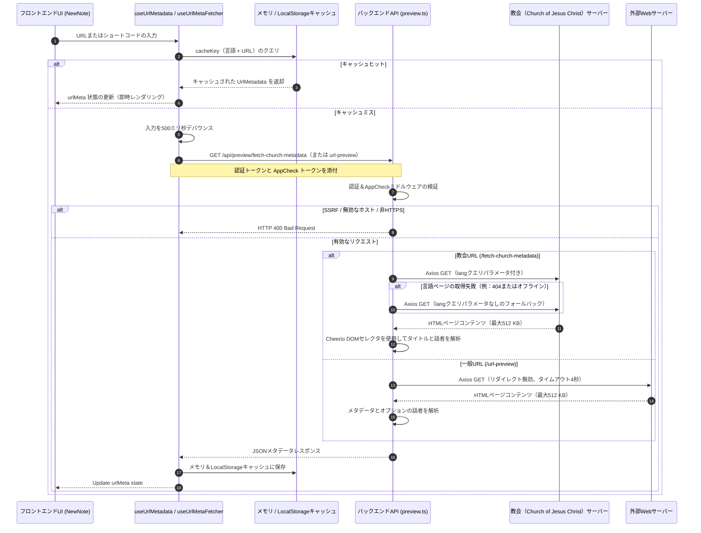

# URLメタデータ＆話者抽出

このドキュメントでは、スタディノートをより豊かにするために、アプリがURL（特に総大会、リアホナ、BYUスピーチ、およびその他のWebリンク）からページタイトルと話者/著者を抽出する方法について説明します。

---

## 🏗️ アーキテクチャの概要

メタデータ抽出は、Reactフック、キャッシュレイヤー、およびFirebaseセキュリティミドルウェアで保護された2つのバックエンドAPIエンドポイントを使用します。

---

## 🔒 セキュリティ対策

メタデータの取得では、サーバーがユーザーの代わりにHTTPリクエストを行う必要があるため、悪用を防ぐために複数のセキュリティ対策が適用されています。

1.  **Firebase Authenticationガード**:
    メタデータエンドポイントへのすべてのリクエストには、`Authorization: Bearer <Token>` ヘッダーに有効な Firebase ID トークンが含まれている必要があります。
2.  **Firebase App Checkガード**:
    自動ボットやスクレイパーからAPIルートを保護します。フロントエンドは `X-Firebase-AppCheck` ヘッダーで App Check トークンを送信します。
3.  **サーバーサイドリクエストフォージェリ（SSRF）保護**:
    -   `/fetch-church-metadata` では、厳格なホワイトリストが適用されます。ホスト名は正確に `www.churchofjesuschrist.org` または `churchofjesuschrist.org` である必要があり、プロトコルは `https:` でなければなりません。
    -   `/url-preview` では、ローカルまたはプライベートなネットワーク範囲（ループバックやプライベートサブネットなど）へのリクエストを防ぐために、入力が `isSafeUrl(url)` を介してチェックされます。
4.  **リソース制限、タイムアウト、およびリダイレクトルーティング**:
    -   **コンテンツサイズ制限**: 大規模なファイルを読み込ませるサービス拒否（DoS）攻撃を阻止するため、Axiosはダウンロードするペイロードを `512 KB` に制限しています。
    -   **タイムアウト**: サーバーのブロッキングを防ぐため、リクエストは `4000ms - 5000ms` でタイムアウトします。
    -   **コンテキストに応じたリダイレクト制限（多層SSRFガード）**:
        -   **教会メタデータ (`/fetch-church-metadata`)**: 最大 `maxRedirects: 5` まで許可します。ドメインは厳密にホワイトリストに登録されており、取得前に `churchofjesuschrist.org` であることが検証されるため、SSRFのリスクなしに標準的なリダイレクト（例：ローカライズされたサブディレクトリやショートコード変換へのルーティング）を許可しても安全です。
        -   **一般プレビュー (`/url-preview`)**: `maxRedirects: 0` を厳格に適用します。このエンドポイントは信頼できない外部のURLを処理するため、SSRF IPチェックを回避しようとする攻撃者制御のリダイレクトループを防ぐ目的で、HTTPリダイレクトはサーバーの境界で完全にブロックされます。

---

## 📡 バックエンドAPIエンドポイント (`api_internal/routes/preview.ts`)

### 1. 教会メタデータ (`/api/preview/fetch-church-metadata`)
総大会の説教やリアホナの記事などのLDSコンテンツの解析に最適化されています。

*   **URLルール**: ホストは `churchofjesuschrist.org` / `www.churchofjesuschrist.org` であり、プロトコルは `https:` である必要があります。
*   **言語パラメータ**: アプリケーションの言語コードを教会の言語パラメータに変換します（例：日本語の `'ja'` は `'jpn'` にマッピングされます）。
*   **言語フォールバック**:
    ローカライズされたページの取得に失敗した場合（例：HTTPエラーを返すなど）、システムは `lang` パラメータを削除し、それなしで再試行します。これにより、処理全体が失敗する代わりに、英語版のページやデフォルトバージョンが抽出されます。
*   **Cheerioセレクタ（DOM抽出）**:
    -   **タイトル**:
        1.  `meta[property="og:title"]` (content属性)
        2.  最初の `<h1>` 要素
        3.  `<title>` タグ
        *クリーンアップ: タイトルに `|` などのセパレータが含まれている場合（例: "タイトル | Ensign"）、最初の部分のみを保持します。*
    -   **話者/著者**:
        1.  `div.byline p.author-name`
        2.  `p.author-name`
        3.  `a.author-name`
        4.  `div.byline p`
        *クリーンアップ: 正規表現を使用して、"By"、"Par"、"De"、"Por" などの著者のプレフィックスを削除します。*
*   **失敗時の処理**: 抽出に失敗した場合は、フロントエンドのノート保存フォームが動作し続けられるよう、空の値 `{ title: '', speaker: '' }` を HTTP 200 で返します。

### 2. 一般URLプレビュー (`/api/preview/url-preview`)
一般的なウェブサイトのリンクからリッチなメタデータプレビューを抽出します。

*   **メタデータセレクタ**:
    -   **タイトル**: `og:title` $\rightarrow$ `twitter:title` $\rightarrow$ 最初の `<h1>` $\rightarrow$ `<title>`.
    -   **説明**: `og:description` $\rightarrow$ `meta[name="description"]`.
    -   **画像**: `og:image` $\rightarrow$ `twitter:image`。相対パスは絶対URLに変換されます。
    -   **ファビコン**: Googleのファビコンサービスを使用します：
        `https://www.google.com/s2/favicons?domain=${parsedUrl.hostname}&sz=64`
*   **教会URLのサポート**:
    一般的なURLが `churchofjesuschrist.org` に属している場合、話者の特定を試みます。話者が見つかった場合、タイトルの後ろにかっこ書きで追加します：`タイトル (話者)`。

---

## ⚡ フロントエンドクライアントフック

### 1. `useUrlMetadata` フック (`src/hooks/use-url-metadata.ts`)
メタデータを取得、管理、およびキャッシュするためのカスタムReactフック。

*   **2段階のキャッシュ**:
    バックエンドへのリクエストとネットワークの遅延を最小限に抑えるため、フックは以下を使用します。
    1.  **メモリキャッシュ**: アクティブなセッション中に即座にロードできるように、JavaScriptオブジェクトにメタデータを保存します。
    2.  **ローカルストレージキャッシュ**: ページの更新後も保持されるように、ブラウザのローカルストレージにメタデータを保存します。
*   **キャッシュキーのフォーマット**:
    `url_meta_${language}_${urlOrSlug}`
*   **トークンの取得**:
    リクエストを送信する前に、フックは Firebase ユーザー ID トークと Firebase App Check トークンを取得します。取得に失敗した場合、開発環境では警告をログに出力し、動作自体はエラーにせず正常に継続します。

### 2. `useUrlMetaFetcher` フック (`src/components/newnote/hooks/use-url-meta-fetcher.ts`)
ノート作成モーダル（`NewNote`）のためのインテグレーションフック。

*   **デバウンスされた入力**:
    入力後、取得リクエストを **`500ms`** 遅らせます。ユーザーが入力し続けた場合、前のリクエストはキャンセルされ、APIリクエストの数が削減されます。
*   **実行条件**:
    入力された値が有効なURLまたはショートコードであり、聖典カテゴリが `"General Conference"`（総大会）、`"BYU Speeches"`（BYUスピーチ）、または `"Other"`（その他）である場合のみ実行されます。

---

## 🧪 テストと検証

`api_internal/routes/preview.integration.test.ts` での統合テストにより、以下の挙動が検証されています。
-   **認証**: トークンなしのリクエストが `401 Unauthorized` を返すことを検証します。
-   **バリデーション**: 無効なドメインや空のパラメータが `400 Bad Request` を返すことを確認します。
-   **モック**: `vitest` を使用して `axios.get` をモックし、メタデータ解析のテスト用にカスタムHTMLページを挿入します。
-   **フォールバック**: エラー発生時に言語フォールバックメカニズムが機能することを確認します。
-   **SSRFブロック**: プライベートIP範囲（例：`http://127.0.0.1`）へのクエリの試みがブロックされることを確認します。
