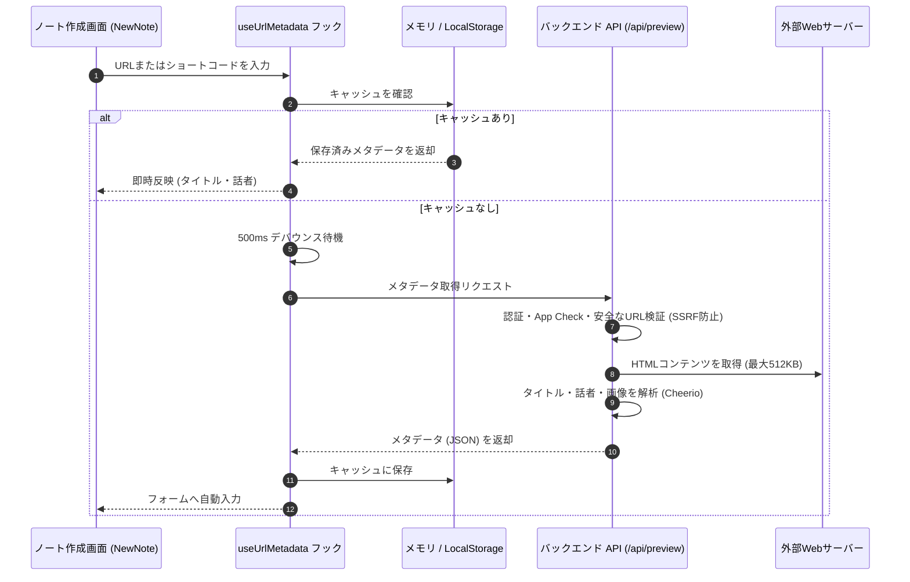

# URLメタデータ ＆ 話者抽出の仕組み

このドキュメントでは、ノート作成時にURL（総大会、リアホナ、BYUスピーチなど）を入力した際、記事タイトルや話者・著者名を自動取得する仕組みについて解説します。

---

## 1. 処理フローの概要

URLが入力されると、キャッシュ確認、デバウンス処理、セキュリティ検証を経て、サーバー側でメタデータを取得・解析します。

---

## 2. セキュリティ対策

サーバーが外部URLへアクセスする際、不正なリクエストや悪用を防ぐため以下の対策を行っています：

1. **認証とApp Check**: 有効なログインセッションとApp Checkトークンを持つリクエストのみを受け付けます。
2. **SSRF（不正アクセス）の防止**:
   - 教会公式サイト用API（`/fetch-church-metadata`）: `churchofjesuschrist.org` ドメインかつHTTPSのみに限定。
   - 一般URL用API（`/url-preview`）: ローカルIP（`127.0.0.1` やプライベートネットワーク）へのアクセスをブロック。
3. **容量制限とタイムアウト**:
   - 巨大なファイルのダウンロードを防ぐため、取得サイズを最大 `512 KB` に制限。
   - サーバーの応答待ちを防ぐため、4〜5秒でタイムアウト。

---

## 3. バックエンド API (`api_internal/routes/preview.ts`)

### ① 教会コンテンツ用 (`/api/preview/fetch-church-metadata`)
総大会の説教やリアホナ記事向けに最適化されたAPIです。
- **言語フォールバック**: 指定言語（例: `?lang=jpn`）のページ取得に失敗した場合は、言語パラメータを外して再取得を試みます（404エラーによる失敗を防止）。
- **話者・著者名のクレンジング**: "By", "Par", "De" などの接頭辞を自動で除去して名前のみを抽出します。
- **安全なエラー処理**: 解析に失敗した場合でもフォーム入力を妨げないよう、空データ（`{ title: '', speaker: '' }`）を返します。

### ② 一般Webサイト用 (`/api/preview/url-preview`)
一般的なウェブサイトから `og:title`、`og:description`、`og:image`、ファビコンなどを取得します。

---

## 4. フロントエンド側のキャッシュ設計

- **2層キャッシュ**:
  1. **メモリキャッシュ**: 同一画面での高速表示用。
  2. **LocalStorage**: ページを再読み込みしても以前取得したメタデータを即時利用できるように保存。
- **500ms デバウンス**: 文字を入力するたびにリクエストが飛ばないよう、入力完了から500ms待機してAPIを呼び出します。

---

## 5. 関連ドキュメント

- [ノート作成（NewNote）設計・実装ガイド](./newnote-construction-guide.md)
- [福音ライブラリマッパー](./gospel-library-mapper.md)
