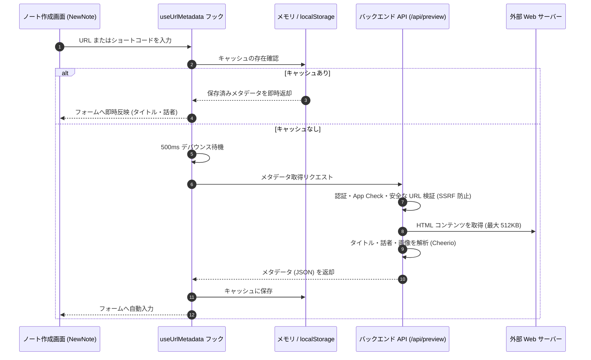

# URLメタデータ ＆ 話者抽出の仕組み

このドキュメントでは、ノート作成時に URL（総大会、リアホナ、BYU スピーチ等）を入力した際、記事タイトルや話者・著者名を自動抽出する仕組みについて解説します。

---

## 1. 処理フローの概要

URL が入力されると、クライアントキャッシュの確認、デバウンス処理、セキュリティ検証を経て、サーバーサイドで HTML を解析します。

### シーケンスの解説

1. **2層キャッシュとデバウンス**  
   入力開始から 500ms のデバウンスを挟み、メモリおよび `localStorage` を走査して重複リクエストを抑止します。
2. **SSRF 防御と制限付きフェッチ**  
   サーバー側で App Check と URL ホワイトリスト（`churchofjesuschrist.org` 等）を検証し、サイズ（最大 512KB）とタイムアウト（5秒）を制限して安全に取得します。
3. **HTML 解析と自動入力**  
   Cheerio により Open Graph タグや話者・著者名を抽出し、クライアントの入力フォームへ自動反映します。

---

## 2. セキュリティ対策

1. **認証と App Check 検証**: 有効なセッションと App Check トークンを持つリクエストのみを受理。
2. **SSRF（Server-Side Request Forgery）の防止**:
   - 教会公式用 API: `churchofjesuschrist.org` ドメインかつ HTTPS に限定。
   - 一般 URL 用 API: プライベート IP（`127.0.0.1` や 10.x.x.x 等）へのアクセスを遮断。
3. **容量制限とタイムアウト**:
   - 取得サイズを最大 `512 KB` に制限。
   - 4〜5 秒でタイムアウトし、リソースの枯渇を防止。

---

## 3. バックエンド API (`api_internal/routes/preview.ts`)

### ① 教会コンテンツ用 (`/api/preview/fetch-church-metadata`)
総大会やリアホナ記事向けに最適化されたエンドポイントです。
- **言語フォールバック**: 指定言語（`?lang=jpn` 等）で 404 となった場合、言語クエリを除去して再試行。
- **話者名のクレンジング**: "By", "Par", "De" などの言語別接頭辞を自動除去。
- **安全な縮退動作**: 解析不能時もフォーム入力を阻害しないよう、空オブジェクト（`{ title: '', speaker: '' }`）を返却。

### ② 一般 Web サイト用 (`/api/preview/url-preview`)
任意のウェブサイトから `og:title`、`og:description`、`og:image`、ファビコンを抽出。

---

## 4. クライアントキャッシュ設計

- **2層キャッシュ**: メモリ（即時再利用）と `localStorage`（リロード後の永続利用）を併用。
- **デバウンス制御**: 入力完了から 500ms 待機して API 呼び出しを発行。

---

## 5. 関連ドキュメント

- [ノート作成（NewNote）設計・実装ガイド](./newnote-construction-guide.md)
- [福音ライブラリマッパー](./gospel-library-mapper.md)
