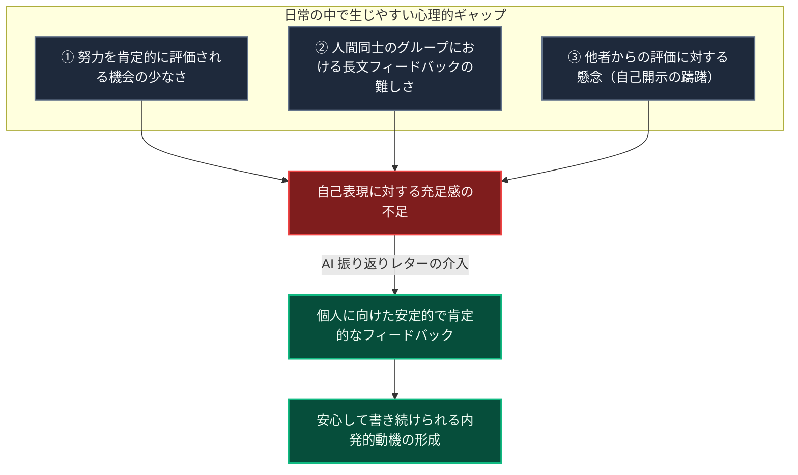

# AI振り返りレターの心理学的効用とリテンション

::: tip インタラクティブ・アーキテクチャツアー
この機能のデータフローとステップ解説ツアーを体験できます：
- **オンライン（GitHubブラウザプレビュー）**: [インタラクティブツアーを開く (習慣リキャップ & 振り返り)](https://htmlpreview.github.io/?https://github.com/ScriptureHabit/scripture-habit/blob/main/docs/public/architecture-tour.html?tour=tour-recap&lang=ja)
- **VitePress / ローカル**: [習慣リキャップ & 振り返り の解説ツアーを開く](/architecture-tour.html?tour=tour-recap&lang=ja)
:::

Scripture Habit の開発過程におけるユーザーヒアリングにおいて、合計日数の集計やグループ共有以上に、**「AI から届くパーソナルな振り返りレター（AI Reflection Letter）が継続の大きな支えになっている」**という声が多数寄せられました。

本ドキュメントでは、AI 振り返りレターがもたらす心理学的効用と、継続率（リテンション）への影響について解説します。

---

## 1. ユーザーフィードバックからの洞察

AI 振り返りレター（[`api_internal/routes/ai.ts`](file:///c:/Users/dazhi/code/scripture-habit/api_internal/routes/ai.ts)）は、ユーザーが投稿した直近の学習ノートをもとに、AI が気づきを整理し、聖句の文脈や励ましの言葉を手紙形式で届ける機能です。

> *「日々の地道な努力や考えを誰かに認めてもらえる機会は少ないため、自分のノートを丁寧に受け止めて返信が届く体験が、次のノートを書く動機になっています」*

単なる記録の要約にとどまらず、**「自らの内面的な努力が肯定され、受け止められる安心感」**が学習を継続する心理的推進力となっています。

---

## 2. 背景にある大人の心理的環境

### 構造的ギャップの解説

1. **日常における肯定機会の減少**  
   成人期においては日々の責務を果たすことが前提となり、個人の内省や小さな努力に対して丁寧なフィードバックを得る機会が限定されます。
2. **人間同士のチャットにおける負荷**  
   忙しいコミュニティ内では長文への返信コストが高く、リアクションはスタンプや一言に集約されがちです。
3. **AI による無条件の肯定的関心**  
   評価への不安を感じることなく素直な自己開示ができる環境を AI が提供し、内省の継続を支援します。

---

## 3. なぜ AI レターが継続を促すのか

1. **無条件の肯定的関心**  
   批判や評価を下さず、ユーザーの思考や率直な疑問をありのまま好意的に受け止めます。
2. **思考の整理と深化（ミラーリング効果）**  
   ノートの要点と感情を抽出し、「この気づきは聖典のこの出来事と響き合います」と文脈を広げて返すことで、日々の読書への意味づけを深めます。
3. **自己開示のハードル低減**  
   文章の巧拙や長さを気にせず、気兼ねなく思考を書き残すことができます。

---

## 4. プロダクト設計上の位置づけ

| 比較項目 | 一般的な習慣化 / 聖典アプリ | Scripture Habit (AI 振り返りレター) |
| :--- | :--- | :--- |
| **ユーザー体験** | チェック入力 / 読むだけの受け身 | **自らの考えを書き、振り返りを受け取る双方向体験** |
| **フィードバック** | なし、または定型スタンプのみ | **個人のノートに深く寄り添った個別レター** |
| **継続の動機** | 「ストリークを途切れさせたくない」 | **「自分の歩みを振り返り、次の手紙を読みたい」** |

---

## 5. レター生成の工夫と教会 AI ガイドラインへの配慮

『総合手引き』第 38.8.47 項（「人工知能の適切な使用」）の原則に沿ってプロンプトを設計しています。

- **人物ペルソナ選定**: 読んだ聖典の章に直結する人物を優先（※イエス・キリストおよび現代の生ける指導者は除外）。
- **手紙の 2 段構成**:
  1. **前半（共感・人間味）**: 登場人物の苦労や人間味あるエピソードで親近感を形成。
  2. **後半（霊的洞察・キリスト中心）**: トーンを切り替え、信仰や疑問に寄り添った深い洞察を提示。
- **透明性と注記**: 冒頭と末尾で AI のなりすましであることを明記し、個人の啓示を代替しない旨の免責注記を付与。
- **知恵の言葉の遵守**: コーヒー・アルコール・タバコ等の飲食の言及・比喩を禁止し、健全な日常習慣を使用。
- **手紙箱（Letter Box）への保存**: 生成された手紙は [`src/components/letterbox/letter-box.tsx`](file:///c:/Users/dazhi/code/scripture-habit/src/components/letterbox/letter-box.tsx) に保存され、いつでも読み返すことが可能です。

---

## 6. 関連ドキュメント

- [少人数グループ（最大5人）とピア・アカウンタビリティの心理学](./ux-small-groups-and-peer-accountability.md)
- [マイルストーン達成 & リテンション心理学](./logic-milestone-retention.md)
- [AI 統合 (Gemini)](./feature-ai-integration.md)
- [ダッシュボード ＆ マイノートの設計と実装](./dashboard-mynotes-construction-guide.md)
