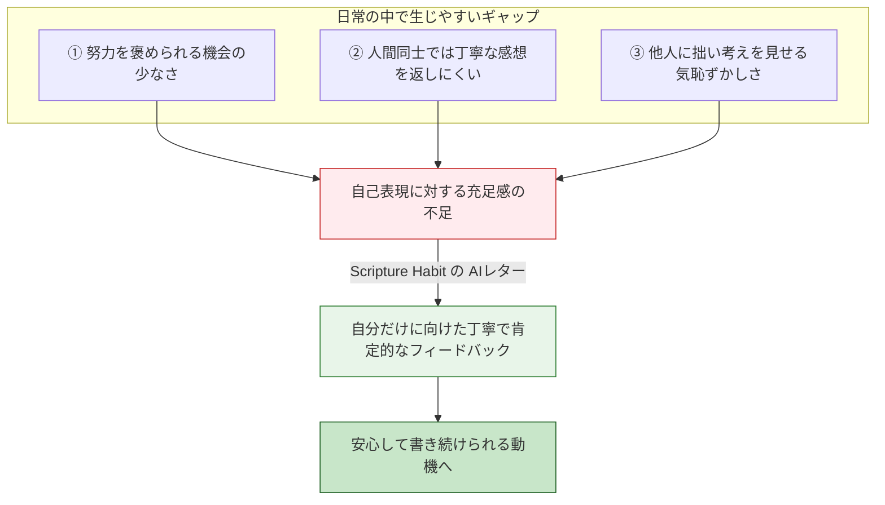

# AI振り返りレターの心理学的効用とリテンション

Scripture Habit の開発過程でユーザーにヒアリングを行ったところ、合計日数のカウントやグループでの共有以上に、**「AIから届くパーソナルな振り返りレター（AI Reflection Letter）が嬉しくてアプリを続けている」**という声が多く寄せられました。

この機能は、もともとは過去のノートを読み返しやすくする目的で実装したものでしたが、結果としてユーザーの継続動機を支える大きな要素になっていることがわかりました。

本ドキュメントでは、なぜ AI振り返りレターがこれほど好評なのかを、日常の心理環境や対話の性質から考察します。

---

## 1. ユーザーの声からわかったこと

AI振り返りレター（[`api_internal/routes/ai.ts`](file:///c:/Users/dazhi/code/scripture-habit/api_internal/routes/ai.ts)）は、ユーザーが投稿した最近の学習ノートをもとに、AIが気づきを振り返り、聖句の教えや励ましの言葉を添えて手紙形式で届ける機能です。

ユーザーからは以下のような感想が寄せられています：

> *「大人になると、日々の地道な努力や考えを誰かに認めてもらえる機会はほとんどありませんでした」*
>
> *「自分が書いたノートをきちんと読んでもらい、丁寧な返信が返ってくるのが嬉しくて、次の手紙を楽しみに毎日ノートを書いています」*
>
> *「グループチャットだと他人の反応が気になってしまうこともありますが、AIは自分の考えをそのまま受け止めてくれるので安心感があります」*

この声から、単に学習記録を要約する便利さだけでなく、**「自分の内面的な努力が肯定され、受け止められる安心感」**が学習を続ける原動力になっていることがうかがえます。

---

## 2. 背景にある大人の心理的環境

### ① 日常生活で褒められる機会の少なさ
子供や学生のころは、成長や努力を親や先生に認めてもらう場面が多くあります。しかし大人になると、日々の役割（仕事や家事など）を果たすことが当たり前になり、**個人の日々の内省や小さな努力に対して丁寧なフィードバックをもらえる機会はほとんどなくなります。**

### ② 人間同士のグループにおけるフィードバックの難しさ
グループチャットでノートを共有しても、他のメンバーも忙しいため、長文のノートをじっくり読んで丁寧な感想を返すのには時間も手間もかかります。そのため、普段のリアクションはスタンプや一言になりがちです。

### ③ 評価されることへの不安
人間相手だと、「こんな短いメモを書いたら浅いと思われるのではないか」「誰からも反応がなかったら少し寂しい」といった遠慮が生まれ、素直な気持ちを書くのをためらってしまうことがあります。

---

## 3. なぜ AI レターが安心感を与えるのか

### ① 否定せず、丁寧に受け止める姿勢（無条件の肯定的関心）
カウンセリング心理学で重要視される「無条件の肯定的関心（相手の意見を批判せず、まずありのまま受け止めること）」を、AIは安定して提供できます。
AIはユーザーの考えを否定したりジャッジしたりせず、常に好意的に受け止めます。

### ② 自分の思考が整理されて返ってくる（ミラーリング効果）
AIはユーザーのノートから要点や感情を読み取り、「あなたが感じたこの気づきは、聖典のこの物語とも重なります」といった形で、自分の考えを整理・発展させて返してくれます。
これにより、ユーザーは「自分の日々の読書や考えには意味があるんだ」と実感しやすくなります。

### ③ 気兼ねなく自己開示できる空間
AI相手であれば、文章の拙さや長さを気にする必要がありません。「何を書いても優しく返してくれる」という安心感があるため、気取らずに学習メモを残すことができます。

---

## 4. プロダクトとしての特徴と位置づけ

多くの学習・習慣化アプリは、グラフやチェックボックスによる「進捗の数値管理」や、運営からの「一方的なコンテンツ配信」が中心です。

| 比較項目 | 一般的な習慣化 / 聖典アプリ | Scripture Habit (AI振り返りレター) |
| :--- | :--- | :--- |
| **ユーザーの体験** | チェックを入れる / 読むだけの受け身 | **自分の考えを書き、振り返りを受け取る体験** |
| **フィードバック** | なし、またはスタンプのみ | **自分のノートに応じた個別のお手紙** |
| **続けたい理由** | 「記録を途切れさせたくないから」 | **「自分の歩みを振り返り、次の手紙を読みたいから」** |

ユーザー一人ひとりのノートに寄り添い、丁寧な言葉を返すこの仕組みは、Scripture Habit の大きな特徴となっています。

---

## 5. レター生成の工夫と教会AIガイドラインへの配慮
 
AI振り返りレターは、単なるテキスト要約ではなく、**『総合手引き』第38.8.47項（人工知能の適切な使用）の原則に沿って配慮されたプロンプト設計（[`api_internal/routes/ai.ts`](file:///c:/Users/dazhi/code/scripture-habit/api_internal/routes/ai.ts)）**によって作成されています。

- **四標準聖典の人物ペルソナ選定（ハイブリッド選定）**:
  - 読んだ聖典の章（1ニーファイ→ニーファイ、教義と聖約25章→エマ・スミス等）に関連する人物を優先し、該当がない場合は霊的テーマに寄り添える人物をAIが選定。
  - ※イエス・キリストおよび現代の生ける指導者は除外。
- **手紙の2段構成（ジョークと霊的感動のパート分け）**:
  1. **前半（アイスブレイク・人間味・共感）**:
     - 登場人物自身の失敗談や自虐（ペテロの居眠り・水沈み、ニーファイの弓折れ、ヨナの逃亡劇、アルマの気絶など）、現代あるあるへのツッコミ、またはAIメタユーモアをランダムに織り交ぜて親近感を生み、肩の力を抜かせる。
  2. **後半（真摯で心に染みる霊的感動・キリスト中心）**:
     - 冗談を交えずトーンを真摯に切り替え、ユーザーのノートの核心にある信仰や疑問、救い主の贖罪と神の愛に寄り添った深い霊的洞察を届ける。
- **手紙の構成と配慮**:
  1. **AIの明示**: 冒頭で `「わたし、AIは[人物名]になりきって…」`、末尾で `「— [人物名]になりきったAIより」` と明記し誤解を防止。
  2. **自然な文章（見出し・ラベルの排除）**: `【前半】` や `【アイスブレイク】` などの構造ラベルは一切出力せず、自然な段落のつながりで展開。
  3. **クリーンな詩 ＆ 柔軟なP.S.（追伸）**: 記号（`*` や `---`）を使わない自然な改行による3〜4行の詩と、必要に応じて読後に微笑みを残す軽やかな追伸（P.S.）を配置。
  4. **個人の啓示に関する注記**: 手紙末尾に「聖霊による個人の啓示を代替しない」旨の注記を付与。
- **手紙箱（Letter Box）への保存**:
  - 届いた手紙は手紙箱（[`src/components/letterbox/letter-box.tsx`](file:///c:/Users/dazhi/code/scripture-habit/src/components/letterbox/letter-box.tsx)）に保存され、過去の振り返りをいつでも読み返すことができます。

---

## 6. 関連ドキュメント

- [少人数グループ（最大5人）とピア・アカウンタビリティの心理学](./ux-small-groups-and-peer-accountability.md)
- [マイルストーン達成 & リテンション心理学](./logic-milestone-retention.md)
- [AI 統合 (Gemini)](./feature-ai-integration.md)
- [ダッシュボード ＆ マイノートの設計と実装](./dashboard-mynotes-construction-guide.md)
