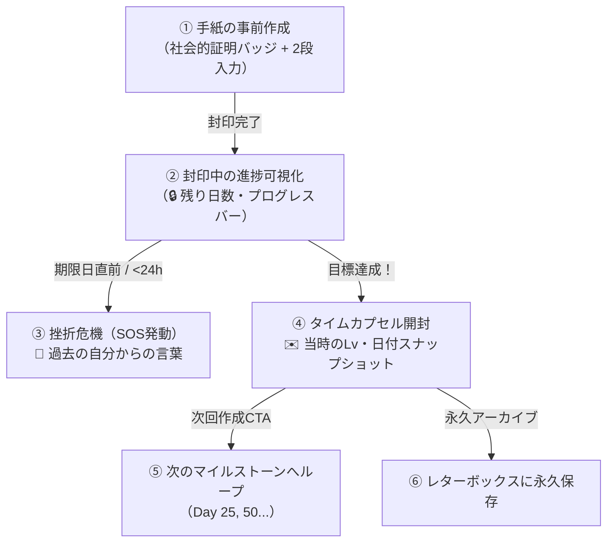

# 将来の自分への手紙（タイムカプセル機能）と習慣化心理学

## 概要

「将来の自分への手紙（タイムカプセル機能）」は、ユーザーが次のマイルストーン（Day 10, 25, 50, 75, 100...）に向けて、未来の自分へ宛てた応援の手紙と、挫折しそうな時のための「SOSメッセージ」を事前に作成・封印し、目標達成時に開封する機能です。

この機能は、単なるテキストの保存ではなく、**行動心理学における「自己連続性（Future Self Continuity）」と「事前コミットメント（Pre-commitment）」** を活用し、日々の聖典学習を長期的な習慣へと定着させる強力なUXドライバーとして設計されています。

---

## 🧠 習慣化を支える心理学的メカニズム

### 1. 自己連続性（Future Self Continuity）の強化
人は往々にして「未来の自分」を「見知らぬ他人」のように感じてしまい、「今日の自分がサボっても、未来の自分が困るだけだ」と先延ばしや挫折をしてしまいます。  
未来の自分へ向けて手紙を書く行為は、**「現在の自分」と「目標を達成した未来の自分」の感情的なつながりを結び直す効果**（自己連続性の向上）を持ちます。これにより、目先の怠惰よりも未来の自分への約束を優先するようになります。

### 2. 事前コミットメント（Pre-commitment）
次の目標日（例: Day 10）を設定し、その日の自分へ手紙を「封印」することで、心理的な契約（コミットメント）が結ばれます。封印された手紙が存在すること自体が、「Day 10まで到達して必ずあの手紙を開封するぞ」という強い内発的動機を生み出します。

### 3. 他者評価から「自己対話」へのシフト
他人の目を気にした継続（承認欲求）は燃え尽きやすい一方、「過去の自分が応援してくれている」「過去の自分に恥じないようにしよう」という自己対話型の動機づけは、他人の評価に左右されない安定した習慣の土台を築きます。

---

## 🎨 5段階のUXジャーニー設計

### ① 手紙の事前作成（TimeCapsuleModal）
*   **社会的証明バッジ**:
    *   3名以上の達成者がいる場合: `✨ 今まで{count}名の仲間がDay {days}を達成しました！`
    *   3名未満の場合: `🌱 世界中の仲間がDay {days}を目指して挑戦中！`
    *   孤独感を解消し、「自分にもできる」という自己効力感を高めます。
*   **2段フォーム構成**:
    1.  **達成した自分への手紙**（最大500文字）: 到達時の喜びや未来の自分へのメッセージ。
    2.  **サボりそうな時のSOS一言**（最大100文字）: 「初心の気持ちを思い出して！」「1行だけでもOK」といった危機管理メッセージ。
*   **下書き自動保存（Draft Sync）**: 入力中の内容はリアルタイムにローカル保存され、誤ってモーダルを閉じても消えません。

### ② 封印中の進捗可視化（TimeCapsuleCard）
*   ダッシュボード最上部に「🔒 Day {days}のタイムカプセル封印中」カードが常時表示されます。
*   レベル表示と調和した落ち着いたコーラルピンク（`--pink: #FF919D`）のプログレスバーと「あと ○日」のバッジが表示され、毎日のノート投稿ごとに着実にゲージが進みます。

### ③ 挫折危機（SOSリマインダー）
*   グループのルール期限（残り24時間未満）が迫り、習慣が途切れそうになると、ダッシュボードのカードが自動で **「🚨 サボりそうなあなたへ：過去の自分からの言葉」** バナーに変化します。
*   一般的な機械的アラートではなく、**「やる気に満ちていた過去の自分が書いた生の言葉」** が届くことで、罪悪感なく前向きに聖典を開くきっかけを作ります。

### ④ 達成時の開封サプライズ（TimeCapsuleUnlockModal）
*   マイルストーン達成時、達成記念カード（MilestoneCard）からシームレスに手紙開封モーダルへ誘導されます。
*   **過去のスナップショット**: 手紙を書いた当時の「作成日」「当時の学習日数」「当時のレベル（Lv.1 など）」が便箋デザインとともに表示され、自身の成長と歩んできた道のりを深く実感できます。

### ⑤ 次回目標へのシームレスなループ
*   開封モーダルの最下部に **「次のDay {nextDays}の自分へ手紙を書く」** ボタンが配置されており、1つの目標達成がそのまま次の目標への挑戦に直結します。

### ⑥ レターボックスへの永久アーカイブ
*   **封印中**: レターボックスには表示されず、ネタバレを完全に防止します。
*   **開封後**: レターボックス（手紙箱）に自動保存され、通常の30日自動削除対象から除外（永久アーカイブ）され、一生の思い出としていつでも読み返せます。

---

## 🔒 プライバシーとセキュリティ設計

1.  **完全なプライベート保護**:
    *   手紙の内容（`content` / `sosMessage`）は `users/{uid}/letters/capsule_{targetDays}` のサブコレクションに保存され、本人のみに読み取り権限が付与されます（グループメンバーや他者には一切公開されません）。
2.  **Firestore集計効率の最適化**:
    *   社会的証明カウントの取得には Firestore のサーバー集計API（`getCountFromServer`）とインメモリキャッシュを採用し、最小限の読み取りコストで高速に表示します。
