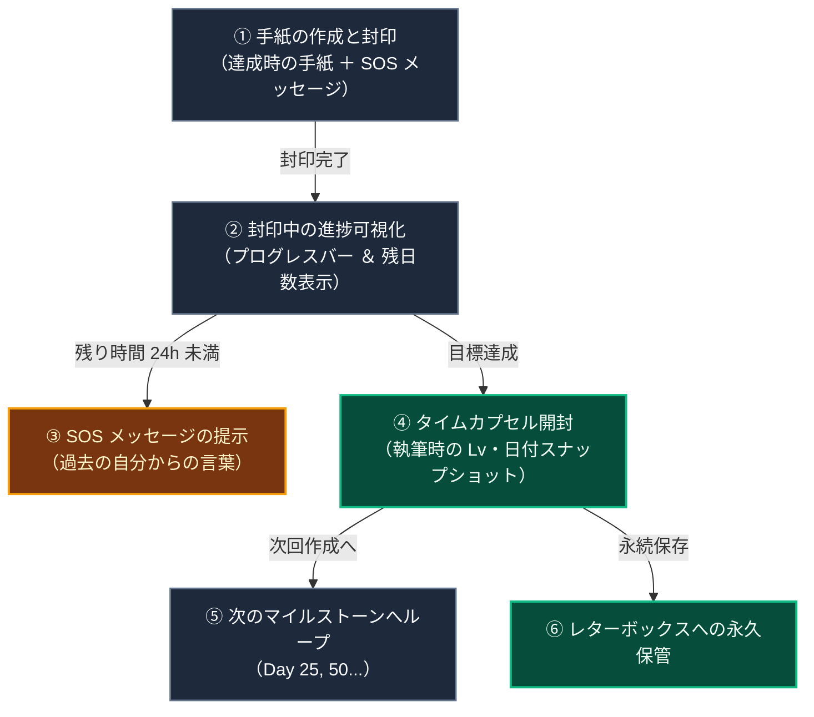

# 将来の自分への手紙（タイムカプセル機能）と習慣化心理学

::: tip インタラクティブ・アーキテクチャツアー
この機能のデータフローとステップ解説ツアーを体験できます：
- **オンライン（GitHubブラウザプレビュー）**: [インタラクティブツアーを開く (タイムカプセル・未来の手紙)](https://htmlpreview.github.io/?https://github.com/ScriptureHabit/scripture-habit/blob/main/docs/public/architecture-tour.html?tour=tour-timecapsule&lang=ja)
- **VitePress / ローカル**: [タイムカプセル・未来の手紙 の解説ツアーを開く](/architecture-tour.html?tour=tour-timecapsule&lang=ja)
:::

「将来の自分への手紙（タイムカプセル機能）」は、次のマイルストーン（Day 10, 25, 50, 75, 100...）に向けて未来の自分へ宛てた応援の手紙と、挫折しそうな時のための「SOS メッセージ」を事前に封印し、目標達成時に開封する機能です。

行動心理学における**「自己連続性（Future Self Continuity）」と「事前コミットメント（Pre-commitment）」**を活用し、学習の長期定着を支援します。

---

## 1. 習慣化を支える心理学的メカニズム

1. **自己連続性（Future Self Continuity）の強化**  
   「未来の自分」を他人事のように捉えて先延ばしする心理を防ぎ、「現在の自分」と「達成した未来の自分」の感情的な結びつきを強化します。
2. **事前コミットメント（Pre-commitment）**  
   次の目標日を設定して手紙を封印することで、「達成して必ず開封する」という明確な内発的動機を形成します。
3. **自己対話へのシフト**  
   他者評価や承認欲求に依存せず、「過去の自分が応援してくれている」という自己対話に基づいた安定した習慣の土台を築きます。

---

## 2. 5段階の UX ジャーニー設計

### ジャーニーの解説

1. **作成と封印**  
   達成時の手紙（最大 500 文字）とサボりそうな時の SOS メッセージ（最大 100 文字）を書き、目標日数に向けて封印します。
2. **封印中の進捗可視化**  
   ダッシュボード上部にプログレスバーと残り日数が表示され、日々の投稿ごとに着実に進行します。
3. **SOS リマインダーの発動**  
   期限が迫ると機械的なアラートではなく、「やる気に満ちていた過去の自分が書いた生の言葉」をバナーに表示し、前向きな再開を促します。
4. **達成時の開封と成長の実感**  
   目標到達時に開封され、当時のレベルや作成日とともに手紙が表示され、自身の歩んできた成長を深く実感できます。
5. **永続アーカイブと継続ループ**  
   開封後の手紙は手紙箱（Letter Box）に永久保存され、シームレスに次のマイルストーン作成へと接続されます。

---

## 3. プライバシーとセキュリティ設計

1. **完全な個人隔離**  
   手紙の内容（`content` / `sosMessage`）は `users/{uid}/letters/capsule_{targetDays}` に保存され、本人のみが読み書き可能（他ユーザーには非公開）です。
2. **サーバー集計の最適化**  
   達成者数のカウントには Firestore の集計 API（`getCountFromServer`）とインメモリキャッシュを用い、最小限の読み取りコストで高速に表示します。

---

## 4. 関連ドキュメント

- [マイルストーン達成 & リテンション心理学](./logic-milestone-retention.md)
- [AI振り返りレターの心理学的効用とリテンション](./ux-ai-reflection-letters.md)
- [ダッシュボード ＆ マイノートの設計と実装](./dashboard-mynotes-construction-guide.md)
