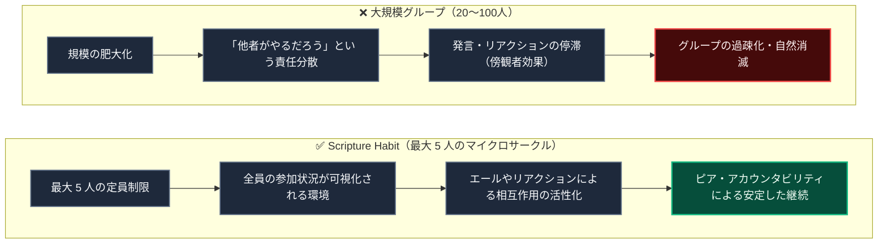
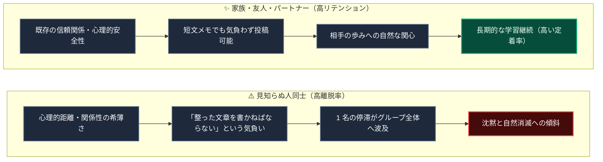

# 少人数グループ（最大5人）とピア・アカウンタビリティの心理学

Scripture Habit のグループ機能では、**「1グループあたりの最大人数を 5 人に制限する（`maxMembers: 5`）」**という設計を採用しています。

また、アプリの運用データとユーザー観察から、**「家族や親しい友人など信頼関係のあるグループは継続率が高く、見知らぬ人同士のグループは離脱しやすい」**という傾向が確認されています。

本ドキュメントでは、少人数制の意図と、グループ内の心理的安全性が習慣化に与える影響について解説します。

---

## 1. なぜ「最大人数 5人」なのか？

日々の学習継続や内省を共有する場において、過度な人数規模はコミットメントの低下を招きます。

### 規模設計の解説

1. **社会的手抜き（リンゲルマン効果）の防止**  
   集団の人数が増えるほど「自分がサボっても影響はない」と責任が分散されます。5 名のマイクロサークルであれば個々の参加状況が全員に認知され、健全なピア・アカウンタビリティ（相互責任感）が機能します。

2. **傍観者効果の抑制**  
   大人数のチャットでは「誰かが返信するだろう」と全員が沈黙しがちですが、少人数であればリアクションやエール（Cheer）が活発に循環します。

3. **親密性を維持できる規模（ダンバー数）**  
   人類学におけるダンバー数の知見に基づき、気兼ねのない深い共感を維持できる上限として 5 名を上限としています。

---

## 2. 信頼関係の深さと継続率の相関

### 相関関係の解説

1. **心理的安全性と自己開示**  
   親密なグループでは「短い感想でも受け入れられる」という安心感があるため、1 行のメモからでも継続的に共有できます。

2. **未知の他者に対するハードル**  
   見知らぬ人同士では投稿への過度な緊張が生まれ、1 人の休止が全体の休止へと連鎖しやすい特性があります。

---

## 3. アプリケーション設計への反映

| 設計方針 | 目的と効果 |
| :--- | :--- |
| **定員 5 名の制限 (`maxMembers: 5`)** | 責任分散を防ぎ、全員の顔が見える相互作用を維持。 |
| **ダイレクト招待リンク** | 家族やパートナーなど、既存の信頼関係を持つ相手と開始可能。 |
| **AI パートナーグループ** | 他者との共同学習にハードルを感じるユーザー向けに、AI と 1 対 1 で気兼ねなく継続できる専用空間を提供。 |
| **団結度（Unity）メーター** | 競争ではなく「全員で本日学習できたか」の協力型メトリクスを採用。 |
| **長期非アクティブの自動退出** | 幽霊メンバーによるグループの活動停滞を防止。 |

---

## 4. 関連ドキュメント

- [AI振り返りレターの心理学的効用とリテンション](./ux-ai-reflection-letters.md)
- [マイルストーン達成 & リテンション心理学](./logic-milestone-retention.md)
- [グループチャットの設計と実装](./groupchat-construction-guide.md)
- [グループ招待 & 参加処理](./group-invites.md)
- [非アクティブ判定 & 自動整理](./inactivity-and-autokick.md)
- [団結度（Unity）の同期](./unity-participation.md)
