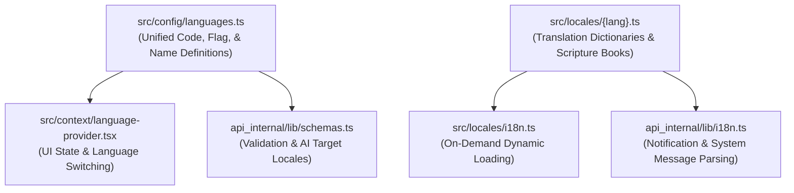

# Internationalization (i18n)

Scripture Habit supports multilingual localization across 11 languages so users around the world can study in their native tongue.

Language configurations and translation dictionaries are maintained in a Single Source of Truth (`src/locales/`), synchronized across frontend UI, backend notifications, and AI translation services.

---

## 1. Architecture Overview

---

## 2. Frontend Architecture

- **`src/config/languages.ts`**: Unified configuration of supported language codes, native names, flags, and Church LDS codes.
- **`src/context/language-provider.tsx`**: Manages browser-based language detection, dynamic loading, and active translation caches.
- **`src/locales/i18n.ts`**: Uses `import.meta.glob` to lazily import only requested locale dictionaries.

### ① Translation Helper `t()`
- **Parameter Interpolation**: Safely replaces dynamic placeholders (e.g. `"{name} posted a note"`).
- **English Fallback**: If a key is missing in the active language, it falls back to English (`en`) to prevent blank UI labels.

### ② Scripture Book Translations
Scripture book names are stored using canonical keys and dynamically resolved to the viewer's language (e.g., "Book of Mormon" $\rightarrow$ "モルモン書" / "Libro de Mórmon").

---

## 3. Backend Localization (`api_internal/lib/i18n.ts`)

The backend directly references `src/locales/` to format multilingual push notifications and system announcement messages.

---

## 4. Dynamic AI Translation (`/api/ai/translate`)

User-generated study notes are translated on demand by Gemini AI:
- **Message Caching**: Translated outputs are cached directly in the message document to avoid redundant API calls.

---

## 5. Supported Languages (11 Locales)

| Code | Native Name | English Name | Flag | Church LDS Code |
| :--- | :--- | :--- | :---: | :--- |
| `en` | English | English | 🇺🇸 | `eng` |
| `ja` | 日本語 | Japanese | 🇯🇵 | `jpn` |
| `pt` | Português | Portuguese | 🇧🇷 | `por` |
| `zho` | 繁體中文 | Chinese (Traditional) | 🇹🇼 | `zho` |
| `es` | Español | Spanish | 🇪🇸 | `spa` |
| `vi` | Tiếng Việt | Vietnamese | 🇻🇳 | `vie` |
| `th` | ไทย | Thai | 🇹🇭 | `tha` |
| `ko` | 한국어 | Korean | 🇰🇷 | `kor` |
| `tl` | Tagalog | Tagalog | 🇵🇭 | `tgl` |
| `sw` | Kiswahili | Swahili | 🇰🇪 | `swa` |
| `it` | Italiano | Italian | 🇮🇹 | `ita` |

---

## 6. Adding a New Language

1. **Create Dictionary (`src/locales/{code}.ts`)**:
   Add a new locale file (e.g., `fr.ts` for French) with UI translations and scripture book names.
2. **Run Sync Script**:
   Execute `npm run i18n:sync` to automatically register the new language in `src/config/languages.ts` and backend schemas.

---

## 7. Related Documentation

- [AI Integration (Gemini)](./feature-ai-integration.md)
- [Push Notification System](./feature-notifications.md)
