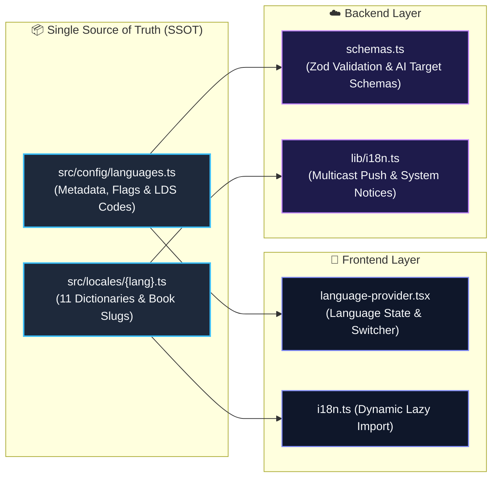

# Internationalization (i18n)

::: tip Interactive Architecture Tour
Explore the live data-flow blueprint and guided walkthrough for this feature:
- **Online (GitHub Browser Preview)**: [Open Interactive Tour (Language Switcher & i18n)](https://htmlpreview.github.io/?https://github.com/ScriptureHabit/scripture-habit/blob/main/docs/public/architecture-tour.html?tour=tour-languages&lang=en)
- **VitePress / Local**: [Open Language Switcher & i18n Tour](/architecture-tour.html?tour=tour-languages&lang=en)
:::

Scripture Habit supports multilingual localization across 11 languages, allowing users worldwide to study in their native language.

Configurations and translation dictionaries reside in a Single Source of Truth (`src/locales/`), shared across frontend rendering, backend push notifications, and AI translation pipelines.

---

## 1. Architecture Overview

### Architecture Breakdown

1. **Single Source of Truth**  
   All language codes, native names, Church LDS codes, and UI dictionaries are centralized under `src/locales/` and `src/config/`.
2. **Frontend Dynamic Imports**  
   Uses Vite's `import.meta.glob` to load translation bundles on demand, keeping initial bundle size minimal.
3. **Backend Multi-Language Formatting**  
   Express services import locale bundles directly to format push notifications and system messages according to each recipient's language preference.

---

## 2. Frontend Architecture

- **`src/config/languages.ts`**: Centralized configuration of supported language codes, native names, flags, and Church LDS codes.
- **`src/context/language-provider.tsx`**: Manages browser language detection, state changes, and translation caches.
- **`src/locales/i18n.ts`**: Lazy-imports locale dictionaries on demand.

### ① Translation Helper `t()`
- **Parameter Interpolation**: Replaces placeholders (e.g., `"{name} posted a note"`).
- **English Fallback**: Missing keys fall back to English (`en`) to prevent missing UI labels.

### ② Scripture Book Translations
Scripture book names are stored using canonical keys and resolved dynamically to the viewer's language (e.g., "Book of Mormon" $\rightarrow$ "モルモン書" / "Libro de Mórmon").

---

## 3. Backend Localization (`api_internal/lib/i18n.ts`)

The backend references `src/locales/` directly to compose localized push notifications and group announcement cards.

---

## 4. Dynamic AI Translation (`/api/ai/translate`)

Study notes are translated dynamically via Gemini AI:
- **Direct Cache Storage**: Outputs are persisted in the Firestore message document (`translations.{lang}`) to eliminate redundant API calls.

---

## 5. Supported Languages (11 Locales)

| Code | Native Name | English Name | Flag | Church LDS Code |
| :--- | :--- | :--- | :---: | :--- |
| `en` | English | English | 🇺🇸 | `eng` |
| `ja` | 日本語 | Japanese | 🇯🇵 | `jpn` |
| `pt` | Português | Portuguese | 🇧🇷 | `por` |
| `zho` | 繁體中文 | Chinese (Traditional) | 🇹🇼 | `zho` |
| `es` | Español | Spanish | 🇪🇸 | `spa` |
| `vi` | Tiếng Việt | Vietnamese | 🇻🇳 | `vie` |
| `th` | ไทย | Thai | 🇹🇭 | `tha` |
| `ko` | 한국어 | Korean | 🇰🇷 | `kor` |
| `tl` | Tagalog | Tagalog | 🇵🇭 | `tgl` |
| `sw` | Kiswahili | Swahili | 🇰🇪 | `swa` |
| `it` | Italiano | Italian | 🇮🇹 | `ita` |

---

## 6. Adding a New Language

1. **Create Dictionary (`src/locales/{code}.ts`)**: Add a new locale dictionary with UI strings and scripture book titles.
2. **Run Sync Automation**: Run `npm run i18n:sync` to register the new language in `src/config/languages.ts` and backend validation schemas.

---

## 7. Related Documentation

- [AI Integration (Gemini)](./feature-ai-integration.md)
- [Push Notification System](./feature-notifications.md)
