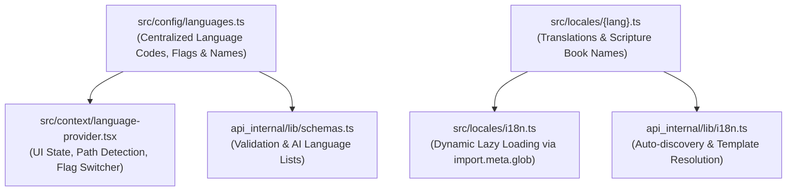

# I18n & Localization

Scripture Habit is designed for global users. The localization system ensures that all users can use the app in their preferred language (English, Japanese, Spanish, Tagalog, etc.).

Language definitions and translation dictionaries are structured around a **Single Source of Truth (SSOT)** and follow **DRY (Don't Repeat Yourself)** principles, keeping Frontend, Backend, and AI translation components fully synchronized.

---

## Architecture: Single Source of Truth (SSOT)

---

## Frontend Architecture: Language Context & Provider

Frontend localization is managed through:
- **`src/config/languages.ts`**: Central registry defining all language metadata (codes, native names, English names, flag icons, LDS codes).
- **`src/context/language-context.ts`**: Declares TypeScript types and the React Context instance.
- **`src/context/language-provider.tsx`**: Handles URL path extraction, storage caching, browser preference detection, and translation caching.
- **`src/locales/i18n.ts`**: Uses `import.meta.glob` to lazily import only the required translation files on-demand.

### 1. The `t()` Translation Helper
A custom hook that provides:
- **Variable Insertion**: Supports dynamic text like `"{name} added a note"`.
- **English Fallback**: If a translation key is missing in the current language, it safely falls back to the English (`en`) translation instead of leaving the UI blank.

### 2. Scripture Book Translations
To display scripture book names correctly in multiple languages, we use a mapping function:
- Book names are stored using standard keys.
- The UI uses `translateBookName(bookName)` to show "Book of Mormon" as "モルモン書" or "Libro de Mórmon" based on the user's language setting (sourced from the `books` dictionary object).

---

## Backend Localization: Auto-Discovery System

The backend (`api_internal/lib/i18n.ts`) manages translations for system messages, push notifications, and AI prompts.

### Shared Translation Bundles
The backend directly scans the shared `src/locales/` directory at startup (Auto-discovery) rather than keeping duplicate locale files:
- **Type Safety**: Derives `SupportedLanguage` types directly from `src/config/languages.ts` to ensure 100% parity with Zod validation schemas.
- **Dynamic Text**: Replaces placeholders like `{nickname}` or `{streak}` inside notification templates.

---

## AI Localization: Content Translation

User-generated study notes are translated dynamically by Gemini AI rather than using static files.

### 1. Language Detection
The app detects if a note's language is different from the viewer's preferred language.

### 2. AI Translation Endpoint (`/api/ai/translate`)
- The backend identifies the target language (`targetLanguage`).
- Injects standardized language names into AI prompts using `languageNames` from `api_internal/lib/schemas.ts` (derived from `src/config/languages.ts`).
- **Caching**: The translation is saved directly to the message document, ensuring each note is translated only once per language.

---

## Supported Languages (10 Languages)

| Code | Native Name | English Name | Flag | LDS Code |
| :--- | :--- | :--- | :---: | :--- |
| `en` | English | English | US | `eng` |
| `ja` | 日本語 | Japanese | JP | `jpn` |
| `pt` | Português | Portuguese | BR | `por` |
| `zho` (zh) | 繁體中文 | Chinese (Traditional) | TW | `zho` |
| `es` | Español | Spanish | ES | `spa` |
| `vi` | Tiếng Việt | Vietnamese | VN | `vie` |
| `th` | ไทย | Thai | TH | `tha` |
| `ko` | 한국語 | Korean | KR | `kor` |
| `tl` | Tagalog | Tagalog | PH | `tgl` |
| `sw` | Kiswahili | Swahili | KE | `swa` |

---

## Adding a New Language (DRY Process)

Because language settings and translation bundles are centralized, adding a new language requires just 2 simple steps:

1. **Add Language Configuration (`src/config/languages.ts`)**:
   Add a new language config object (`code`, `name`, `englishName`, `flag`, `ldsCode`) to the `LANGUAGES` array.
   > [!NOTE]
   > This automatically updates backend Zod schemas (`schemas.ts`), UI language switchers, and AI translation target lists.

2. **Create Translation File (`src/locales/{code}.ts`)**:
   Create a new locale file in `src/locales/` (e.g., `fr.ts` for French) and define UI keys along with the `books` scripture names mapping.
   > [!TIP]
   > - **Frontend**: Automatically discovered and lazy-loaded via `import.meta.glob` in `src/locales/i18n.ts`.
   > - **Backend**: Automatically discovered by `api_internal/lib/i18n.ts` on startup without manual registration.
