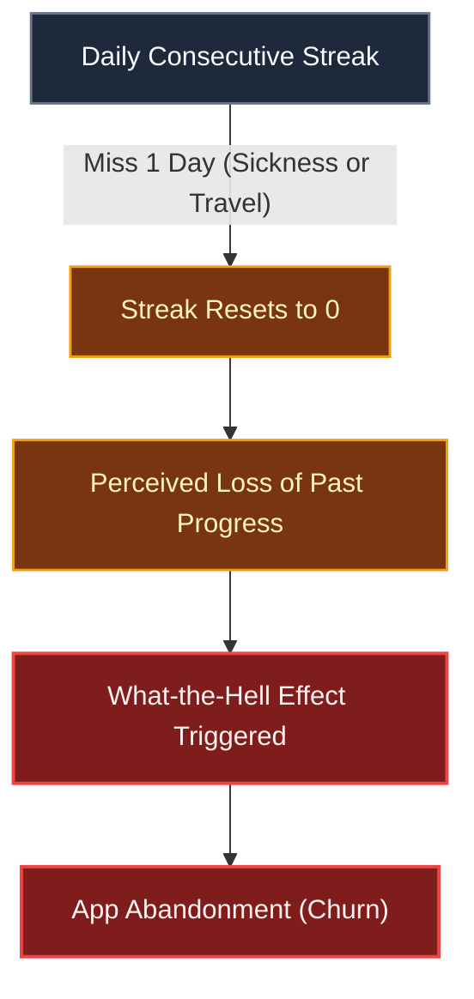
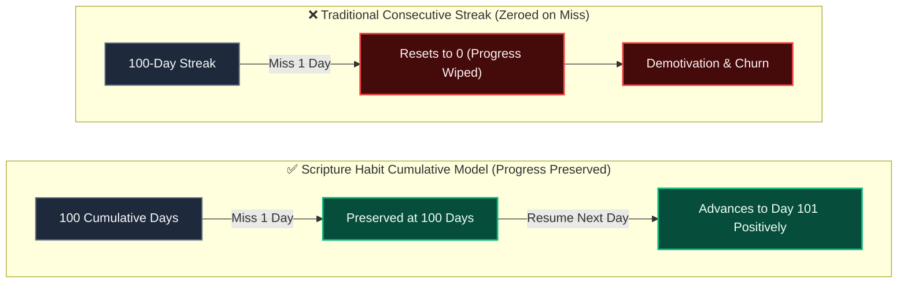
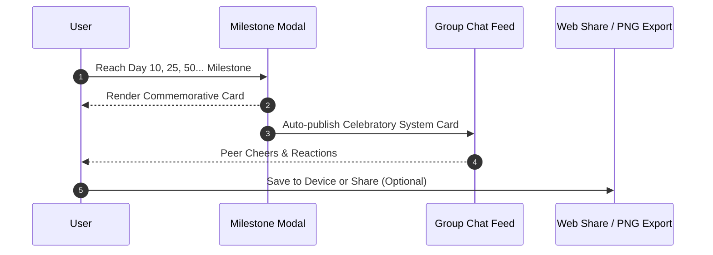

# Milestone Celebrations & Retention Psychology

::: tip Interactive Architecture Tour
Explore the live data-flow blueprint and guided walkthrough for this feature:
- **Online (GitHub Browser Preview)**: [Open Interactive Tour (Milestone Achievements)](https://htmlpreview.github.io/?https://github.com/ScriptureHabit/scripture-habit/blob/main/docs/public/architecture-tour.html?tour=tour-milestone&lang=en)
- **VitePress / Local**: [Open Milestone Achievements Tour](/architecture-tour.html?tour=tour-milestone&lang=en)
:::

This document details the milestone calculation engine (Day 10 and every 25 days thereafter), commemorative image generation ([`src/utils/milestone.ts`](file:///c:/Users/dazhi/code/scripture-habit/src/utils/milestone.ts)), and behavioral retention principles in Scripture Habit.

---

## 1. Challenges with Traditional Consecutive Streaks

Many habit applications rely heavily on daily consecutive streaks. However, rigid streak models introduce significant psychological friction:



### Psychological Mechanism Breakdown

1. **Loss Aversion**  
   The pain of losing accumulated progress outweighs equivalent gains. Resetting a 100-day streak to zero after a single missed day fosters the perception that past dedication has been invalidated.

2. **The "What-the-Hell Effect"**  
   A minor lapse often triggers total disengagement from a goal. Streak abandonment is primarily a failure of application incentive design rather than individual willpower.

---

## 2. Transition to the Cumulative Days Model

Scripture Habit mitigates streak anxiety by establishing **"Total Study Days (`daysStudiedCount`)"** as its primary celebration metric:



### Comparative Breakdown

- **Irreversibility of Past Effort**: Missing a day does not delete cumulative progress; accumulated milestones remain permanently recorded.
- **Lower Resumption Barrier**: Users return with the empowering knowledge that their 100 days of prior study remain intact.

---

## 3. Milestone Spacing (10 Days + Every 25 Days)

Milestone intervals are structured around habit formation phases:

```
[Day 1] ───→ [Day 10 (Initial Milestone)] ───→ [Day 25] ───→ [Day 50] ───→ [Day 75] ───→ [Day 100] ...
              ▲                                  ▲           ▲           ▲           ▲
         Quick Win (Early Retention)                 Achievable ~3-4 Week Goals (Goal Gradient Effect)
```

1. **Initial 10 Days (Quick Win)**  
   Targets the steepest drop-off period (Weeks 1–2) with an early, achievable threshold that builds initial self-efficacy.
2. **Every 25 Days Thereafter (Goal Gradient Effect)**  
   Leverages the psychological surge of nearing a visible finish line, placing achievable goals every 3–4 weeks to prevent mid-phase disengagement.

---

## 4. Visualizing Achievement with Commemorative Cards

Reaching a milestone renders a dedicated modal ([`MilestoneModal`](file:///c:/Users/dazhi/code/scripture-habit/src/components/milestone/milestone-modal.tsx)) and card ([`MilestoneCard`](file:///c:/Users/dazhi/code/scripture-habit/src/components/milestone/milestone-card.tsx)):

```
┌────────────────────────────────────────────────────────┐
│               ✨ SCRIPTURE HABIT ✨                    │
│                                                        │
│                    🏆 50 DAYS 🏆                       │
│                                                        │
│               "Jane Doe achieved a milestone            │
│               of 50 total days of study."              │
│                                                        │
│                  DATE: 2026-08-27                      │
│               https://scripturehabit.app               │
└────────────────────────────────────────────────────────┘
```

- **Building Self-Efficacy**: Having tangible visual artifacts reinforces positive identity transformation.
- **Personal Growth vs. Leaderboards**: Celebrates individual consistency rather than zero-sum social comparison.

---

## 5. Sharing and Group Celebrations



### Sharing Sequence Breakdown

1. **Milestone Detection**  
   Triggered on note submission when cumulative days reach an eligible milestone index.
2. **Group Notification**  
   Publishes an official announcement card to the group feed, inviting natural peer encouragement without daily message spam.
3. **Flexible Export**  
   Supports 1-tap image export via `html-to-image` and Web Share API integration.

---

## 6. Architecture Overview

| Layer | Key File | Responsibility |
| :--- | :--- | :--- |
| **Logic** | [`src/utils/milestone.ts`](file:///c:/Users/dazhi/code/scripture-habit/src/utils/milestone.ts) | Identifies Day 10 and 25-multiple milestones |
| **State** | [`src/store/use-milestone-store.ts`](file:///c:/Users/dazhi/code/scripture-habit/src/store/use-milestone-store.ts) | Manages modal lifecycle and card payload |
| **UI Components** | [`src/components/milestone/`](file:///c:/Users/dazhi/code/scripture-habit/src/components/milestone/) | Renders cards with PNG export and share handlers |
| **Backend Integration** | [`api_internal/services/note-service.ts`](file:///c:/Users/dazhi/code/scripture-habit/api_internal/services/note-service.ts) | Emits group announcements in note transactions |

---

## 7. Related Documentation

- [AI Reflection Letters & Retention Psychology](./ux-ai-reflection-letters.md)
- [Small Group Dynamics (Max 5) & Peer Accountability](./ux-small-groups-and-peer-accountability.md)
- [Note Posting & Streaks](./logic-note-posting.md)
- [Chat & Dashboard Synchronization](./feature-chat-dashboard.md)
