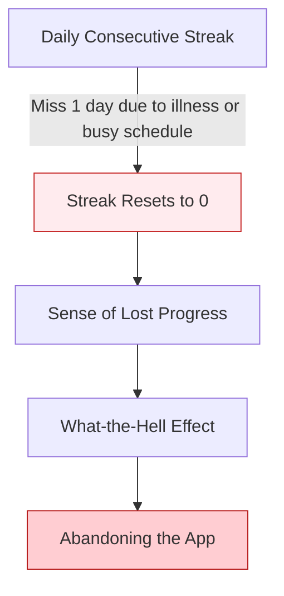
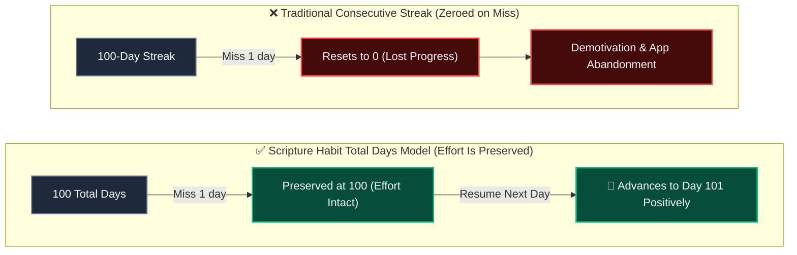
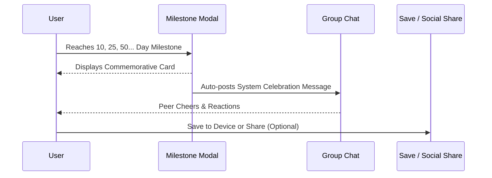

# Milestone Celebrations & Retention Psychology

Scripture Habit features **milestone celebrations at 10 days and every 25 days thereafter (25, 50, 75, 100... days)**, alongside **commemorative image card generation and sharing ([`src/utils/milestone.ts`](file:///c:/Users/dazhi/code/scripture-habit/src/utils/milestone.ts))**.

This mechanism is designed to reduce the anxiety associated with broken streaks and help users sustain a calm, consistent scripture habit over the long term.

---

## 1. Challenges with Traditional Consecutive Streaks

Many habit-tracking applications rely heavily on daily consecutive streaks as their primary incentive. However, rigid streak models introduce several psychological friction points:



### Loss Aversion
In behavioral economics, the pain of losing progress is felt more acutely than the joy of an equivalent gain.
When a 100-day streak resets to zero after a single missed day, users often feel as though all their previous efforts were invalidated.

### The "What-the-Hell Effect"
In cognitive psychology, the "What-the-Hell Effect" refers to the tendency to completely abandon a goal after a minor lapse.
Users who drop out after a broken streak do so primarily because of this psychological reaction rather than a lack of dedication.

---

## 2. Transition to the Total Study Days Model

To relieve pressure, Scripture Habit uses **"Total Study Days (`daysStudiedCount`)"** as its primary celebration metric:



- **Effort Is Never Lost**: Missing a day does not erase past progress; cumulative days remain intact.
- **Easy Resumption**: Users can return with a positive mindset: *"I have studied for 100 days so far, let's keep building on that today."*

---

## 3. Milestone Spacing (10 Days + Every 25 Days)

Milestones are placed at Day 10 and every 25 days thereafter to align with natural habit formation phases:

```
[Day 1] ───→ [Day 10 (First Major Milestone)] ───→ [Day 25] ───→ [Day 50] ───→ [Day 75] ───→ [Day 100] ...
              ▲                                      ▲           ▲           ▲           ▲
         Quick Win (Early Retention)                     Achievable ~3-4 Week Goals
```

### ① Day 10: Breaking the Initial Habit Barrier (Quick Win)
The steepest drop-off in any new habit occurs within the first 1 to 2 weeks.
Celebrating at 3 or 7 days feels premature, while 30 days is too far for beginners. Day 10 is an achievable timeframe where users start feeling genuine confidence that they can maintain the habit.

### ② Every 25 Days: Sustaining the Goal Gradient Effect
People naturally stay more motivated when a goal feels within reach (the Goal Gradient Effect).
Spacing milestones 50 or 100 days apart can cause motivation to sag in between. A 25-day cadence (~3 to 4 weeks) keeps the next goal clearly in sight.

---

## 4. Visualizing Achievement with Commemorative Cards

When a milestone is reached, a celebratory modal ([`MilestoneModal`](file:///c:/Users/dazhi/code/scripture-habit/src/components/milestone/milestone-modal.tsx)) and card ([`MilestoneCard`](file:///c:/Users/dazhi/code/scripture-habit/src/components/milestone/milestone-card.tsx)) appear:

```
┌────────────────────────────────────────────────────────┐
│               ✨ SCRIPTURE HABIT ✨                    │
│                                                        │
│                    🏆 50 DAYS 🏆                       │
│                                                        │
│               "Jane Doe achieved a milestone            │
│               of 50 total days of study."              │
│                                                        │
│                  DATE: 2026-08-27                      │
│               https://scripturehabit.app               │
└────────────────────────────────────────────────────────┘
```

- **Building Self-Efficacy**: Having tangible visual evidence of one's progress reinforces the belief: *"I am someone who reads scripture regularly."*
- **Focusing on Personal Growth**: Celebrations focus on personal accumulation rather than competitive leaderboards, supporting healthy internal motivation.

---

## 5. Sharing and Group Celebrations



- **Thoughtful Group Sharing**: Instead of cluttering chat with regular daily post alerts, celebratory messages appear specifically on milestone days, allowing group members to encourage each other naturally.
- **Easy Saving and Sharing**: Built-in support for Web Share API and PNG download enables users to save or share their cards in a single click.

---

## 6. Architecture Overview

| Role | Key File | Description |
| :--- | :--- | :--- |
| **Logic** | [`src/utils/milestone.ts`](file:///c:/Users/dazhi/code/scripture-habit/src/utils/milestone.ts) | Calculates milestones (10 and multiples of 25) |
| **State** | [`src/store/use-milestone-store.ts`](file:///c:/Users/dazhi/code/scripture-habit/src/store/use-milestone-store.ts) | Manages modal visibility and milestone metadata |
| **UI Components** | [`src/components/milestone/`](file:///c:/Users/dazhi/code/scripture-habit/src/components/milestone/) | Renders the card and handles PNG export and sharing |
| **Backend Integration** | [`api_internal/services/note-service.ts`](file:///c:/Users/dazhi/code/scripture-habit/api_internal/services/note-service.ts) | Detects milestone achievements during note posting and posts group celebrations |

---

## 7. Related Documentation

- [Psychological Impact & Retention of AI Reflection Letters](./ux-ai-reflection-letters.md)
- [Small Group Dynamics (Max 5) & Peer Accountability](./ux-small-groups-and-peer-accountability.md)
- [Note Posting & Streaks](./logic-note-posting.md)
- [Chat & Dashboard Synchronization](./feature-chat-dashboard.md)
