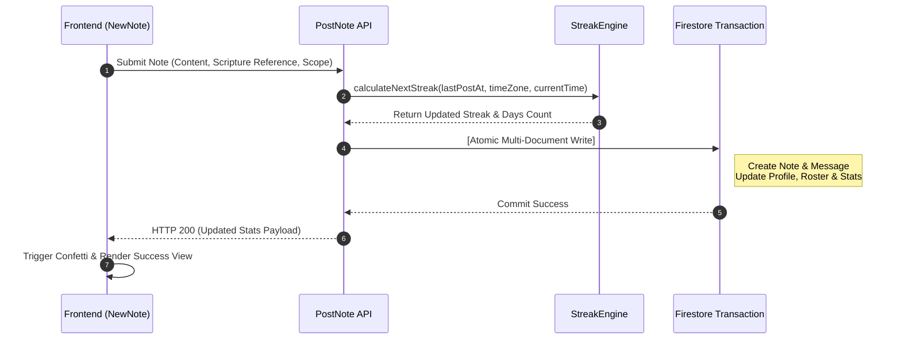

# Note Posting & Streak Calculation Architecture

> [!TIP]
> **Interactive Architecture Tour**: [Open Live Tour (Note Posting Flow)](https://htmlpreview.github.io/?https://github.com/ScriptureHabit/scripture-habit/blob/main/docs/public/architecture-tour.html?tour=tour-newnote&lang=en)

This document describes the end-to-end processing pipeline for study notes, timezone-aware streak evaluation, and dynamic user level computation in Scripture Habit.

---

## 1. Streak Calculation Engine (`api_internal/lib/streak-engine.ts`)

To accurately evaluate consistency across timezones and personal study routines, the system applies a hybrid calendar and grace-period engine.

### Core Rules
Upon note submission, the engine evaluates the user's configured `timeZone` (defaults to `'UTC'`):

1. **Local Date Resolution**  
   Converts server timestamps to the user's localized calendar date string (e.g., `'2026-05-22'`) via the Node.js `Intl` API.
2. **Same-Day Duplicate Guard**  
   If the user's `lastPostDate` matches today's local date, the note is committed without incrementing the streak count (`streakUpdated = false`).
3. **Streak Continuity Evaluation**  
   On a new calendar day, the streak increments by **+1** if either condition holds:
   - **Consecutive Calendar Day**: `lastPostDate` equals yesterday in the local timezone.
   - **36-Hour Grace Window**: Time elapsed since the previous post is **$\le$ 36 hours** (`hoursSinceLastPost <= 36`).

   If neither condition is met, the streak resets to `1`.
4. **All-Time Record Updating**  
   When the updated streak surpasses `highestStreak`, the record updates automatically.

### Practical Scenarios
- **Late-Night Routine**: Posting Monday at 8:00 AM and Tuesday at 10:00 PM (38 hours later) preserves the streak because calendar days are consecutive.
- **Transcontinental Travel**: Crossing timezones and skipping a local calendar day is covered by the 36-hour physical window.

```typescript
const isTargetDay = lastPostDate === yesterday;
const withinGracePeriod = lastTimeMillis > 0 && hoursSinceLastPost <= 36;

if (isTargetDay || withinGracePeriod) {
    newStreak += 1;
    isConsecutive = true;
} else {
    newStreak = 1; // Reset streak
}
```

---

## 2. Note Posting Transaction Flow

To guarantee state consistency, note submissions execute within an atomic Firestore transaction (`db.runTransaction()`):

1. **Membership Verification**: Confirms group authorization via `userData.groupIds`.
2. **Streak Calculation**: Resolves new streak counts and total study days via `StreakEngine`.
3. **Message Publishing**: Writes the note payload into `groups/{id}/messages`.
4. **Master Note Archive**: Saves a copy into `users/{uid}/notes` for the private library.
5. **User Profile Update**: Updates `totalNotes`, `lastPostAt`, `streakCount`, and `daysStudiedCount`.
6. **Group Statistics Increment**: Atomically increments counters via `FieldValue.increment`.

---

## 3. Post-Transaction Background Tasks

To maintain low commit latency, non-blocking tasks execute asynchronously after the transaction commits:

1. **Push Notifications**: Retrieves member FCM tokens and broadcasts multicast notifications.
2. **Unity Score Recomputation**: Asynchronously recalculates the group's daily participation score.

---

## 4. Database Operation Costs (5-Member Group Example)

Operational read/write costs for a single note submission within a 5-member group (1 author + 4 peers):

### Writes (Total: 8)
- **Within Transaction (7 writes)**:
  1. User Profile (`/users/{uid}`)
  2. Master Note Archive (`/users/{uid}/notes/{noteId}`)
  3. Chat Message (`/groups/{gid}/messages/{messageId}`)
  4. Group Metadata (`/groups/{gid}`)
  5. Member Status (`/groups/{gid}/members/{uid}`)
  6. User Group State (`/users/{uid}/groupStates/{gid}`)
  7. Latest Message Cache (`/groups/{gid}/messages_latest/latest`)
- **Background Async (1 write)**:
  8. Group Unity Status (`/groups/{gid}`)

*(Achieving a milestone adds +1 transaction write for the system announcement.)*

### Reads (Total: 7)
- **Within Transaction (2 reads)**: User Profile, Latest Message Cache
- **Background Async (5 reads)**: Group Metadata (1 read), Member FCM Tokens & Locales (4 reads)

---

## 5. Dynamic Level Computation

User level is derived dynamically from cumulative study days (`daysStudiedCount`):

$$\text{Level} = \lfloor \frac{\text{daysStudiedCount}}{7} \rfloor + 1$$

- **Weekly Progression**: Every 7 unique study days advances the user by 1 level.
- **On-the-Fly Derivation**: Computing levels on the client during render avoids database write overhead.

---

## 6. Sequence Diagram



### Posting Sequence Breakdown

1. **Payload Dispatch**  
   The client submits reflection text, scripture references, and group visibility scopes to `/api/messages/post-note`.

2. **Timezone-Aware Evaluation**  
   `StreakEngine` evaluates local date continuity and the 36-hour grace window against the user's historical records.

3. **Atomic Commit & Client Feedback**  
   Personal archives, chat messages, and group rosters commit in a single transaction. Upon success, the client triggers celebration feedback.

---

## 7. Milestone Celebrations

To prevent demotivation when streaks break, the app celebrates **Total Study Days (`daysStudiedCount`)** as its primary retention driver:

- **Regular Days**: Publishes a standard note notification to the group feed.
- **Milestones**: Automatically publishes an official celebration card:
  - **Initial Milestone**: **Day 10**
  - **Regular Cadence**: Every **25 days** thereafter (Day 25, 50, 75, 100, 125...).

See [Milestone Celebrations & Retention Psychology](./logic-milestone-retention.md) for UX rationale.

---

## 8. Related Documentation

- [Milestone Celebrations & Retention Psychology](./logic-milestone-retention.md)
- [Dashboard & MyNotes Guide](./dashboard-mynotes-construction-guide.md)
- [Firestore Transactions & Counters](./firestore-transactions-counters.md)
- [Push Notification System](./feature-notifications.md)
