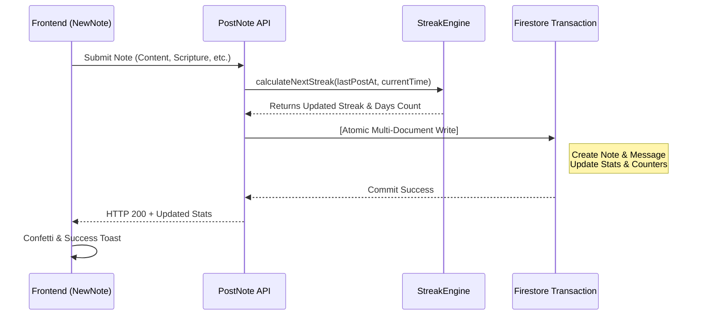

# Note Posting & Streak Logic

This document describes the end-to-end flow of posting a study note, calculating timezone-aware streaks, and determining user levels.

---

## 1. Streak Calculation Engine (`api_internal/lib/streak-engine.ts`)

To accurately evaluate a user's study consistency across different timezones and daily routines (e.g., late-night reading), the app employs a hybrid calculation engine.

### Core Rules
When a user posts a note, the system evaluates their streak using their configured `timeZone` (defaults to `'UTC'`):

1. **Local Date Resolution**:
   Using Node.js's `Intl` API, the current server time is converted into the user's local calendar date string (e.g., `'2026-05-22'`).
2. **Duplicate Post Guard**:
   To prevent multiple increments within the same calendar day, if the user's `lastPostDate` is already today, the note is saved without increasing the streak (`streakUpdated = false`).
3. **Streak Continuity Conditions**:
   When posting on a new calendar day, the streak increases by **+1** if either of the following holds true:
   - **Consecutive Day**: The user's `lastPostDate` was yesterday in their local timezone.
   - **36-Hour Grace Period**: The time elapsed since the previous post is **within 36 hours** (`hoursSinceLastPost <= 36`).

   If neither condition is met, the streak resets to `1`.
4. **Highest Streak Tracking**:
   If the new streak exceeds the user's `highestStreak`, it is automatically updated.

### Practical Scenarios
- **Late-Night Study**: If a user posts Monday at 8:00 AM and again Tuesday at 10:00 PM (38 hours later), the streak continues because the calendar days are consecutive (Monday → Tuesday).
- **Timezone Shifts**: When traveling across timezones and skipping a local calendar day, the 36-hour physical window protects the streak.

```typescript
const isTargetDay = lastPostDate === yesterday;
const withinGracePeriod = lastTimeMillis > 0 && hoursSinceLastPost <= 36;

if (isTargetDay || withinGracePeriod) {
    newStreak += 1;
    isConsecutive = true;
} else {
    newStreak = 1; // Reset streak
}
```

---

## 2. Note Posting Transaction Flow

To maintain data consistency and minimize latency, note submissions are executed within a Firestore transaction (`db.runTransaction()`):

1. **Membership Verification**: Verifies that the user belongs to the target group using `userData.groupIds`.
2. **Streak Calculation**: Calculates updated streak counts and total study days via `StreakEngine`.
3. **Message Creation**: Adds the message document to `groups/{id}/messages`.
4. **Personal Note Archive**: Duplicates the note to `users/{uid}/notes` for the user's private library.
5. **User Profile Update**: Updates `totalNotes`, `lastPostAt`, and `streakCount`.
6. **Group Statistics Update**: Uses `FieldValue.increment` to increment message and note counters.

---

## 3. Post-Transaction Background Tasks

To keep the transaction fast and lightweight, non-blocking tasks run asynchronously after commit:

1. **Push Notifications**: Retrieves target member tokens and dispatches notifications in the background.
2. **Unity Percentage Calculation**: Asynchronously updates the group's daily completion rate (`unityPercentage`).

---

## 4. Database Operation Costs (5-Member Group Example)

Theoretical Firestore read/write operations when 1 member posts to a 5-member group (1 sender + 4 recipients):

### Writes (Total: 8)
- **Within Transaction (7 writes)**:
  1. User Profile (`/users/{uid}`)
  2. Master Note Archive (`/users/{uid}/notes/{noteId}`)
  3. Chat Message (`/groups/{gid}/messages/{messageId}`)
  4. Group Metadata (`/groups/{gid}`)
  5. Member Status (`/groups/{gid}/members/{uid}`)
  6. User Group State (`/users/{uid}/groupStates/{gid}`)
  7. Latest Message Cache (`/groups/{gid}/messages_latest/latest`)
- **Background Async (1 write)**:
  8. Group Unity Status (`/groups/{gid}`)

*(Achieving a milestone adds +1 write within the transaction for the celebratory system message.)*

### Reads (Total: 7)
- **Within Transaction (2 reads)**: User Profile, Latest Message Cache
- **Background Async (5 reads)**: Group Metadata (1 read), Member FCM Tokens & Locales (4 reads)

---

## 5. Level Calculation

A user's level is calculated from their total cumulative study days:

$$\text{Level} = \lfloor \frac{\text{daysStudiedCount}}{7} \rfloor + 1$$

- **Weekly Progression**: Every 7 unique study days advances the level by 1.
- **On-the-Fly Optimization**: The `level` is computed dynamically on the client side from `daysStudiedCount` during UI render, saving database write operations.

---

## 6. Sequence Diagram



---

## 7. Milestone Celebrations

To prevent demotivation when streaks break, the application highlights **Total Study Days (`daysStudiedCount`)** as its primary metric:

- **Regular Days**: Posts a standard notification (*"User posted a note!"*).
- **Milestone Days**: Automatically triggers a celebration message in the group:
  - **Initial Milestone**: **Day 10**
  - **Regular Cadence**: Every **25 days** thereafter (25, 50, 75, 100, 125...).

For design principles and psychological context, see [Milestone Celebrations & Retention Psychology](./logic-milestone-retention.md).

---

## 8. Related Documentation

- [Milestone Celebrations & Retention Psychology](./logic-milestone-retention.md)
- [Dashboard & MyNotes Guide](./dashboard-mynotes-construction-guide.md)
- [Firestore Transactions & Counters](./firestore-transactions-counters.md)
- [Push Notification System](./feature-notifications.md)
