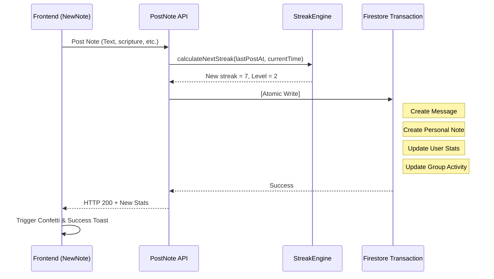

# Note Posting & Streak Logic

This document explains how users post study notes and how streaks and levels are calculated.

---

## 🔥 Streak Engine (`api_internal/lib/streak-engine.ts`)

The app uses a **Hybrid Streak Engine** to calculate user streaks. It prevents users from losing streaks due to timezone changes or late-night study habits.

### Core Calculation Rules
When a user posts a note, the system calculates their streak using their local `timeZone` (default is `'UTC'`):

1.  **Local Date Resolution**:
    The engine converts the current server time and the time 24 hours ago into the user's local date string (e.g., `'2026-05-22'`) using Node's `Intl` API.
2.  **Same-Day Double-Increment Guard**:
    To prevent users from increasing their streak multiple times a day:
    - If the user's `lastPostDate` is already today, the note is saved, but the streak count does not increase (`streakUpdated = false`).
3.  **Streak Continuation Check**:
    If the note is posted on a new day, the streak **increases by 1** if either condition is met:
    - **Consecutive Calendar Day**: The user's `lastPostDate` is exactly yesterday.
    - **36-Hour Grace Period**: The time since the last post is **36 hours or less** (`hoursSinceLastPost <= 36`).
    
    If neither condition is met, the streak **resets to 1**.
4.  **Highest Streak**:
    If the new streak is higher than `highestStreak`, the system updates `highestStreak`.

### Example Benefits
- **Late-Night Study**: A user posts Monday morning at 8:00 AM, and then Tuesday night at 10:00 PM (38 hours later). Even though it is past 36 hours, they keep their streak because it is consecutive calendar days (Monday -> Tuesday).
- **Timezone Shift**: A user traveling across timezones who misses a calendar day is protected by the 36-hour physical window.

### Algorithm Code
```typescript
const isTargetDay = lastPostDate === yesterday;
const withinGracePeriod = lastTimeMillis > 0 && hoursSinceLastPost <= 36;

if (isTargetDay || withinGracePeriod) {
    newStreak += 1;
    isConsecutive = true;
} else {
    newStreak = 1; // Reset streak
}
```

---

## 💎 Deconstructed Post Transaction Steps (Read-Optimized)

To maximize performance and prevent transaction lock contention, posting a note runs inside a Firestore `db.runTransaction()` with **0 transactional group document reads**:

1.  **Validate Membership (Read-Free)**: Verify that the user belongs to the group by validating against the user's own `userData.groupIds` array, bypassing `groupRef.get()`.
2.  **Calculate Stats**: Call `StreakEngine` to get the new `streakCount` and updates.
3.  **Create Message**: Add a message document to `groups/{id}/messages`.
4.  **Sync Personal Note**: Duplicate the note to `users/{uid}/notes` for personal archives.
5.  **Update User Profile**: Increment `totalNotes` and update `lastPostAt`, `streakCount`, etc. on the user document.
6.  **Atomic Group Update (Write-Only)**: Perform a blind write to update metadata counters (`messageCount`, `noteCount`) and timestamp arrays via `FieldValue.increment` and `FieldValue.arrayUnion`.

---

## 🤝 Asynchronous Post-Transaction Sweeps

All non-blocking calculations, push notification sweeps, and daily activity resets are deferred to **post-transaction background operations** outside the transaction context:

1.  **Push Notification Member Sweeps**: The list of group members to notify is fetched outside the transaction context in a background task, avoiding transactional locking.
2.  **Lazy Daily resets & Unity Calculations**:
    - Instead of resetting all group stats via nightly CRON sweeps, the system resets the `dailyActivity` dates and sweeps **lazily** on the first note post of a new calendar day.
    - The unity percentage (`unityPercentage`) is calculated dynamically outside the transaction and updated asynchronously, preventing expensive queries from stalling the chat post transaction.

---

## 🏆 Level Calculation & UI Optimization

The user's level is calculated using this formula:
`Level = floor(daysStudiedCount / 7) + 1`

- **Weekly Pace**: Studying for 7 unique days increases the user's level by 1.
- **On-the-Fly Calculation (Write Optimization)**:
  To eliminate redundant database writes and minimize Firestore storage costs, the `level` field is **not persisted** directly in the `users` document.
  Instead, the client application dynamically computes the level in the React render phase using the user's physical `daysStudiedCount` field (e.g., inside `DashboardOverview` or `UserProfileModal`).
- **Leaderboard Performance**: Leaderboards and rankings can still be sorted efficiently since the underlying sorting key (`daysStudiedCount`) scales linearly and is indexed natively in Firestore, ensuring fast response times without requiring duplicate properties in the database.

---

## 🚦 Posting Flow Diagram



---

## 🎉 Cumulative Study Milestones & Dashboard Metric Migration

To promote positive psychology and reduce user anxiety related to maintaining daily streaks (which could lead to demotivation if a single day is missed), the application has transitioned to celebrating **Cumulative Study Days (累積日数)** instead of continuous streaks:

1. **Dashboard & Profile Metrics**: The primary dashboard overview card and user profile widgets now display **Cumulative Days** (`daysStudiedCount`) rather than consecutive streaks (`streakCount`).
2. **Mascot Celebrations**: The mascot speech bubble dynamically celebrates the user's cumulative days achieved (`daysStudiedCount`) upon posting a note (e.g., "Amazing! Cumulative 10 days achieved!").
3. **Group Chat Announcements**:
   Instead of announcing every daily post to group chats (which causes chat clutter and social pressure), group-wide system announcements are only posted when a user achieves a significant cumulative study milestone:
   - **Fixed Milestones**: **3, 7, 10, 21, 30, 50, 100 days**
   - **Recurring Milestones**: Every **50 days** thereafter (e.g., 150, 200, 250...)
