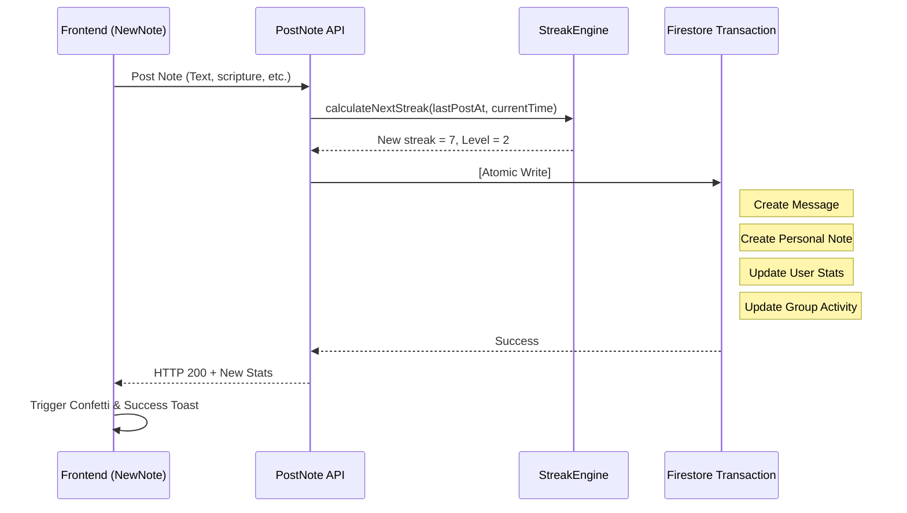

# Note Posting & Streak Logic

This document explains how users post study notes and how streaks and levels are calculated.

---

## 🔥 Streak Engine (`api_internal/lib/streak-engine.ts`)

The app uses a **Hybrid Streak Engine** to calculate user streaks. It prevents users from losing streaks due to timezone changes or late-night study habits.

### Core Calculation Rules
When a user posts a note, the system calculates their streak using their local `timeZone` (default is `'UTC'`):

1.  **Local Date Resolution**:
    The engine converts the current server time and the time 24 hours ago into the user's local date string (e.g., `'2026-05-22'`) using Node's `Intl` API.
2.  **Same-Day Double-Increment Guard**:
    To prevent users from increasing their streak multiple times a day:
    - If the user's `lastPostDate` is already today, the note is saved, but the streak count does not increase (`streakUpdated = false`).
3.  **Streak Continuation Check**:
    If the note is posted on a new day, the streak **increases by 1** if either condition is met:
    - **Consecutive Calendar Day**: The user's `lastPostDate` is exactly yesterday.
    - **36-Hour Grace Period**: The time since the last post is **36 hours or less** (`hoursSinceLastPost <= 36`).
    
    If neither condition is met, the streak **resets to 1**.
4.  **Highest Streak**:
    If the new streak is higher than `highestStreak`, the system updates `highestStreak`.

### Example Benefits
- **Late-Night Study**: A user posts Monday morning at 8:00 AM, and then Tuesday night at 10:00 PM (38 hours later). Even though it is past 36 hours, they keep their streak because it is consecutive calendar days (Monday -> Tuesday).
- **Timezone Shift**: A user traveling across timezones who misses a calendar day is protected by the 36-hour physical window.

### Algorithm Code
```typescript
const isTargetDay = lastPostDate === yesterday;
const withinGracePeriod = lastTimeMillis > 0 && hoursSinceLastPost <= 36;

if (isTargetDay || withinGracePeriod) {
    newStreak += 1;
    isConsecutive = true;
} else {
    newStreak = 1; // Reset streak
}
```

---

## 💎 Post Transaction Steps

To keep data consistent, posting a note runs inside a Firestore `db.runTransaction()` with **6 atomic steps**:

1.  **Validate**: Verify that the user belongs to the group.
2.  **Calculate Stats**: Call `StreakEngine` to get the new `streakCount` and `level`.
3.  **Create Message**: Add a message document to `groups/{id}/messages`.
4.  **Sync Personal Note**: Duplicate the note to `users/{uid}/notes` for personal archives.
5.  **Update User Profile**: Increment `totalNotes` and update `lastPostAt`, `streakCount`, and `level` on the user document.
6.  **Update Group Metadata**: Update fields like `lastMessageAt` and `lastNoteAt` on the group document to refresh the sidebar UI.

---

## 🤝 Group Unity (`dailyActivity`)

The Group Unity bar shows the study completion status of the group for the current UTC day.
- **Active Members**: When a user posts, their UID is added to the group's `dailyActivity.activeMembers` array.
- **Deduplication**: The array only stores unique UIDs, so posting multiple times only counts once per member.
- **Daily Reset**: A daily cron job (or the first post of a new UTC day) resets the `dailyActivity` object.

---

## 🏆 Level Calculation

The user's level is calculated with this formula:
`Level = floor(daysStudiedCount / 7) + 1`

- **Weekly Pace**: Studying for 7 unique days increases the user's level by 1.
- **Performance**: The level is saved to the `users` document to make leaderboard sorting fast.

---

## 🚦 Posting Flow Diagram


