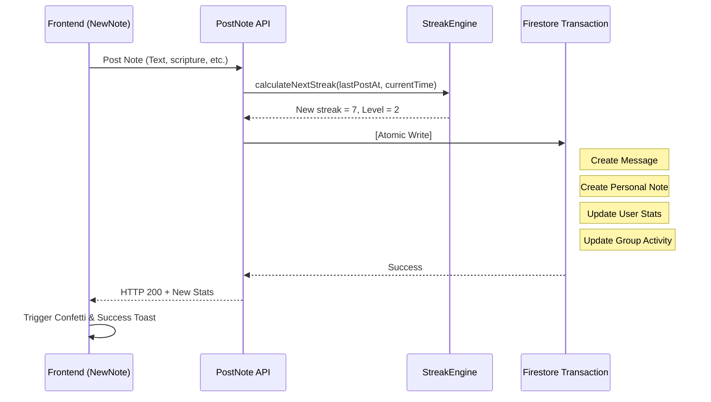

# Note Posting & Streak Logic: Technical Deep-Dive

The Note Posting mechanism is the heart of the "Habit" loop in **scripture-habit**. It is designed to be fair, encouraging, and highly reliable across timezones.

---

## 🔥 The Streak Engine (`api_internal/lib/streak-engine.ts`)

To protect users against timezone warp anomalies, timezone shifts during travel, and late-night habits, **scripture-habit** implements a highly generous and robust **Hybrid Streak Engine**. 

Rather than enforcing a simple 24-hour calendar grid or a strict physical hours cutoff, the engine combines **Calendar-Consecutive Day verification** with a **36-Hour Physical Grace Period** and incorporates a **Same-Day Double-Increment Guard**.

### Core Evaluation Pipeline
When a user posts a note, the system evaluates their streak based on their profile `timeZone` (falling back to `'UTC'`):

1. **Timezone-Aware Local Date Resolution**:
   The engine formats the current server timestamp (`now`) and the date exactly 24 hours prior (`now - 24 hours`) inside the user's localized timezone using the Swedish locale format (`'sv-SE'`) via Node's `Intl` API:
   - **`today`**: Resolved local date string (e.g. `'2026-05-22'`).
   - **`yesterday`**: Resolved local yesterday date string (e.g. `'2026-05-21'`).

2. **Same-Day Double-Increment Guard**:
   To prevent users from artificially bloating their streak counts by posting multiple study notes in a single calendar day:
   - If the user's `lastPostDate` matches `today`, the note is successfully recorded, but the streak count is preserved as-is without incrementing (`streakUpdated = false`).

3. **Hybrid Streak Continuation Check**:
   If the post occurs on a new calendar date, the engine validates continuation using two cooperative checks. A streak is successfully **incremented by `1`** if **either** of these is true:
   - **Consecutive Calendar Day**: The user's `lastPostDate` is exactly equal to `yesterday` (meaning they posted at some point yesterday, local timezone time).
   - **36-Hour Physical Grace Period**: The time elapsed since the user's previous note (`lastPostAt`) is less than or equal to **36 hours** (`hoursSinceLastPost <= 36`).
   
   If *neither* condition is satisfied (e.g., they skipped a full calendar day and exceeded the 36-hour physical window), the streak **resets to `1`** to start a new streak.

4. **Highest Streak Record**:
   If the newly calculated streak exceeds the user's persisted `highestStreak`, `highestStreak` is atomically updated to match the new value.

### Hybrid Evaluation Advantages
This hybrid engine is exceptionally fair. For example:
- **Late-Night to Next-Night Posting**: A user posts early on Monday morning at 8:00 AM, and then posts late on Tuesday night at 10:00 PM (38 hours later). Even though it exceeds the 36-hour physical window, they **do not lose their streak** because it is calendar-consecutive (Monday -> Tuesday).
- **Timezone Shifts / Travel Protection**: A user travels across timezones, causing them to miss a calendar day on their local calendar. They are **protected by the 36-hour physical window**, maintaining their streak.

### Concrete Algorithm Flow
```typescript
// Actual StreakEngine evaluation logic
const isTargetDay = lastPostDate === yesterday;
const withinGracePeriod = lastTimeMillis > 0 && hoursSinceLastPost <= 36;

if (isTargetDay || withinGracePeriod) {
    newStreak += 1;
    isConsecutive = true;
} else {
    newStreak = 1; // Reset streak
}
```

---

## 💎 The Post Transaction (Atomic Steps)

To ensure data integrity, every note post is wrapped in a `db.runTransaction()`. The following **6 steps** happen at once:

1.  **Validate**: Ensures the user is a member of the target group.
2.  **Calculate Stats**: Invokes `StreakEngine` to determine the new `streakCount` and `level` (based on `daysStudiedCount`).
3.  **Create Message**: A new document is written to `groups/{id}/messages` containing the note content.
4.  **Sync Personal Note**: A duplicate is written to `users/{uid}/notes` for long-term personal storage.
5.  **Update User Profile**: Atomic increment of `totalNotes` and updates to `lastPostAt`, `streakCount`, and `level`.
6.  **Metadata Update**: Updates `lastMessageAt/Nickname` and `lastNoteAt/Nickname` on the main group document to trigger real-time sidebar updates.

---

## 🤝 Group Unity Logic (`dailyActivity`)

The "Unity" bar in the group chat reflects collective effort for the current calendar day (UTC).
- **Active Members**: During the transaction, the user's UID is added to the group's `dailyActivity.activeMembers[]` array.
- **Deduplication**: The array is unique; posting multiple times in one day only counts as one "Unity point" per member.
- **Reset**: The cron job OR the first post of a new UTC day resets the `dailyActivity` object.

---

## 🏆 Level Derivation

Level is a derived value calculated as follows:
`Level = floor(daysStudiedCount / 7) + 1`

- **Why 7?**: We use a weekly cadence. Completing 7 distinct days of study (regardless of streaks) earns you a new level.
- **Persistence**: While it's a derived value, we persist it to the `users` document to allow for high-performance sorting in leaderboards and profiles.

---

## 🚦 Posting Flow Diagram


