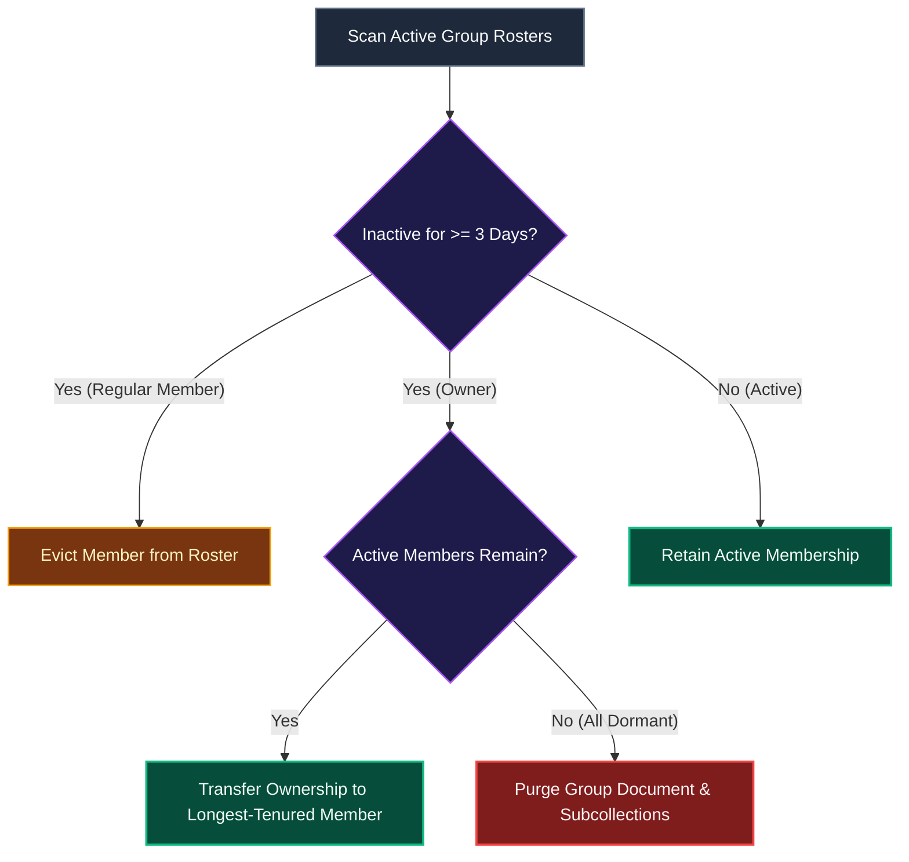

# Maintenance & Scheduled Jobs (Cron)

This document details the background cron architecture, inactivity evaluation schedules, ownership reassignment protocols, and automated TTL data retention in Scripture Habit.

---

## 1. Scheduled Jobs Overview

All cron endpoints require valid `Authorization: Bearer <CRON_SECRET>` headers and execute on automated schedules:

| Endpoint | Cadence | Core Responsibility |
| :--- | :--- | :--- |
| `/api/cron/check-inactive-users` | Daily (00:00 UTC) | Evaluates inactivity thresholds ($\ge$ 3 days) and manages owner succession |
| `/api/cron/sync-user-stats` | Daily | Reconciles note counters and cleans dangling group memberships |
| `/api/cron/cleanup-orphaned-cheers` | Daily | Purges cheer records referencing deleted accounts or groups |
| `/api/cron/post-ai-daily-notes` | Daily | Publishes daily study notes into dedicated AI companion groups |
| `/api/cron/cleanup-demo-sandboxes` | Hourly | Purges temporary guest demo sessions older than 1 hour |

---

## 2. Inactivity Pruning & Ownership Transfer

Maintains active group participation by pruning dormant accounts:

### Maintenance Flow Breakdown

1. **Roster Evaluation**  
   Compares member interaction timestamps against resolved inactivity thresholds.
2. **Owner Succession**  
   If the group owner becomes inactive, ownership automatically transfers to the longest-tenured active member.
3. **Dormant Group Purge**  
   If all members become inactive, the group is purged to eliminate orphaned records.

---

## 3. Automated Message Retention (Firestore Native TTL)

Active chat messages are stamped with an `expireAt` timestamp (30 days from creation) and purged by Cloud Firestore's native TTL engine in the background.
*(Personal study notes under `users/{uid}/notes` are preserved permanently).*

---

## 4. Related Documentation

- [Inactivity & Auto-Kick Engine](./inactivity-and-autokick.md)
- [CI/CD & Maintenance Automation](./cicd-maintenance-automation.md)
- [Database & Security Architecture](./database-security.md)
