# Maintenance & Batch Jobs

The **scripture-habit** platform uses automated background jobs (cron) to manage inactive users, prune old data, and synchronize statistics.

---

## 1. Inactivity Check

The **Inactivity Check** job (`/api/cron/check-inactive-users`) removes inactive users from groups to keep groups active.

### 1.1 Rotation-Based Scanning
To minimize database load, the system scans groups in rotation:
- It fetches 100 groups sorted by `lastInactivityCheckedAt` (oldest first).
- It checks new groups that do not have this timestamp yet.
- This ensures every group is checked at least once every few days.

### 1.2 Activity Markers
A user is inactive if all of these dates are older than the `kickThreshold` (default 3 days):
- `lastNoteAt`: Last time they posted a study note.
- `lastPostAt`: Last time they sent any message.
- `joinedAt`: The date they joined the group (grace period for new members).

### 1.3 Inactive User Cleanup
When a user is kicked:
- The user's membership in the `groups` collection is removed.
- Their personal `groupIds` array is updated.
- Their `groupStates` record in the `users` subcollection is deleted to free up space.
- Legacy member documents without a `joinedAt` timestamp are updated with a default value to prevent errors.

---

## 2. Group Ownership Transfer

If a group owner becomes inactive:
1.  **Selection**: The system identifies all active members.
2.  **Promotion**: The most active or senior member is promoted to the new owner.
3.  **Deletion**: If there are no active members left, the group is deleted along with its messages and statistics.

---

## 3. Message Archiving (Bucket Pattern)

Having too many messages in a group chat slows down real-time queries and increases database costs. To prevent this, the `ArchiveService` runs a background task (`/api/archive-old-messages`) to archive old messages using a **Bucket Pattern**.

### 3.1 The Archiving Pipeline (`ArchiveService.ts`)
The cron job finds group messages older than **30 days** and archives them in chunks:
- **Chunking**: Messages are grouped into chunks of 50 (`BUCKET_SIZE = 50`).
- **Deterministic Bucket ID**: To prevent duplicate entries when multiple tasks run, each bucket gets a unique ID:
  `bucket_${timeMillis}_${firstMsg.id.substring(0, 8)}`
  - `timeMillis`: Timestamp of the oldest message in the chunk.
  - `firstMsg.id`: ID of the first message in the chunk.

### 3.2 Transaction-Based Migration
To ensure data safety, each chunk is migrated using a Firestore transaction:
1. **Check**: The transaction checks if `/groups/{groupId}/message_buckets/{bucketId}` already exists. If yes, it skips the chunk.
2. **Write**: The transaction writes the messages, the `count` (up to 50), and the `groupId` to the bucket document.
3. **Delete**: The transaction deletes the original 50 message documents from `/groups/{groupId}/messages/{messageId}`.
4. **Commit**: The transaction commits. If any step fails, the entire transaction rolls back to keep data consistent.

### 3.3 Loading Archived History
When a user scrolls back in time to read older messages:
- The backend `/api/history` endpoint fetches active messages.
- If the user scrolls past the oldest active message, the app loads the latest archived bucket.
- The server packages this data using Firestore Bundles and sends it to the client so the UI can display older messages.

---

## 4. Counter Synchronization

We use denormalized counters (`messageCount`, `noteCount`) to improve performance. These counters can occasionally drift from the actual counts.
- **Recounting**: For groups that have not been active in 24 hours, the system recounts the documents to verify statistics.

### 4.1 Recounting with Archived Buckets
Since archived messages are removed from the active `messages` subcollection, counting active documents alone is not enough. The recount process sums active and archived messages:
1. Count the active message documents in `/groups/{groupId}/messages`.
2. Sum the `.count` values of all bucket documents in `/groups/{groupId}/message_buckets`.
3. Calculate the total: `Total Messages = activeMessageCount + Sum(bucket.count)`.
4. Update the group's `messageCount` property in Firestore.

---

## 5. Security & Secret Verification

All cron endpoints require a `CRON_SECRET` token in the request header (`Authorization: Bearer <secret>`). This ensures only authorized services (like Vercel Cron or GitHub Actions) can run maintenance or administrative jobs.

---

## 6. Data Integrity & Self-Healing Sync Jobs

To prevent long-term data degradation due to network errors, race conditions, or aborted clients, the backend includes self-healing background synchronization jobs.

### 6.1 User Statistics and Membership Validation (`/api/cron/sync-user-stats`)
This job targets active users (who posted in the last 24 hours) in batches of 100 to reconcile their stats with absolute physical database truth:
- **Physical Count Verification**:
  - Counts documents in the user's `notes` subcollection and updates `users/{uid}/totalNotes`.
  - Counts documents in the `cheers` collection where `targetUid == uid` and updates `users/{uid}/cheersReceived`.
- **Orphan Membership Pruning (Self-Healing)**:
  - Fetches the user's `groupIds` array and uses `db.getAll` to check if their corresponding `groups/{groupId}/members/{uid}` document actually exists.
  - If a group was deleted or the user was kicked but the user profile wasn't updated, the system **automatically removes** the group ID from the user's `groupIds` array and deletes the stale `users/{uid}/groupStates/{groupId}` state document.
  - All operations are written using Firestore Batches committed in chunks of **400 operations**.

### 6.2 Orphaned Cheers Cleanup (`/api/cron/cleanup-orphaned-cheers`)
When accounts or groups are deleted, social interaction nodes (Cheers) can become orphaned.
- **Orphan Sweeper**:
  - Fetches a batch of 200 cheers sorted by `lastCheckedAt` (oldest checked first).
  - Uses `db.getAll` to verify in parallel whether the associated `groupId`, `senderUid`, and `targetUid` still exist in Firestore.
- **Auto-Deletion**:
  - If any associated entity is missing, the cheer document is immediately deleted.
  - If all entities are valid, the cheer's `lastCheckedAt` timestamp is updated to the current time, moving it to the back of the queue.

---

## 7. Diagnostics & Simulated Dry-Runs

### 7.1 Inactivity Check Simulation (`/api/cron/test-inactive-check/:groupId`)
Provides a safe, read-only diagnostic API for developers or administrators to review a group's inactivity state without modifying any databases.
- **Simulated Actions**: Calculates the inactivity metrics for all members and reports what actions (repair, initialize, keep, or remove) the actual inactivity cron *would* take.
- **Ghost Member Detection**: Explicitly identifies "Ghost Members" (users who are present in the root group's `members` array but lack a corresponding document in the `groups/{groupId}/members` subcollection), marking them for automatic repair.

---

## 8. Data Pruning & Self-Healing Maintenance Flow

```mermaid
flowchart TD
    subgraph Archiving [ArchiveService: Daily Cron]
        Cron[Cron Trigger: /api/archive-old-messages] --> FetchOld[Fetch messages older than 30 days]
        FetchOld --> Partition[Partition into chunks of BUCKET_SIZE = 50]
        Partition --> LoopChunks[For each chunk...]
        LoopChunks --> GenId[Generate Unique Bucket ID: bucket_timestamp_msgPrefix]
        GenId --> StartTx[Start Firestore Transaction]
        StartTx --> CheckExist{Bucket exists in DB?}
        CheckExist -->|Yes| Skip[Skip chunk / Prevent duplication]
        CheckExist -->|No| SetBucket[transaction.set message_buckets/bucketId]
        SetBucket --> DeleteOld[transaction.delete original messages]
        DeleteOld --> CommitTx[Commit Transaction / Atomic Move]
    end

    subgraph Recount [CounterService: Recount Loop]
        TriggerRecount[Recount Triggered] --> ActiveCount[Count documents in active messages subcollection]
        ActiveCount --> FetchBuckets[Fetch all documents in message_buckets subcollection]
        FetchBuckets --> SumBuckets[Sum bucket.count properties]
        SumBuckets --> Total[Total = Active + Summed Buckets]
        Total --> UpdateGroup[Update group.messageCount denormalized state]
    end

    subgraph SelfHealing [Self-Healing: Data Sync]
        TriggerSync[Sync Triggered: /api/cron/sync-user-stats] --> PhysicalCount[Verify & update notes/cheers count]
        PhysicalCount --> ParallelCheck[Parallel check user group memberships]
        ParallelCheck --> PruneOrphans[Prune orphan group IDs & groupStates]
    end
```

