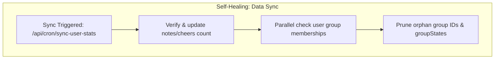

# Maintenance & Batch Jobs

The **scripture-habit** platform uses automated background jobs (cron) to manage inactive users, prune old data, and synchronize statistics.

---

## 1. Inactivity Check

The **Inactivity Check** job (`/api/cron/check-inactive-users`) removes inactive users from groups to keep groups active.

### 1.1 Rotation-Based Scanning
To minimize database load, the system scans groups in rotation:
- It fetches 100 groups sorted by `lastInactivityCheckedAt` (oldest first).
- It checks new groups that do not have this timestamp yet.
- This ensures every group is checked at least once every few days.

### 1.2 Activity Markers
A user is inactive if all of these dates are older than the `kickThreshold` (default 3 days):
- `lastNoteAt`: Last time they posted a study note.
- `lastPostAt`: Last time they sent any message.
- `joinedAt`: The date they joined the group (grace period for new members).

### 1.3 Inactive User Cleanup
When a user is kicked:
- The user's membership in the `groups` collection is removed.
- Their personal `groupIds` array is updated.
- Their `groupStates` record in the `users` subcollection is deleted to free up space.
- Legacy member documents without a `joinedAt` timestamp are updated with a default value to prevent errors.

---

## 2. Group Ownership Transfer

If a group owner becomes inactive:
1.  **Selection**: The system identifies all active members.
2.  **Promotion**: The most active or senior member is promoted to the new owner.
3.  **Deletion**: If there are no active members left, the group is deleted along with its messages and statistics.

---

## 3. Message TTL (Time-To-Live)

Having too many messages in a group chat slows down real-time queries and increases database costs. To prevent this, Firestore TTL (Time-To-Live) is configured on the `messages` collection-group.

- **Auto-Deletion**: Every message document includes an `expireAt` field set to 30 days after creation.
- **Background Deletion**: Firestore automatically deletes documents once the current time exceeds `expireAt`.
- **Note Preservation**: Note sharing copies (`isNote: true` messages) in the group chat are deleted by TTL, but the user's original notes at `/users/{uid}/notes/{noteId}` are kept permanently.

---

## 4. Security & Secret Verification

All cron endpoints require a `CRON_SECRET` token in the request header (`Authorization: Bearer <secret>`). This ensures only authorized services (like Vercel Cron or GitHub Actions) can run maintenance or administrative jobs.

---

## 5. Data Integrity & Self-Healing Sync Jobs

To prevent long-term data degradation due to network errors, race conditions, or aborted clients, the backend includes self-healing background synchronization jobs.

### 5.1 User Statistics and Membership Validation (`/api/cron/sync-user-stats`)
This job targets active users (who posted in the last 24 hours) in batches of 100 to reconcile their stats with absolute physical database truth:
- **Physical Count Verification**:
  - Counts documents in the user's `notes` subcollection and updates `users/{uid}/totalNotes`.
  - Counts documents in the `cheers` collection where `targetUid == uid` and updates `users/{uid}/cheersReceived`.
- **Orphan Membership Pruning (Self-Healing)**:
  - Fetches the user's `groupIds` array and uses `db.getAll` to check if their corresponding `groups/{groupId}/members/{uid}` document actually exists.
  - If a group was deleted or the user was kicked but the user profile wasn't updated, the system **automatically removes** the group ID from the user's `groupIds` array and deletes the stale `users/{uid}/groupStates/{groupId}` state document.
  - All operations are written using Firestore Batches committed in chunks of **400 operations**.

### 5.2 Orphaned Cheers Cleanup (`/api/cron/cleanup-orphaned-cheers`)
When accounts or groups are deleted, social interaction nodes (Cheers) can become orphaned.
- **Orphan Sweeper**:
  - Fetches a batch of 200 cheers sorted by `lastCheckedAt` (oldest checked first).
  - Uses `db.getAll` to verify in parallel whether the associated `groupId`, `senderUid`, and `targetUid` still exist in Firestore.
- **Auto-Deletion**:
  - If any associated entity is missing, the cheer document is immediately deleted.
  - If all entities are valid, the cheer's `lastCheckedAt` timestamp is updated to the current time, moving it to the back of the queue.

### 5.3 AI Partner Daily Note Posting (`/api/cron/post-ai-daily-notes`)
Automatically generates and posts daily scripture study notes for AI Partner study groups (`isAiGroup: true`):
- **Automated Posting**: Uses `AiDailyNoteService` with Gemini AI to generate insightful scripture reflections based on the daily reading plan.
- **Cache Reconciliation**: Reconciles the latest messages cache (`messages_latest/latest`) after posting to keep real-time chat previews synchronized.

### 5.4 Demo Sandbox Environment Cleanup (`/api/cron/cleanup-demo-sandboxes`)
Prevents temporary sandbox data from accumulating in the database:
- **TTL Expiration**: Automatically queries anonymous demo accounts (`isAnonymousDemo: true`) exceeding the 1-hour expiration window (`DEMO_TTL_MS`).
- **Full Deletion**: Performs `recursiveDelete` on demo groups and user subcollections, and deletes temporary Firebase Auth accounts.

---

## 6. Diagnostics & Simulated Dry-Runs

### 6.1 Inactivity Check Simulation (`/api/cron/test-inactive-check/:groupId`)
Provides a safe, read-only diagnostic API for developers or administrators to review a group's inactivity state without modifying any databases.
- **Simulated Actions**: Calculates the inactivity metrics for all members and reports what actions (repair, initialize, keep, or remove) the actual inactivity cron *would* take.
- **Ghost Member Detection**: Explicitly identifies "Ghost Members" (users who are present in the root group's `members` array but lack a corresponding document in the `groups/{groupId}/members` subcollection), marking them for automatic repair.

---

## 7. Data Pruning & Self-Healing Maintenance Flow

