# Maintenance & Batch Jobs: The "Self-Healing" App

To ensure the long-term health and performance of the platform, **scripture-habit** utilizes a series of automated background jobs (Cron) that handle user churn, data pruning, and statistical synchronization.

---

## 🏃 Inactivity Check: The Core Algorithm

The most important maintenance task is the **Inactivity Check** (`/api/check-inactive-users`), which prevents groups from becoming "graveyards" of inactive profiles.

### 1. Rotation Scanning
The system uses a **Rotation-based Scanning** pattern to minimize database load:
- It fetches 100 groups sorted by `lastInactivityCheckedAt` (oldest first).
- It also uses a "Stale Net" to catch new groups that don't have the field yet.
- This ensures every group is checked at least once every few days.

### 2. Activity Multi-Marker
A user is declared inactive only if **all** of these markers exceed the `kickThreshold` (default 3 days):
- `lastNoteAt`: Last time they posted a study note.
- `lastPostAt`: Last time they sent any message.
- `joinedAt`: The date they joined the group (grace period for new members).

### 3. "Ghost Buster" Cleanup
To maintain strict data integrity, when a user is kicked:
- The user's membership in the `groups` collection is removed.
- Their personal `groupIds` array is updated.
- Their `groupStates` record in the `users` subcollection is deleted to free up space.
- Legacy/corrupted member documents without `joinedAt` are auto-initialized to prevent infinite loops.

---

## 👑 Ownership Transfer: The Succession Plan

Groups are never left without a leader. If a Group Owner becomes inactive:
1.  **Selection**: The system identifies all active members.
2.  **Promotion**: The member with the highest activity or seniority is promoted to "Owner."
3.  **Group Deletion**: If *zero* active members remain, the system assumes the group is abandoned and invokes `recursiveDelete()` to clean up all subcollections (messages, stats, etc.).

---

## 📦 Data Pruning: The Message Bucket Strategy

Chat history grows dynamically. Leaving thousands of individual message documents inside a single active group chat subcollection results in slow real-time `onSnapshot` listener queries, high database read costs, and client UI lag. 

To manage this, the application employs a background **Message Archiving** task (`/api/archive-old-messages`) built on a high-performance **Bucket Pattern** managed by the `ArchiveService`.

### 1. The Archiving Pipeline (`ArchiveService.ts`)
The Cron job queries Firestore for group messages older than **30 days** and processes them through an atomic, chunked migration flow:
- **Partitioned Chunking**: Historical messages are partitioned into groups of exactly `BUCKET_SIZE = 50` messages.
- **Race-Condition Proof Bucket ID**:
  To prevent parallel Cron routines from overwriting data or generating duplicate entries, the service generates a unique, deterministic ID for each bucket:
  `bucket_${timeMillis}_${firstMsg.id.substring(0, 8)}`
  - `timeMillis`: The millisecond timestamp of the oldest message in the chunk.
  - `firstMsg.id`: The ID of the first message in the chunk.

### 2. Atomic Transaction Migration
To ensure zero data loss or duplication during migration, each 50-message chunk is moved inside an isolated Firestore transaction:
1. **Deduplication Check**: The transaction reads the target bucket document `/groups/{groupId}/message_buckets/{bucketId}` first. If it already exists, the chunk is skipped.
2. **Bucket Set**: The transaction writes the consolidated array of messages, the aggregate `count: number` (50, or fewer for the final trailing chunk), and the parent `groupId` directly into the bucket document.
3. **Source Pruning**: The transaction deletes all 50 original message documents from `/groups/{groupId}/messages/{messageId}`.
4. **Commitment**: The transaction commits atomically. If any write or delete fails, the entire chunk rolls back, keeping chat history perfectly consistent.

### 3. Client-Side History Reconstruction
When a client requests older chat history:
- The backend `/api/history` endpoint fetches active messages from the primary collection.
- If there is a "history gap" (i.e., the user scrolls past the oldest active message in the database), the service loads the latest document from the `message_buckets` collection.
- It bundles this data utilizing Firestore Bundles (`bundle.add("previous-bucket-" + groupId, bucketsSnap)`) and delivers it to the client, allowing the React UI to display historical context seamlessly.

---

## 📊 Counter Synchronization: The "Shard Hum"

We use denormalized counters (`messageCount`, `noteCount`) for performance. However, these can occasionally "drift" due to race conditions.
- **Aggregation**: Incremental changes are aggregated into the main document.
- **The Recount (Absolute Truth Recovery)**: For groups that haven't been active in 24 hours, the system performs a physical count to ensure synced stats match reality.

### Message Counter Recovery with Archive Buckets
Because archived messages are physically removed from the active `messages` subcollection, a simple count of active documents will fall short. `CounterService.recount` recovers the absolute truth using a dual-source summation algorithm:
1. It queries and counts all active message documents in `/groups/{groupId}/messages`.
2. It queries all bucket documents in `/groups/{groupId}/message_buckets` and sums up their `.count` properties (falling back to the `messages` array length or 0 if `.count` is missing for legacy compatibility).
3. **Aggregation**:
   `Total Messages = activeMessageCount + Sum(bucket.count)`
4. It atomically updates the group's denormalized `messageCount` property, resolving any drift.

---

## 🚦 Security Rules & Automation
The Cron system is protected by a `CRON_SECRET` Bearer token. This ensures that only authorized automated services (like Vercel Cron or GitHub Actions) can trigger these expensive maintenance operations.

---

## 🛠️ Data Pruning & Counter Recovery Flow

```mermaid
flowchart TD
    subgraph Archiving [ArchiveService: Daily Cron]
        Cron[Cron Trigger: /api/archive-old-messages] --> FetchOld[Fetch messages older than 30 days]
        FetchOld --> Partition[Partition into chunks of BUCKET_SIZE = 50]
        Partition --> LoopChunks[For each chunk...]
        LoopChunks --> GenId[Generate Unique Bucket ID: bucket_timestamp_msgPrefix]
        GenId --> StartTx[Start Firestore Transaction]
        StartTx --> CheckExist{Bucket exists in DB?}
        CheckExist -->|Yes| Skip[Skip chunk / Prevent duplication]
        CheckExist -->|No| SetBucket[transaction.set message_buckets/bucketId]
        SetBucket --> DeleteOld[transaction.delete original messages]
        DeleteOld --> CommitTx[Commit Transaction / Atomic Move]
    end

    subgraph Recount [CounterService: Recount Loop]
        TriggerRecount[Recount Triggered] --> ActiveCount[Count documents in active messages subcollection]
        ActiveCount --> FetchBuckets[Fetch all documents in message_buckets subcollection]
        FetchBuckets --> SumBuckets[Sum bucket.count properties]
        SumBuckets --> Total[Total = Active + Summed Buckets]
        Total --> UpdateGroup[Update group.messageCount denormalized state]
    end
```

