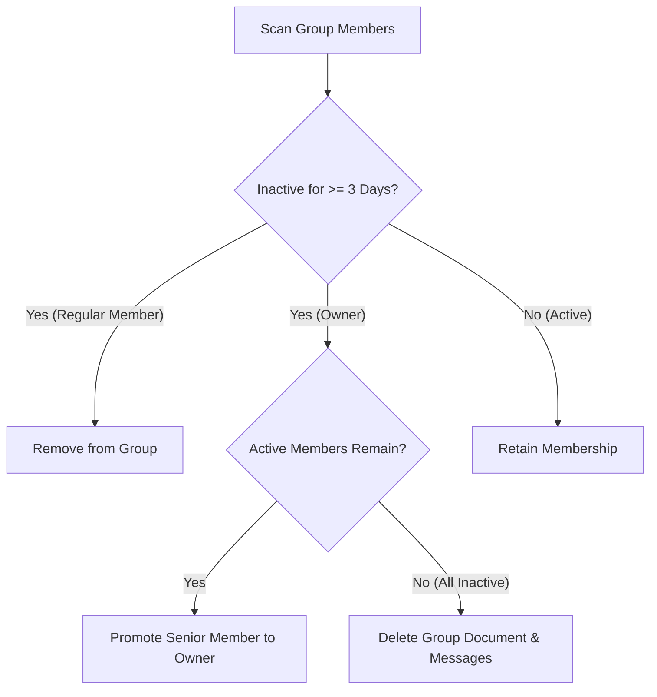

# Maintenance & Scheduled Jobs (Cron)

This document details automated background cron jobs, inactivity prunings, ownership reassignments, data reconciliations, and Firestore TTL retention.

---

## 1. Scheduled Jobs Overview

All cron endpoints require `Authorization: Bearer <CRON_SECRET>` headers and run on automated schedules:

| Endpoint | Cadence | Core Responsibility |
| :--- | :--- | :--- |
| `/api/cron/check-inactive-users` | Daily (00:00 UTC) | Prunes members inactive for >= 3 days and handles ownership transfers |
| `/api/cron/sync-user-stats` | Daily | Self-heals note counters and removes dangling group memberships |
| `/api/cron/cleanup-orphaned-cheers` | Daily | Purges cheer interactions belonging to deleted users or groups |
| `/api/cron/post-ai-daily-notes` | Daily | Automatically posts daily scripture notes to AI partner groups |
| `/api/cron/cleanup-demo-sandboxes` | Hourly | Purges temporary anonymous sandbox sessions older than 1 hour |

---

## 2. Inactivity Pruning & Ownership Transfer

Maintains active accountability groups by pruning dormant members:

- **Activity Detection**: Posting notes, sending chat messages, or launching the app updates `lastActiveAt`.
- **Empty Group Cleanup**: Groups with zero remaining active members are recursively deleted from Firestore.

---

## 3. Automated Message Retention (Firestore Native TTL)

Active chat messages are stamped with an `expireAt` timestamp (30 days from creation) and automatically purged by Cloud Firestore's native TTL engine.
(Personal study notes in `users/{uid}/notes` are preserved permanently).

---

## 4. Related Documentation

- [Inactivity & Auto-Kick Rules](./inactivity-and-autokick.md)
- [CI/CD & Maintenance Automation](./cicd-maintenance-automation.md)
- [Database & Security Architecture](./database-security.md)
