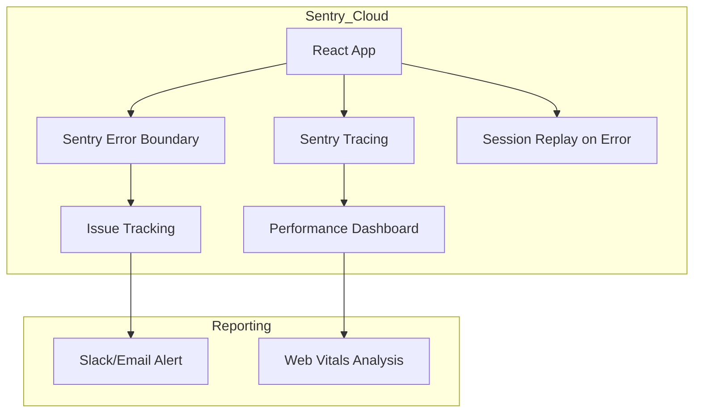

# Monitoring & Observability

To keep the platform running smoothly, **scripture-habit** uses multiple monitoring tools to catch performance issues and unexpected errors before users report them.

---

## 1. Error Tracking with Sentry

We use **Sentry** to monitor application performance and track crashes.

### 1.1 Performance Sampling
To balance cost and visibility, we use these configurations:
- **`tracesSampleRate: 0.1`**: We trace 10% of performance data to identify slow API endpoints or complex React renders.
- **Session Replays**: We only record session replays when an error occurs (`replaysOnErrorSampleRate: 1.0`). This shows the user actions leading up to a crash without recording healthy sessions.

### 1.2 React Router Integration
Sentry's React Router integration helps us see which page transitions are slow or failing, so we can pinpoint issues like dashboard lag or note submission errors.

### 1.3 Observability & Tracing Guidelines
To maintain alert reliability and cost control, developers must adhere to these tracing and error filtering guidelines:

*   **Error Filtering Policy (`ignoreErrors`)**:
    *   Trivial user-driven client errors such as standard authentication failures (`401 Unauthorized` during session expiry), permissions rule rejections on logouts (`403 Forbidden`), and failed external metadata lookups (`404 Not Found`) should be ignored or logged as warnings to prevent alert fatigue.
    *   All unhandled exceptions, server-side database transaction aborts, and Sentry Express error handlers must remain active and register as high-priority issues.
*   **Transaction Naming Conventions**:
    *   All route handlers must trace parameterized paths (e.g., `/api/groups/:groupId` instead of resolving to physical IDs like `/api/groups/seed-group-daily-bread`). Parameterized routes allow Sentry to properly aggregate performance metrics under a single transaction type.
*   **Firestore Transaction Custom Spans**:
    *   When executing atomic Firestore transactions (e.g., in `NoteService`), wrap operations in custom Sentry spans using `Sentry.startSpan({ name: 'db.transaction.note-post' })`. Separating transactional Firestore read-before-write latency from general API HTTP response latency ensures clean performance bottlenecks analysis.

---

## 2. Silencing Common Errors

In a mobile hybrid app, some expected errors do not need action. We suppress these in `main.tsx` to keep Sentry logs clean:
- **`AbortError`**: Occurs when a user closes the app or switches tabs during an active Firebase request.
- **`permission-denied`**: Occurs briefly when a user logs out while a Firestore listener is still active. We suppress this to avoid false alarms.

---

## 3. PWA Update Lifecycle

To ensure users always run the latest version of our Progressive Web App (PWA):
1.  **State Detection**: The app monitors the Service Worker installation.
2.  **Event Dispatch**: When a new Service Worker is ready, the app triggers a `pwa-update-available` custom event.
3.  **User UI**: The user interface displays a "New Version Available" banner.
4.  **Refresh**: When the user clicks "Refresh," the new Service Worker takes over and the page reloads.

---

## 4. Mobile Debugging (vConsole)

To debug production Android and iOS builds where Chrome DevTools is unavailable, we use **vConsole**.
- **Usage**: Access via `?vconsole=true` in the URL.
- **Features**: Shows console logs, network requests, and local storage data directly on the mobile device.

---

## 5. Monitoring Architecture Diagram

