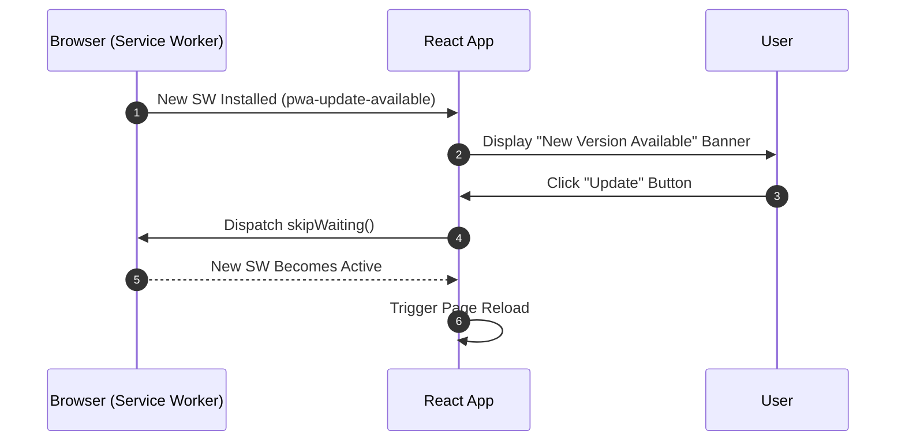

# Monitoring & Observability

This document details error logging, performance tracing with Sentry, log noise reduction, and the PWA update lifecycle.

---

## 1. Sentry Error Tracking & Performance Monitoring

Sentry is integrated across both frontend and backend to monitor runtime reliability:

- **Performance Tracing (`tracesSampleRate: 0.1`)**:
  Samples 10% of transactions to identify latency bottlenecks in API handlers and React renders.
- **Session Replays (`replaysOnErrorSampleRate: 1.0`)**:
  Records user interaction breadcrumbs strictly when runtime errors occur to assist with diagnosis.
- **Normalized Transaction Names**:
  Parameterized routes (e.g. `/api/groups/:groupId`) group performance metrics under clean aggregated tags.

---

## 2. Noise Suppression (`ignoreErrors`)

Benign expected client events are filtered out to keep alerts focused:

- **`AbortError`**: Triggered when users navigate away before background GET requests complete.
- **`permission-denied` on Logout**: Harmless transient race condition when listeners tear down during user sign-out.

---

## 3. PWA Update Lifecycle

Coordinates seamless Service Worker upgrades with a non-intrusive UI banner:

---

## 4. Related Documentation

- [Architecture Overview](./architecture.md)
- [API Middleware & Error Handling](./api-middleware-error-handling.md)
- [CI/CD & Maintenance Automation](./cicd-maintenance-automation.md)
