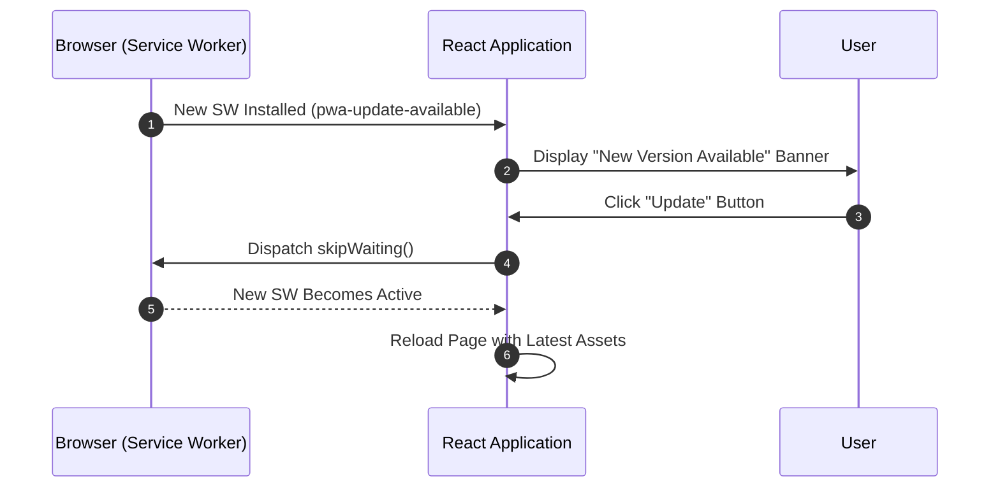

# Monitoring & Observability

This document details error tracking, distributed performance tracing with Sentry, log noise suppression filters, and the PWA update lifecycle in Scripture Habit.

---

## 1. Sentry Error Tracking & Performance Monitoring

Sentry is integrated across frontend and backend environments to monitor system reliability:

- **Performance Tracing (`tracesSampleRate: 0.1`)**:  
  Samples 10% of HTTP transactions to identify latency bottlenecks in API handlers and rendering cycles.
- **Session Replays (`replaysOnErrorSampleRate: 1.0`)**:  
  Captures user interaction breadcrumbs preceding exceptions to facilitate rapid issue reproduction.
- **Normalized Transaction Names**:  
  Routes with dynamic parameters (e.g., `/api/groups/:groupId`) group performance metrics under normalized paths.

---

## 2. Noise Suppression (`ignoreErrors`)

Expected client-side events are filtered to prevent alert fatigue:

- **`AbortError`**: Triggered when users navigate away before an in-flight fetch completes.
- **`permission-denied` on Logout**: Transient teardown event when active Firestore listeners disconnect during sign-out.

---

## 3. PWA Update Lifecycle

Coordinates seamless Service Worker upgrades without interrupting active user sessions:

### PWA Lifecycle Breakdown

1. **Background Asset Ingestion**  
   The browser installs the updated Service Worker in the background, firing a `pwa-update-available` event to the active client.

2. **Non-Intrusive Prompt**  
   Displays a dismissible notification banner inviting the user to refresh their session.

3. **Atomic Cache Activation**  
   Dispatches `skipWaiting()` to swap caches and reloads the browser tab to render the latest application build.

---

## 4. Related Documentation

- [Architecture Overview](./architecture.md)
- [API Design & Error Handling](./api-middleware-error-handling.md)
- [CI/CD & Maintenance Automation](./cicd-maintenance-automation.md)
