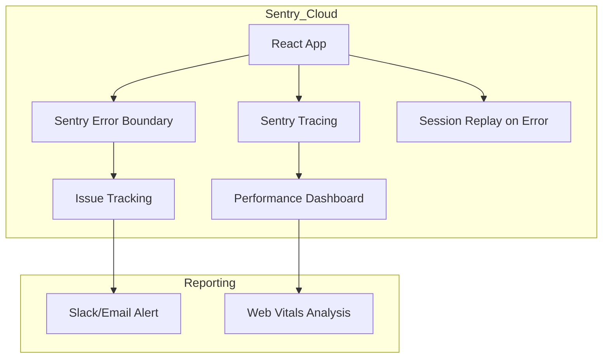

# Monitoring & Observability: Health & Ops

To maintain a "Premium" experience on both web and mobile, **scripture-habit** integrates several layers of monitoring to catch performance regressions and unexpected errors before users report them.

---

## 🐞 Error Tracking: Advanced Sentry

We use **Sentry** not just for crashes, but for total observability of the user experience.

### 1. Performance Budgeting
We optimize our Sentry quota while maintaining high visibility:
- **`tracesSampleRate: 0.1`**: We only track 10% of performance traces to keep the noise low while identifying slow API endpoints or complex React renders.
- **Replay Strategy**: We only record **Session Replays on failure** (`replaysOnErrorSampleRate: 1.0`). This captures exactly what the user was doing leading up to a crash without recording thousands of healthy sessions.

### 2. React Router Integration
Using the Sentry React Router V6/V7 integration, we can see exactly which screen transitions are slow or failing, distinguishing between "Dashboard" lag and "Note Submission" errors.

---

## 🔇 Proactive Error Silencing

In a mobile-web hybrid environment (Capacitor), certain errors are expected and non-critical. We specifically "silence" these in `main.tsx` to keep our Sentry logs actionable:

- **`AbortError`**: Triggered when a mobile user closes the app or switches tabs during an async Firebase/Analytics request.
- **`permission-denied` (Production)**: Silenced during production state transitions. If a user logs out while a Firestore listener is still active for a millisecond, a permission error is thrown. This is caught and suppressed to prevent false-positives in our monitoring.

---

## 📦 PWA Update Lifecycle

As a Progressive Web App, managing "Freshness" is a core architectural requirement.

1.  **State Detection**: The Service Worker (SW) installation process is monitored.
2.  **Event Dispatch**: When a new SW is installed and waiting, the app dispatches a `pwa-update-available` custom event.
3.  **User UI**: The UI listens for this event and shows a "New Version Available" banner.
4.  **Atomic Refresh**: Once the user clicks "Refresh," the new SW takes control, and the app performs a hard reload to ensure no legacy logic is running in memory.

---

## 📱 Mobile Debugging: vConsole & Logging

For production Android/iOS builds where Chrome DevTools is unavailable, we use **vConsole**.
- **Usage**: Access via `?vconsole=true` in the URL.
- **Benefits**: Allows us to see network requests, console logs, and local storage state directly on the physical device.

---

## 🚦 Monitoring Architecture Diagram

