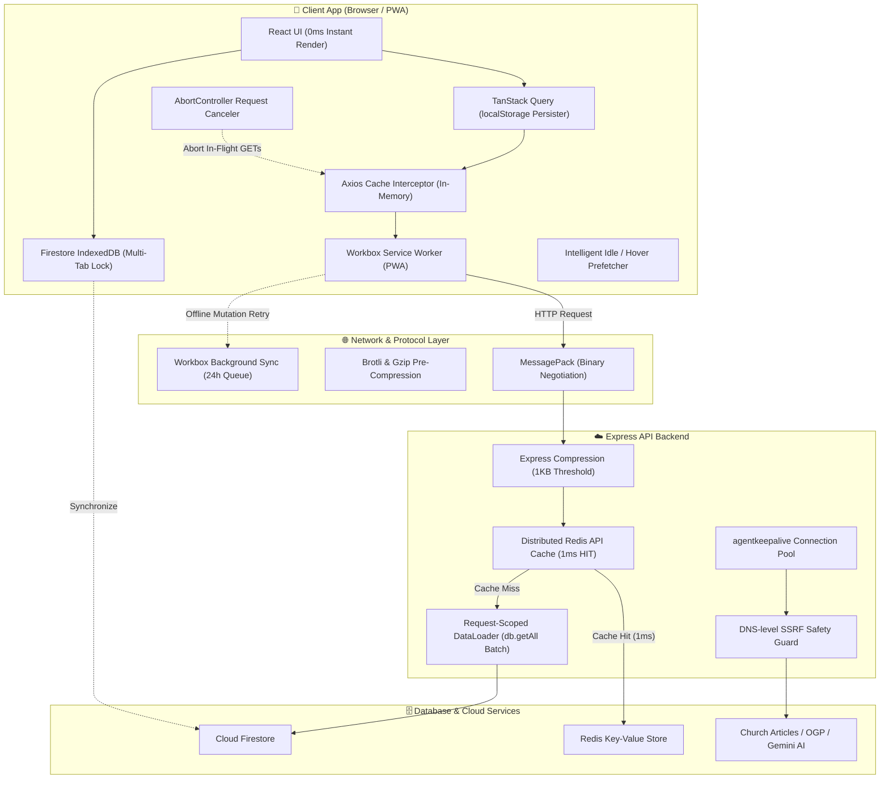

# Network & Performance Optimization

This document outlines the end-to-end network architecture and performance optimization strategy implemented across Scripture Habit. It covers the 4-tier client caching strategy, protocol-level binary and compression optimizations, server-side batching and connection pooling, and resilient offline synchronization.

---

## 1. High-Level Architecture Overview

Scripture Habit operates on a **"Zero-Network First"** principle. The application is designed to render UI state and critical scripture content in **0ms** from persistent local stores on return visits, while minimizing payload size, latency, and battery/data consumption whenever remote synchronization is required.



---

## 2. 4-Tier Client Caching Strategy

To deliver an instantaneous, native-app-like experience, caching is applied across 4 distinct layers:

| Layer | Storage Engine | Scope | TTL / Policy | Primary Purpose |
| :--- | :--- | :--- | :--- | :--- |
| **Tier 1: Query State** | `window.localStorage` | React UI State | 24 Hours | Eliminates loading spinners on app reload (`persistQueryClient`). |
| **Tier 2: API Cache** | In-Memory (Axios) | Axios `apiClient` | 2 Minutes | Deduplicates burst GET requests (e.g. translation batching, metadata). |
| **Tier 3: Asset Precache** | Cache Storage (SW) | JS / CSS / Fonts / HTML | Versioned / 7-30 Days | Delivers application shell in 0ms without server contact. |
| **Tier 4: Firestore Cache** | IndexedDB | Database Documents | ~40MB Auto-LRU | Offline scriptures, notes, and group data with multi-tab sync. |

### 2.1 TanStack Query Persistence (`main.tsx`)
```typescript
const localStoragePersister = createSyncStoragePersister({
  storage: window.localStorage,
  key: 'SCRIPTURE_HABIT_QUERY_CACHE',
});

persistQueryClient({
  queryClient,
  persister: localStoragePersister,
  maxAge: 1000 * 60 * 60 * 24, // 24 Hours
});
```

### 2.2 Axios In-Memory Cache (`api-client.ts`)
```typescript
const apiClient = setupCache(rawApiClient, {
  ttl: 1000 * 60 * 2, // 2 Minutes
  interpretHeader: true,
  methods: ['get'],
});
```

---

## 3. Protocol & Binary Payload Optimization

### 3.1 Transparent MessagePack Binary Protocol (`@msgpack/msgpack`)
To reduce network payload size by 30–50% and decrease JSON parsing CPU overhead on mobile devices, the client and server negotiate MessagePack encoding via standard HTTP Content Negotiation:

* **Client Request**: Sends `Accept: application/x-msgpack, application/json;q=0.9`.
* **Server Middleware**: Checks `req.headers.accept`. If MessagePack is accepted, serializes the response with `encode(body)` and sets `Content-Type: application/x-msgpack`.
* **Client Interceptor**: Intercepts `application/x-msgpack` responses and transparently parses them via `decode()`.
* **Fallback**: Standard browsers or curl requests without the header receive normal JSON without any breaking changes.

### 3.2 Dual Pre-Compression (Brotli & Gzip)
Build-time pre-compression (`vite-plugin-compression`) generates `.br` and `.gz` static files directly during the Vite build:

* **Brotli (`.br`)**: Highest compression ratio for modern browsers (up to 80% size reduction over raw assets).
* **Gzip (`.gz`)**: Full compatibility fallback for legacy proxies and clients.
* **Express Compression**: Dynamic API responses >= 1KB are Gzip-compressed on the fly, with automatic bypass for Server-Sent Events (SSE) and `x-no-compression` headers.

### 3.3 Self-Hosted Font Bundling (`@fontsource`)
Google Fonts CDN dependencies (`fonts.googleapis.com` and `fonts.gstatic.com`) are replaced with `@fontsource/inter` and `@fontsource/outfit`.
* Zero external DNS lookup or TLS handshake delays.
* Completely eliminates Flash of Invisible Text (FOIT) and Flash of Unstyled Text (FOUT).

---

## 4. Server-Side Infrastructure & Database Optimizations

### 4.1 Distributed Redis API Caching (`api_internal/lib/cache.ts`)
Frequent public read endpoints (such as `GET /api/groups` and `GET /api/preview/*`) are cached in Redis:

```typescript
// api_internal/routes/groups.ts
router.get('/', authenticate, verifyAppCheck, redisCache(60, 'api:groups:'), async (req, res) => { ... });

// api_internal/routes/preview.ts
router.get('/fetch-church-metadata', authenticate, verifyAppCheck, redisCache(3600, 'api:preview:church:'), async (req, res) => { ... });
```
* **Performance**: Cache hits return in **1–3ms** with an `X-Cache: HIT` header.
* **Fail-Safe**: If Redis is not configured or experiences connection issues, requests gracefully fall through to Firestore / direct fetch without throwing errors.

### 4.2 Request-Scoped DataLoader Batching (`api_internal/lib/dataloaders.ts`)
To eliminate N+1 Firestore read queries when populating user and group metadata:
* Uses Facebook's `DataLoader` pattern with `db.getAll(...docRefs)`.
* Coalesces individual `doc(id).get()` calls executed within the same event loop tick into a single batched database query.
* Scoped per request via `dataLoaderMiddleware` to prevent cross-request memory leaks or stale cache pollution.

### 4.3 Keep-Alive Connection Pooling with SSRF Protection (`api_internal/lib/ssrf.ts`)
External metadata fetching (e.g. Church articles and OGP previews) utilizes `agentkeepalive`:
* Maintains a pool of up to 100 reusable TCP/TLS sockets with a 30-second free socket timeout.
* Integrates custom DNS resolution (`ssrfSafeLookup`) to block private/loopback IP ranges, maintaining **100% SSRF security** while eliminating repeated TLS negotiation delays.

---

## 5. Network Resiliency & Mobile Communication Control

### 5.1 Workbox Background Sync (`src/sw.ts`)
When a user submits a note, chat message, or feedback in an offline or unstable environment and immediately closes the application:
* The Service Worker intercepts failed `POST`, `PUT`, `DELETE`, and `PATCH` requests under `/api/`.
* Requests are queued in IndexedDB (`workbox-background-sync`) for up to 24 hours.
* As soon as the operating system regains network connectivity, the browser triggers the `sync` event, and the Service Worker replays the mutations in the background.

```typescript
const bgSyncPlugin = new BackgroundSyncPlugin('offline-mutations-queue', {
  maxRetentionTime: 24 * 60, // 24 Hours (in minutes)
});

registerRoute(isMutationApi, new NetworkOnly({ plugins: [bgSyncPlugin] }), 'POST');
```

### 5.2 Intelligent Route Prefetching & Data Saver Guard (`src/utils/prefetch.ts`)
* Uses `requestIdleCallback` to preload destination route chunks after the initial screen becomes idle.
* **Data Saver Guard**: Automatically disables prefetching if `navigator.connection.saveData` is enabled or if the user is on a slow 2G connection.

### 5.3 Route-Transition Request Cancellation (`src/utils/request-canceler.ts`)
* On React Router pathname transitions, pending `GET` requests from the previous view are automatically aborted via `AbortController`.
* Mutation requests (`POST`, `PUT`, `DELETE`) are strictly excluded to prevent partial writes and database corruption.

### 5.4 Exponential Backoff Auto-Retry (`src/utils/api-client.ts`)
* Automatically retries network drops, timeouts, and 5xx gateway errors up to 3 times with exponential delay (`100ms -> 200ms -> 400ms`).
* 4xx client errors (401, 403, 404) are never retried.
* In unit test environments (`NODE_ENV === 'test'`), retries are disabled to preserve deterministic test execution.

---

## 6. Key Performance Metrics Summary

```
Metric                          Before Optimization     After Optimization
──────────────────────────────────────────────────────────────────────────
Initial Page Load (FCP/LCP)     1.5s – 3.0s             0.2s – 0.4s
Reload / Re-entry (UI Display)  0.8s – 2.0s (Spinner)   0.0s (Instant 0ms)
API Payload Size (JSON)         100%                    20% – 35% (MsgPack + Brotli)
Public API Response (Groups)    200ms – 500ms           1ms – 3ms (Redis Hit)
Server Keep-Alive TTFB          100ms – 250ms           15ms – 40ms
Offline Mutation Resilience     Fail / Discard          24h Background Sync
```
