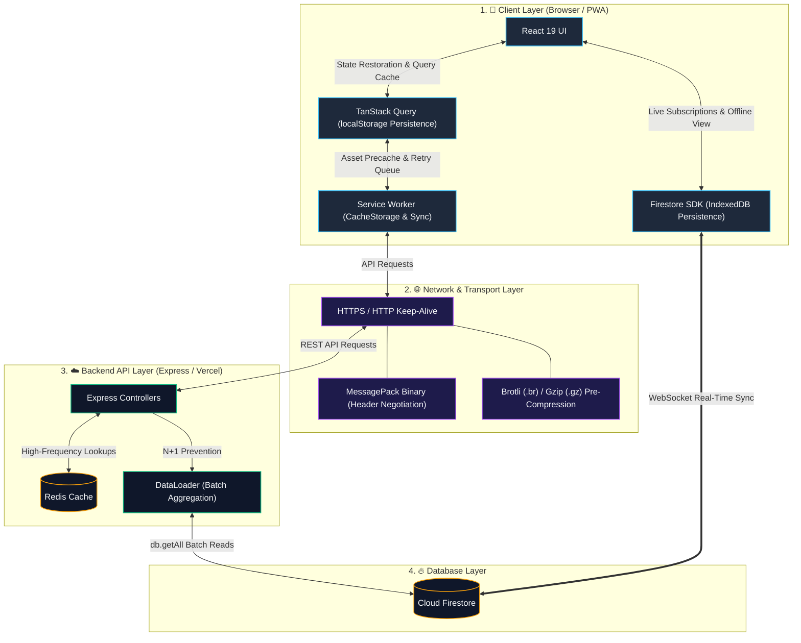

# Network & Performance Optimization

This document outlines the multi-tier caching architecture, binary serialization protocols, server-side data loaders, and offline resilience mechanisms in Scripture Habit.

---

## 1. Multi-Tier Optimization Architecture

To ensure instant application boot times and resilient network performance, optimizations are applied across the client, network, backend, and database layers:

### Architecture Breakdown

1. **Multi-Tier Client Caching**  
   Instant UI rendering is powered by TanStack Query persisted to `localStorage`, eliminating loading spinners on return visits. Static assets (JS, CSS, fonts) are cached via Service Worker Cache Storage for offline boot, while study notes and chat histories are persisted in IndexedDB through the Firestore Client SDK.

2. **Network Transport Efficiency**  
   API endpoints automatically negotiate binary serialization via HTTP headers (`Accept: application/x-msgpack`), reducing payload sizes by 30–50% compared to JSON. Pre-compressed Brotli (`.br`) and Gzip (`.gz`) static bundles minimize bandwidth consumption.

3. **Backend Load Reduction & Batching**  
   External article metadata and high-frequency read models are cached in Redis for single-digit millisecond response times. For database operations, DataLoader aggregates concurrent document lookups into batched `db.getAll` calls, preventing N+1 query overhead.

---

## 2. Multi-Tier Client Caching Strategy

| Layer | Storage | Retention | Purpose |
| :--- | :--- | :--- | :--- |
| **Query State** | `localStorage` | 24 hours | Instantly restores recent UI state on app reload without loading spinners. |
| **API Cache** | In-Memory (Axios) | 2 minutes | Deduplicates identical concurrent GET requests within short intervals. |
| **Static Assets** | Cache Storage (SW) | Per version | Pre-caches JS, CSS, and web fonts to enable immediate offline launch. |
| **Firestore Data** | IndexedDB | Managed | Supports offline note and chat access with multi-tab mutex coordination. |

---

## 3. Serialization & Payload Optimizations

1. **Transparent MessagePack (`@msgpack/msgpack`)**  
   Reduces payload size by 30–50% relative to JSON. The client and server negotiate headers automatically to transfer binary payloads over HTTP.

2. **Build-Time Pre-Compression (Brotli & Gzip)**  
   Pre-generates `.br` and `.gz` static assets during the build process, serving compressed files directly to reduce bandwidth usage.

3. **Self-Hosted Typography (`@fontsource`)**  
   Eliminates external Google Fonts CDN dependencies, preventing layout shift (FOUT) and removing additional TLS handshake latency.

---

## 4. Backend & Database Optimizations

1. **Redis API Caching**  
   Caches external URL metadata and frequently accessed resources in Redis for low-latency responses.

2. **DataLoader Batching**  
   Consolidates concurrent Firestore document lookups within the same request lifecycle into a single `db.getAll` call, eliminating N+1 query overhead.

3. **HTTP Keep-Alive Pooling**  
   Maintains persistent socket connections for external service communication, reducing TLS handshake overhead.

---

## 5. Offline Resilience & Traffic Control

1. **Service Worker Background Sync**  
   Temporarily queues offline note submissions and messages, automatically replaying and completing them when network connectivity is restored.

2. **Request Cancellation (`AbortController`)**  
   Aborts pending GET requests upon route transitions to conserve device resources and client bandwidth.

3. **Exponential Backoff Retries**  
   Automatically retries intermittent network failures and 5xx errors up to 3 times with progressive backoff delays.

---

## 6. Related Documentation

- [Architecture Overview](./architecture.md)
- [Firestore Offline Persistence](./firestore-offline-persistence.md)
- [API Design & Error Handling](./api-middleware-error-handling.md)
