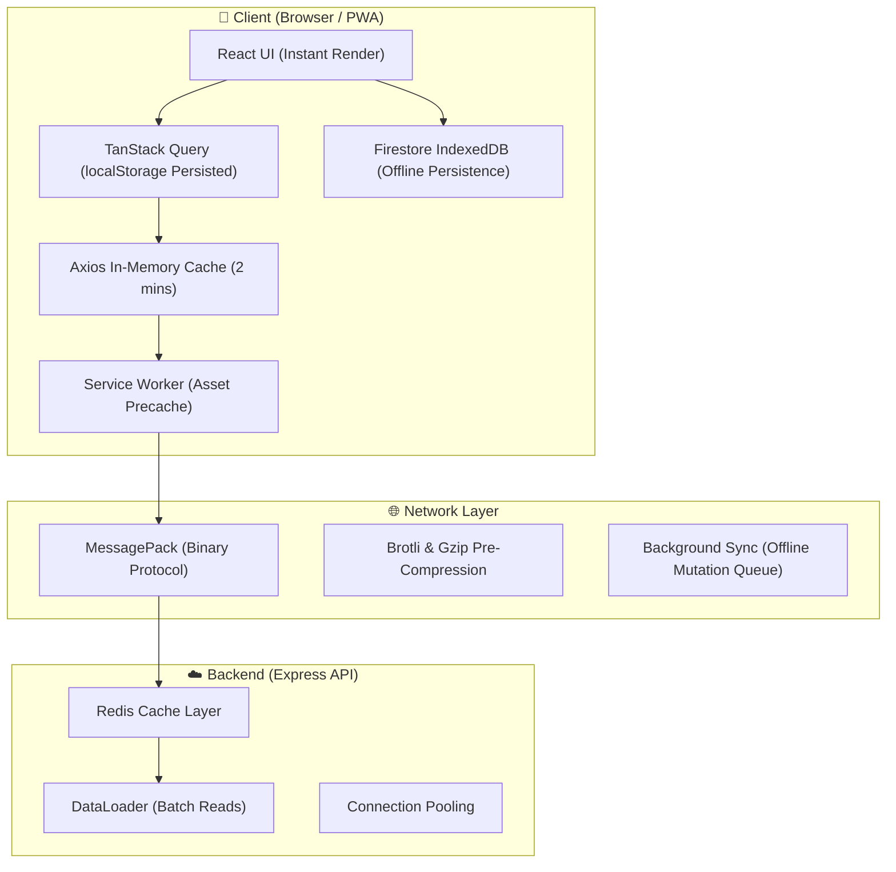

# Network & Performance Optimization

This document outlines the client-side caching strategies, binary payload serialization, server-side data loaders, and offline synchronization mechanisms in Scripture Habit.

---

## 1. Architecture Overview

To provide fast page transitions and robust offline capabilities, optimizations span the client, network, and backend layers:

---

## 2. Multi-Tier Client Caching

| Layer | Storage | Duration | Purpose |
| :--- | :--- | :--- | :--- |
| **Query State** | `localStorage` | 24 hours | Eliminates loading spinners on app reload by restoring recent UI state. |
| **API Cache** | In-Memory (Axios) | 2 minutes | Deduplicates concurrent GET requests for translations and metadata. |
| **Static Assets** | Cache Storage (SW) | Per version | Pre-caches JS, CSS, and fonts for immediate offline boot. |
| **Firestore Cache** | IndexedDB | Managed | Enables offline reading of notes and chats with multi-tab coordination. |

---

## 3. Serialization & Payload Optimization

1. **Transparent MessagePack (`@msgpack/msgpack`)**:
   Reduces payload size by 30–50% compared to JSON. Negotiates headers via `Accept: application/x-msgpack` to serialize binary data over HTTP.
2. **Build-Time Pre-Compression (Brotli & Gzip)**:
   Pre-generates `.br` and `.gz` assets during the Vite build step to minimize bandwidth.
3. **Self-Hosted Typography (`@fontsource`)**:
   Replaces external Google Fonts CDN links with bundled fonts to prevent layout shift (FOUT) and eliminate extra TLS negotiations.

---

## 4. Backend & Database Optimizations

1. **Redis API Caching**:
   Caches external metadata and frequently accessed resources in Redis for sub-millisecond responses.
2. **DataLoader Batching**:
   Eliminates N+1 query patterns by batching concurrent Firestore document reads into a single `db.getAll` call.
3. **HTTP Keep-Alive Pooling**:
   Maintains warm socket connections for external metadata fetching.

---

## 5. Mobile Resilience & Traffic Control

- **Service Worker Background Sync**:
  Queues failed mutations in IndexedDB when offline and replays them automatically when connectivity is restored.
- **Request Cancellation (`AbortController`)**:
  Cancels in-flight GET requests on route transitions to free up client bandwidth.
- **Exponential Backoff**:
  Automatically retries intermittent 5xx network failures up to 3 times.

---

## 6. Related Documentation

- [Architecture Overview](./architecture.md)
- [Firestore Offline Persistence](./firestore-offline-persistence.md)
- [API Middleware & Error Handling](./api-middleware-error-handling.md)
