# User Profile Sync & Reaction Anonymization

This document details the propagation of profile modifications (nickname, avatar URL) to active group feeds and the privacy anonymization protocol executed upon account deletion in Scripture Habit.

---

## 1. Architecture Overview (`ProfileService`)

The serverless `ProfileService` (`api_internal/services/profile-service.ts`) coordinates identity propagation and social data anonymization:

```mermaid
sequenceDiagram
    autonumber
    actor User as User Client
    participant API as Profile API
    participant PS as ProfileService
    participant DB as Cloud Firestore

    rect rgb(20, 30, 45)
        Note over User,DB: Scenario A: User Updates Profile (Nickname / Avatar)
        User->>API: Submit Profile Update
        API->>PS: syncProfileToChats(userId, newProfile)
        PS->>DB: Batch update memberPreviews & recent message reactionPreviews
    end

    rect rgb(35, 20, 30)
        Note over User,DB: Scenario B: User Deletes Account
        User->>API: Request Account Deletion
        API->>PS: purgeSocialIdentity(userId)
        PS->>DB: Anonymize reaction identity in chat history (replace with '...' and '')
    end
```



### Synchronization Sequence Breakdown

1. **Profile Modification Sync**  
   Updates the user's root document and propagates altered nicknames and avatars across joined group parent cards and recent message cache documents.

2. **Account Deletion & Identity Scrubbing**  
   Clears private records and traverses active group logs to anonymize reaction author descriptors without disrupting conversation flow.

---

## 2. Profile Propagation to Group Feeds

Updating every historical message across all groups would incur prohibitive write costs. The sync engine balances consistency with performance:

1. **Targeted Scan Horizon**: Scans recent active messages (up to 500 documents per joined group).
2. **Reaction Preview Invalidation**: Updates cached author nicknames and avatars within `reactionPreviews`.
3. **Batch Partitioning**: Commits Firestore operations in chunks of 450 (within Firestore's 500-write transactional limit).

---

## 3. Account Deletion & Social Identity Anonymization

When an account is deleted, personal identifiable data is removed while preserving chat stream continuity:

```
[Before Account Deletion]
  Reaction: { uid: "user_123", nickname: "Jane Doe", photoURL: "https://..." }
        │
        ▼ (Account Deletion Triggered)
[After Account Deletion]
  Reaction: { uid: "user_123", nickname: "...", photoURL: "" }
```

- **Identity Scrubbing**: Display nicknames are replaced with `"..."` and avatar URLs are cleared.
- **Feed Integrity**: Reaction counts and discussion threads remain intact without rendering broken image placeholders.

---

## 4. Related Documentation

- [Group Chat Architecture & Implementation](./groupchat-construction-guide.md)
- [Database & Security Architecture](./database-security.md)
